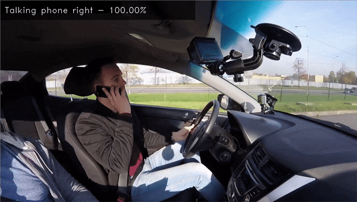

# Action Recognition Python\* Demo



This is the demo application for Action Recognition algorithm, which classifies actions that are being performed on input video.
The following pre-trained models are delivered with the product:

* `driver-action-recognition-adas-0002-encoder` + `driver-action-recognition-adas-0002-decoder`, which are models for driver monitoring scenario. They recognize actions like safe driving, talking on the phone and others
* `action-recognition-0001-encoder` + `action-recognition-0001-decoder` and `i3d-rgb-tf`, which are general-purpose action recognition (400 actions) models for Kinetics-400 dataset.

For more information about the pre-trained models, refer to the [Intel](../../../models/intel/index.md) and [public](../../../models/public/index.md) models documentation.

## How It Works

The demo pipeline consists of several steps, namely `Data`, `Model` and `Render`.
Every step implements `PipelineStep` interface by creating a class derived from `PipelineStep` base class. See `steps.py` for implementation details.

* `DataStep` reads frames from the input video.
*  Model step depends on architecture type:
    - For encder-decoder models there are two steps:
      -  `EncoderStep` preprocesses a frame and feeds it to the encoder model to produce a frame embedding. Simple averaging of encoder's outputs over a time window is applied.
      -  `DecoderStep` feeds embeddings produced by the `EncoderStep` to the decoder model and produces predictions. For models that use `DummyDecoder`, simple averaging of encoder's outputs over a time window is applied.
    - For the specific implemented single models, the corresponding `<ModelNameStep>` does preprocessing and produces predictions.
* `RenderStep` renders prediction results.

Pipeline steps are composed in `AsyncPipeline`. Every step can be run in separate thread by adding it to the pipeline with `parallel=True` option.
When two consequent steps occur in separate threads, they communicate via message queue (for example, deliver step result or stop signal).

To ensure maximum performance, Inference Engine models are wrapped in `AsyncWrapper`
that uses Inference Engine async API by scheduling infer requests in cyclical order
(inference on every new input is started asynchronously, result of the longest working infer request is returned).
You can change the value of `num_requests` in `action_recognition_demo.py` to find an optimal number of parallel working infer requests for your inference accelerators
(Intel(R) Neural Compute Stick devices and GPUs benefit from higher number of infer requests).

> **NOTE**: By default, Open Model Zoo demos expect input with BGR channels order. If you trained your model to work with RGB order, you need to manually rearrange the default channels order in the demo application or reconvert your model using the Model Optimizer tool with the `--reverse_input_channels` argument specified. For more information about the argument, refer to **When to Reverse Input Channels** section of [Converting a Model Using General Conversion Parameters](https://docs.openvinotoolkit.org/latest/_docs_MO_DG_prepare_model_convert_model_Converting_Model_General.html).

## Preparing to Run

For demo input image or video files you may refer to [Media Files Available for Demos](../../README.md#Media-Files-Available-for-Demos).
The list of models supported by the demo is in `<omz_dir>/demos/action_recognition_demo/python/models.lst` file.
This file can be used as a parameter for [Model Downloader](../../../tools/downloader/README.md) and Converter to download and, if necessary, convert models to OpenVINO Inference Engine format (\*.xml + \*.bin).

An example of using the Model Downloader:

```sh
python3 <omz_dir>/tools/downloader/downloader.py --list models.lst
```

An example of using the Model Converter:

```sh
python3 <omz_dir>/tools/downloader/converter.py --list models.lst
```

### Supported Models

* architecture_type = en-de
    - action-recognition-0001-decoder
    - action-recognition-0001-encoder
    - driver-action-recognition-adas-0002-decoder
    - driver-action-recognition-adas-0002-encoder
* architecture_type = en-mean
    - weld-porosity-detection-0001
* architecture_type = i3d-rgb
    - i3d-rgb-tf

> **NOTE**: Refer to the tables [Intel's Pre-Trained Models Device Support](../../../models/intel/device_support.md) and [Public Pre-Trained Models Device Support](../../../models/public/device_support.md) for the details on models inference support at different devices.

## Running

Running the application with the `-h` option yields the following usage message:

```
usage: action_recognition_demo.py [-h] -i INPUT [--loop] [-o OUTPUT]
                                  [-limit OUTPUT_LIMIT] -at
                                  {en-de,en-mean,i3d-rgb} -m_en M_ENCODER
                                  [-m_de M_DECODER | --seq DECODER_SEQ_SIZE]
                                  [-l CPU_EXTENSION] [-d DEVICE] [-lb LABELS]
                                  [--no_show] [-s LABEL_SMOOTHING]
                                  [-u UTILIZATION_MONITORS]

Options:
  -h, --help            Show this help message and exit.
  -i INPUT, --input INPUT
                        Required. An input to process. The input must be a
                        single image, a folder of images, video file or camera
                        id.
  --loop                Optional. Enable reading the input in a loop.
  -o OUTPUT, --output OUTPUT
                        Optional. Name of the output file(s) to save.
  -limit OUTPUT_LIMIT, --output_limit OUTPUT_LIMIT
                        Optional. Number of frames to store in output. If 0 is
                        set, all frames are stored.
  -at {en-de,en-mean,i3d-rgb}, --architecture_type {en-de,en-mean,i3d-rgb}
                        Required. Specify model architecture type.
  -m_en M_ENCODER, --m_encoder M_ENCODER
                        Required. Path to encoder model.
  -m_de M_DECODER, --m_decoder M_DECODER
                        Optional. Path to decoder model. Only for -at en-de.
  --seq DECODER_SEQ_SIZE
                        Optional. Length of sequence that decoder takes as
                        input.
  -l CPU_EXTENSION, --cpu_extension CPU_EXTENSION
                        Optional. For CPU custom layers, if any. Absolute path
                        to a shared library with the kernels implementation.
  -d DEVICE, --device DEVICE
                        Optional. Specify a target device to infer on. CPU,
                        GPU, HDDL or MYRIAD is acceptable. The demo will
                        look for a suitable plugin for the device specified.
                        Default value is CPU.
  -lb LABELS, --labels LABELS
                        Optional. Path to file with label names.
  --no_show             Optional. Don't show output.
  -s LABEL_SMOOTHING, --smooth LABEL_SMOOTHING
                        Optional. Number of frames used for output label
                        smoothing.
  -u UTILIZATION_MONITORS, --utilization-monitors UTILIZATION_MONITORS
```

Running the application with an empty list of options yields the usage message given above and an error message.

**For example**, to run the demo for in-cabin driver monitoring scenario, please provide a path to the encoder and decoder models, an input video and a file with label names, located in the demo folder, `<omz_dir>/demos/action_recognition_demo/python/driver_actions.txt`:

```sh
python3 action_recognition_demo.py \
    -m_en <path_to_model>/driver-action-recognition-adas-0002-encoder.xml \
    -m_de <path_to_model>/driver-action-recognition-adas-0002-decoder.xml \
    -at en-de \
    -i <path_to_video>/inputVideo.mp4 \
    -lb <omz_idr>/demos/action_recognition_demo/python/driver_actions.txt
```

>**NOTE**: If you provide a single image as an input, the demo processes and renders it quickly, then exits. To continuously visualize inference results on the screen, apply the `loop` option, which enforces processing a single image in a loop.

You can save processed results to a Motion JPEG AVI file or separate JPEG or PNG files using the `-o` option:

* To save processed results in an AVI file, specify the name of the output file with `avi` extension, for example: `-o output.avi`.
* To save processed results as images, specify the template name of the output image file with `jpg` or `png` extension, for example: `-o output_%03d.jpg`. The actual file names are constructed from the template at runtime by replacing regular expression `%03d` with the frame number, resulting in the following: `output_000.jpg`, `output_001.jpg`, and so on.
To avoid disk space overrun in case of continuous input stream, like camera, you can limit the amount of data stored in the output file(s) with the `limit` option. The default value is 1000. To change it, you can apply the `-limit N` option, where `N` is the number of frames to store.

>**NOTE**: Windows\* systems may not have the Motion JPEG codec installed by default. If this is the case, you can download OpenCV FFMPEG back end using the PowerShell script provided with the OpenVINO &trade; install package and located at `<INSTALL_DIR>/opencv/ffmpeg-download.ps1`. The script should be run with administrative privileges if OpenVINO &trade; is installed in a system protected folder (this is a typical case). Alternatively, you can save results as images.

## Demo Output

The application uses OpenCV to display the real-time action recognition results and current inference performance (in FPS).

## See Also

* [Open Model Zoo Demos](../../README.md)
* [Model Optimizer](https://docs.openvinotoolkit.org/latest/_docs_MO_DG_Deep_Learning_Model_Optimizer_DevGuide.html)
* [Model Downloader](../../../tools/downloader/README.md)
