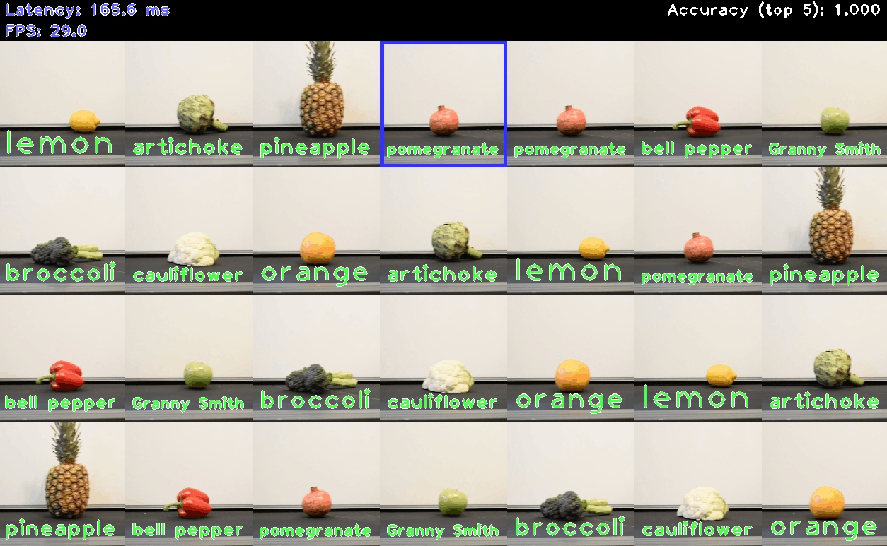

# Classification Benchmark C++ G-API Demo



The demo visualizes OpenVINO performance on inference of neural networks for image classification.

## How It Works

On startup, the application reads command line parameters and loads a classification model to OpenVINO™ Runtime plugin for execution. It might take some time for demo to read all input images. Then the demo performs inference to classify the images and places them on grid.

The demo starts in "Testing mode" with fixed grid size. After calculating the average FPS result, it will switch to normal mode and grid will be readjusted depending on model performance. Bigger grid means higher performance. You can repeat testing by pressing "Space" or "R" button.

When "ground truth" data is applied, the color coding for the text, drawn above each image, shows whether the classification was correct: green means correct class prediction, red means wrong.

You can stop the demo by pressing "Esc" or "Q" button. After that, the average metrics values will be printed to the console.

> **NOTE**: By default, Open Model Zoo demos expect input with BGR channels order. If you trained your model to work with RGB order, you need to manually rearrange the default channels order in the demo application or reconvert your model using the Model Optimizer tool with the `--reverse_input_channels` argument specified. For more information about the argument, refer to **When to Reverse Input Channels** section of [Embedding Preprocessing Computation](@ref openvino_docs_MO_DG_Additional_Optimization_Use_Cases).

## Preparing to Run

The list of models supported by the demo is in `<omz_dir>/demos/classification_benchmark_demo/cpp_gapi/models.lst` file.
This file can be used as a parameter for [Model Downloader](../../../tools/model_tools/README.md) and Converter to download and, if necessary, convert models to OpenVINO IR format (\*.xml + \*.bin).

An example of using the Model Downloader:

```sh
omz_downloader --list models.lst
```

An example of using the Model Converter:

```sh
omz_converter --list models.lst
```

### Supported Models

* convnext-tiny
* densenet-121-tf
* dla-34
* efficientnet-b0
* efficientnet-b0-pytorch
* efficientnet-v2-b0
* efficientnet-v2-s
* googlenet-v1-tf
* googlenet-v2-tf
* googlenet-v3
* googlenet-v3-pytorch
* googlenet-v4-tf
* hbonet-0.25
* hbonet-1.0
* inception-resnet-v2-tf
* levit-128s
* mixnet-l
* mobilenet-v1-0.25-128
* mobilenet-v1-1.0-224-tf
* mobilenet-v2-1.0-224
* mobilenet-v2-1.4-224
* mobilenet-v2-pytorch
* mobilenet-v3-large-1.0-224-tf
* mobilenet-v3-small-1.0-224-tf
* nfnet-f0
* regnetx-3.2gf
* repvgg-a0
* repvgg-b1
* repvgg-b3
* resnest-50-pytorch
* resnet-18-pytorch
* resnet-34-pytorch
* resnet-50-pytorch
* resnet-50-tf
* resnet18-xnor-binary-onnx-0001
* resnet50-binary-0001
* rexnet-v1-x1.0
* shufflenet-v2-x1.0
* swin-tiny-patch4-window7-224
* t2t-vit-14

> **NOTE**: Refer to the tables [Intel's Pre-Trained Models Device Support](../../../models/intel/device_support.md) and [Public Pre-Trained Models Device Support](../../../models/public/device_support.md) for the details on models inference support at different devices.

### Required Files

If you want to see classification results, you must use "-gt" and "-labels" flags to specify two .txt files containing lists of classes and labels.

"The ground truth" file is used for matching image file names with correct object classes.

It has the following format:

```
./ILSVRC2012_val_00000001.JPEG 65
./ILSVRC2012_val_00000002.JPEG 970
./ILSVRC2012_val_00000003.JPEG 230
...
```

Class index values must be in range from 0 to 1000. If you want to use "other" class, which is supported only by a small subset of models, specify it with -1 index.

"Labels" file contains the list of human-readable labels, one line for each class.

and `<omz_dir>/data/dataset_classes/imagenet_2012.txt` labels file with all other models supported by the demo.

## Running

Running the demo with `-h` shows this help message:
```
classification_benchmark_demo [OPTION]
Options:

    -h                        Print a usage message.
    -i "<path>"               Required. Path to a folder with images or path to an image file.
    -m "<path>"               Required. Path to an .xml file with a trained model.
    -labels "<path>"          Required. Path to .txt file with labels.
    -gt "<path>"              Optional. Path to ground truth .txt file.
    -d "<device>"             Optional. Specify the target device to infer on (the list of available devices is shown below). Default value is CPU. The demo will look for a suitable plugin for device specified.
    -nthreads "<integer>"     Optional. Specify count of threads.
    -nstreams "<integer>"     Optional. Specify count of streams.
    -nireq "<integer>"        Optional. Number of infer requests.
    -nt "<integer>"           Optional. Number of top results. Default value is 5. Must be >= 1.
    -res "<WxH>"              Optional. Set image grid resolution in format WxH. Default value is 1280x720.
    -no_show                  Optional. Disable showing of processed images.
    -time "<integer>"         Optional. Time in seconds to execute program. Default is -1 (infinite time).
    -u                        Optional. List of monitors to show initially.
    -backend <string>         Optional. Specify an inference backend. The list of available backends depends on openCV version. Default value is IE. See README.md for details
    -mean_values              Optional. Normalize input by subtracting the mean values per channel. Example: "255.0 255.0 255.0"
    -scale_values             Optional. Divide input by scale values per channel. Division is applied after mean values subtraction. Example: "255.0 255.0 255.0"
```

The number of `InferRequest`s is specified by -nireq flag. Each `InferRequest` acts as a "buffer": it waits in queue before being filled with images and sent for inference, then after the inference completes, it waits in queue until its results are processed. Increasing the number of `InferRequest`s usually increases performance, because in that case multiple `InferRequest`s can be processed simultaneously if the device supports parallelization. However, big number of `InferRequest`s increases latency because each image still needs to wait in queue.

For higher FPS, it is recommended to use -nireq which slightly exceeds -nstreams value summed over all used devices.

For example, use the following command-line command to run the application:

```sh
./classification_benchmark_demo_gapi -m <path_to_classification_model> \
                      -i <path_to_folder_with_images> \
                      -labels <path_to_file_with_list_of_labels> \
                      -gt <path_to_ground_truth_data_file> \
                      -u CDM
```

To let the demo find onnx libs copy `onnxruntime_providers_openvino.dll` from `lib` and `onnxruntime.dll`, `onnxruntime_providers_shared.dll` from `bin` dirs  of onnxruntume install to the folder with the demo executable.

The inference backend is specified by -backend flag. Depends on openCV version there might be different backends available: `IE` starting from openCV 4.2.0, `ONNX` from 4.5.1 and `OV` from 4.8. The possible device value for `ONNX/DML/<device>` can be found using `set OPENCV_LOG_LEVEL=INFO` and running the demo with `-backend ONNX/DML/`. Search for `Available DirectML adapters:`. For `-backend ONNX/OV/<device>` the device is the same as the one selected for `--use_openvino` while compiling `onnxruntime`.

## Demo Output

The demo uses OpenCV to display the resulting image grid with classification results presented as a text above images. The demo reports:

* **FPS**: average rate of video frame processing (frames per second).
* **G-API Pipeline Latency**: average time required to pass one frame through G-API pipeline (from reading the frame to displaying the results).
* Latency for each of the following processing stages:
  * **Decoding** — capturing input data.
  * **Rendering** — generating output image.
* **Output Latency**: average time required to get next frame from G-API pipeline

You can use these metrics to measure application-level performance.

## See Also

* [Open Model Zoo Demos](../../README.md)
* [Model Optimizer](https://docs.openvino.ai/2023.0/openvino_docs_MO_DG_Deep_Learning_Model_Optimizer_DevGuide.html)
* [Model Downloader](../../../tools/model_tools/README.md)
