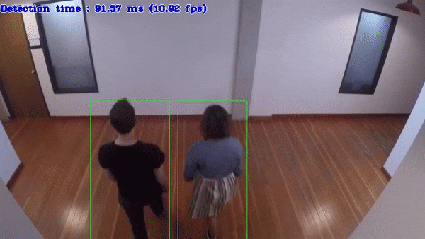

# Crossroad Camera C++ Demo



This demo provides an inference pipeline for person detection, recognition and reidentification. The demo uses a Person Detection network followed by the Person Attributes Recognition and Person Reidentification Retail networks applied on top of the detection results. You can use a set of the following pre-trained models with the demo:

* `person-vehicle-bike-detection-crossroad-0078`, which is a primary detection network for finding the persons (and other objects if needed)
* `person-attributes-recognition-crossroad-0230`, which is executed on top of the results from the first network and
reports person attributes like gender, has hat, has long-sleeved clothes
* `person-reidentification-retail-0277`, which is executed on top of the results from the first network and prints
a vector of features for each detected person. This vector is used to conclude if it is already detected person or not.

For more information about the pre-trained models, refer to the [model documentation](../../../models/intel/index.md).

Other demo objectives are:

* Images/Video/Camera as inputs, via OpenCV\*
* Example of simple networks pipelining: Person Attributes and Person Reidentification networks are executed on top of
the Person Detection results
* Visualization of Person Attributes and Person Reidentification (REID) information for each detected person

## How It Works

On startup, the application reads command line parameters and loads the specified networks. The Person Detection
network is required, and the other two are optional.

Upon getting a frame from the OpenCV VideoCapture, the application performs inference of Person Detection network, then performs another
two inferences of Person Attributes Recognition and Person Reidentification Retail networks if they were specified in the
command line, and displays the results.

If the Person Reidentification Retail network is specified, the resulting vector is generated for each detected person. This vector is
compared one-by-one with all previously detected persons vectors using cosine similarity algorithm. If comparison result
is greater than the specified (or default) threshold value, it is concluded that the person was already detected and a known
REID value is assigned. Otherwise, the vector is added to a global list, and new REID value is assigned.

> **NOTE**: By default, Open Model Zoo demos expect input with BGR channels order. If you trained your model to work with RGB order, you need to manually rearrange the default channels order in the demo application or reconvert your model using the Model Optimizer tool with the `--reverse_input_channels` argument specified. For more information about the argument, refer to **When to Reverse Input Channels** section of [Embedding Preprocessing Computation](@ref openvino_docs_MO_DG_Additional_Optimization_Use_Cases).

## Preparing to Run

For demo input image or video files, refer to the section **Media Files Available for Demos** in the [Open Model Zoo Demos Overview](../../README.md).
The list of models supported by the demo is in `<omz_dir>/demos/crossroad_camera_demo/cpp/models.lst` file.
This file can be used as a parameter for [Model Downloader](../../../tools/model_tools/README.md) and Converter to download and, if necessary, convert models to OpenVINO IR format (\*.xml + \*.bin).

An example of using the Model Downloader:

```sh
omz_downloader --list models.lst
```

An example of using the Model Converter:

```sh
omz_converter --list models.lst
```

### Supported Models

* person-attributes-recognition-crossroad-0230
* person-attributes-recognition-crossroad-0234
* person-attributes-recognition-crossroad-0238
* person-reidentification-retail-0277
* person-reidentification-retail-0286
* person-reidentification-retail-0287
* person-reidentification-retail-0288
* person-vehicle-bike-detection-crossroad-0078
* person-vehicle-bike-detection-crossroad-1016

> **NOTE**: Refer to the tables [Intel's Pre-Trained Models Device Support](../../../models/intel/device_support.md) and [Public Pre-Trained Models Device Support](../../../models/public/device_support.md) for the details on models inference support at different devices.

## Running

Running the application with the `-h` option yields the following usage message:

```
    [ -h]                                         show the help message and exit
    [--help]                                           print help on all arguments
      -m <MODEL FILE>                             path to the Person/Vehicle/Bike Detection Crossroad model (.xml) file
    [ -i <INPUT>]                                 an input to process. The input must be a single image, a folder of images, video file or camera id. Default is 0
    [--auto_resize]                               enables resizable input with support of ROI crop & auto resize
    [ -d <DEVICE>]                                specify a device to infer on (the list of available devices is shown below). Use '-d HETERO:<comma-separated_devices_list>' format to specify HETERO plugin. Use '-d MULTI:<comma-separated_devices_list>' format to specify MULTI plugin. Default is CPU
    [--dpa <DEVICE>]                              specify the target device for Person Attributes Recognition. Use '-d HETERO:<comma-separated_devices_list>' format to specify HETERO plugin. Default is CPU
    [--dpr <DEVICE>]                              specify the target device for Person Reidentification Retail. Use '-d HETERO:<comma-separated_devices_list>' format to specify HETERO plugin. Default is CPU
    [--lim <NUMBER>]                              number of frames to store in output. If 0 is set, all frames are stored. Default is 1000
    [--loop]                                      enable reading the input in a loop
    [--mpa <MODEL FILE>]                          path to the Person Attributes Recognition Crossroad model (.xml) file
    [--mpr <MODEL FILE>]                          path to the Person Reidentification Retail model (.xml) file
    [ -o <OUTPUT>]                                name of the output file(s) to save
    [--person_label <NUMBER>]                     the integer index of the objects' category corresponding to persons (as it is returned from the detection network, may vary from one network to another). Default is 1
    [ -r]                                         output inference results as raw values
    [--show] ([--noshow])                         (don't) show output
    [ -t <NUMBER>]                                probability threshold for detections. Default is 0.5
    [--tpr <NUMBER>]                              cosine similarity threshold between two vectors for person reidentification. Default is 0.7
    [ -u <MONITORS>]                                resource utilization graphs. c - average CPU load, d - load distribution over cores, m - memory usage, h - hide
    Key bindings:
        Q, q, Esc - Quit
        P, p, 0, spacebar - Pause
        C - average CPU load, D - load distribution over cores, M - memory usage, H - hide

```

Running the application with an empty list of options yields the usage message given above and an error message.

For example, to do inference on a GPU with the OpenVINO&trade; toolkit pre-trained models, run the following command:

```sh
./crossroad_camera_demo -i <path_to_video>/inputVideo.mp4 -m <path_to_model>/person-vehicle-bike-detection-crossroad-0078.xml --mpa <path_to_model>/person-attributes-recognition-crossroad-0230.xml --mpr <path_to_model>/person-reidentification-retail-0079.xml -d GPU
```

> **NOTE**: The detection network returns as the result a set of detected objects, where each detected object consists of a bounding box and an index of the object's category (person/vehicle/bike). The demo runs Person Attributes Recognition and Person Reidentification networks only for the bounding boxes that have the category "person".
> Since different detection networks may have different category index corresponding to the category "person", this index may be pointed by the command line parameter `-person_label`.
> Please, note that
> * the model `person-vehicle-bike-detection-crossroad-0078` returns for persons the category index 1, it is the default value for the demo
> * the model `person-vehicle-bike-detection-crossroad-1016` returns for persons the category index 2, so for the demo to work correctly, the command line parameter `-person_label 2` should be added.

>**NOTE**: If you provide a single image as an input, the demo processes and renders it quickly, then exits. To continuously visualize inference results on the screen, apply the `loop` option, which enforces processing a single image in a loop.

You can save processed results to a Motion JPEG AVI file or separate JPEG or PNG files using the `-o` option:

* To save processed results in an AVI file, specify the name of the output file with `avi` extension, for example: `-o output.avi`.
* To save processed results as images, specify the template name of the output image file with `jpg` or `png` extension, for example: `-o output_%03d.jpg`. The actual file names are constructed from the template at runtime by replacing regular expression `%03d` with the frame number, resulting in the following: `output_000.jpg`, `output_001.jpg`, and so on.
To avoid disk space overrun in case of continuous input stream, like camera, you can limit the amount of data stored in the output file(s) with the `lim` option. The default value is 1000. To change it, you can apply the `--lim N` option, where `N` is the number of frames to store.

>**NOTE**: Windows\* systems may not have the Motion JPEG codec installed by default. If this is the case, you can download OpenCV FFMPEG back end using the PowerShell script provided with the OpenVINO &trade; install package and located at `<INSTALL_DIR>/opencv/ffmpeg-download.ps1`. The script should be run with administrative privileges if OpenVINO &trade; is installed in a system protected folder (this is a typical case). Alternatively, you can save results as images.

## Demo Output

The demo uses OpenCV to display the resulting frame with detections rendered as bounding boxes and text.
In the default mode, during the demo's run it reports **Person Detection time** - inference time for the Person/Vehicle/Bike Detection network.

If Person Attributes Recognition or Person Reidentification Retail are enabled, the additional info below is reported also:

* **Person Attributes Recognition time** - Inference time of Person Attributes Recognition averaged by the number of detected persons.
* **Person Reidentification time** - Inference time of Person Reidentification averaged by the number of detected persons.

On completion the demo reports:

* **FPS**: average rate of video frame processing (frames per second).
* **Latency**: average time required to process one frame (from reading the frame to displaying the results).

You can use these metrics to measure application-level performance.

## See Also

* [Open Model Zoo Demos](../../README.md)
* [Model Optimizer](https://docs.openvino.ai/latest/openvino_docs_MO_DG_Deep_Learning_Model_Optimizer_DevGuide.html)
* [Model Downloader](../../../tools/model_tools/README.md)
