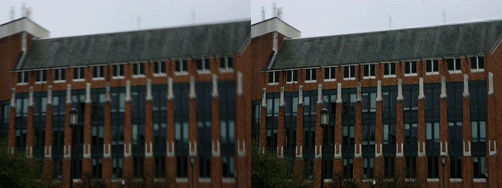

# Image Deblurring Python\* Demo



This topic demonstrates how to run the Image Deblurring demo application, which does inference using deblurring networks.

## How It Works

Upon the start-up the demo application reads command line parameters and loads a network. The demo runs inference and shows results for each image captured from an input. Depending on number of inference requests processing simultaneously (-nireq parameter) the pipeline might minimize the time required to process each single image (for nireq 1) or maximize utilization of the device and overall processing performance.

For each image demo performs the following steps:

1. Do preprocessing consisting of normalization and padding to input shape of model.
2. Inference of model (user is able to set the inference options to influence the execution process).
3. Do postprocessing for output of model.
4. Display the resulting image together with source image.

> **NOTE**: By default, Open Model Zoo demos expect input with BGR channels order. If you trained your model to work with RGB order, you need to manually rearrange the default channels order in the demo application or reconvert your model using the Model Optimizer tool with `--reverse_input_channels` argument specified. For more information about the argument, refer to **When to Reverse Input Channels** section of [Converting a Model Using General Conversion Parameters](https://docs.openvinotoolkit.org/latest/_docs_MO_DG_prepare_model_convert_model_Converting_Model_General.html).

## Preparing to Run

For demo input image or video files you may refer to [Media Files Available for Demos](../../README.md#Media-Files-Available-for-Demos).
The list of models supported by the demo is in <omz_dir>/demos/deblurring_demo/python/models.lst file.
This file can be used as a parameter for [Model Downloader](../../../tools/downloader/README.md) and Converter to download and, if necessary, convert models to OpenVINO Inference Engine format (\*.xml + \*.bin).

### Supported Models

* deblurgan-v2

> **NOTE**: Refer to the tables [Intel's Pre-Trained Models Device Support](../../../models/intel/device_support.md) and [Public Pre-Trained Models Device Support](../../../models/public/device_support.md) for the details on models inference support at different devices.

## Running

Running the application with the `-h` option yields the following usage message:

```
usage: deblurring_demo.py [-h] -m MODEL -i INPUT [-d DEVICE]
                          [-nireq NUM_INFER_REQUESTS] [-nstreams NUM_STREAMS]
                          [-nthreads NUM_THREADS] [--loop] [-o OUTPUT]
                          [-limit OUTPUT_LIMIT] [--no_show]
                          [-u UTILIZATION_MONITORS]

Options:
  -h, --help            Show this help message and exit.
  -m MODEL, --model MODEL
                        Required. Path to an .xml file with a trained model.
  -i INPUT, --input INPUT
                        Required. An input to process. The input must be a
                        single image, a folder of images or anything that
                        cv2.VideoCapture can process.
  -d DEVICE, --device DEVICE
                        Optional. Specify the target device to infer on; CPU,
                        GPU, FPGA, HDDL or MYRIAD is acceptable. The demo will
                        look for a suitable plugin for device specified.
                        Default value is CPU.

Inference options:
  -nireq NUM_INFER_REQUESTS, --num_infer_requests NUM_INFER_REQUESTS
                        Optional. Number of infer requests
  -nstreams NUM_STREAMS, --num_streams NUM_STREAMS
                        Optional. Number of streams to use for inference on
                        the CPU or/and GPU in throughput mode (for HETERO and
                        MULTI device cases use format
                        <device1>:<nstreams1>,<device2>:<nstreams2> or just
                        <nstreams>).
  -nthreads NUM_THREADS, --num_threads NUM_THREADS
                        Optional. Number of threads to use for inference on
                        CPU (including HETERO cases).

Input/output options:
  --loop                Optional. Enable reading the input in a loop.
  -o OUTPUT, --output OUTPUT
                        Optional. Name of output to save.
  -limit OUTPUT_LIMIT, --output_limit OUTPUT_LIMIT
                        Optional. Number of frames to store in output. If 0 is
                        set, all frames are stored.
  --no_show             Optional. Don't show output.
  -u UTILIZATION_MONITORS, --utilization_monitors UTILIZATION_MONITORS
                        Optional. List of monitors to show initially.
```

Running the application with the empty list of options yields the usage message given above and an error message.

You can use the following command to do inference on CPU on images captured by a camera using a pre-trained deblurgan-v2 network:

```sh
    python3 deblurring_demo.py -i 0 -d CPU -m <path_to_model>/deblurgan-v2.xml
```

## Demo Output

The demo uses OpenCV to display the resulting images together with source images.

## See Also

* [Open Model Zoo Demos](../../README.md)
* [Model Optimizer](https://docs.openvinotoolkit.org/latest/_docs_MO_DG_Deep_Learning_Model_Optimizer_DevGuide.html)
* [Model Downloader](../../../tools/downloader/README.md)
