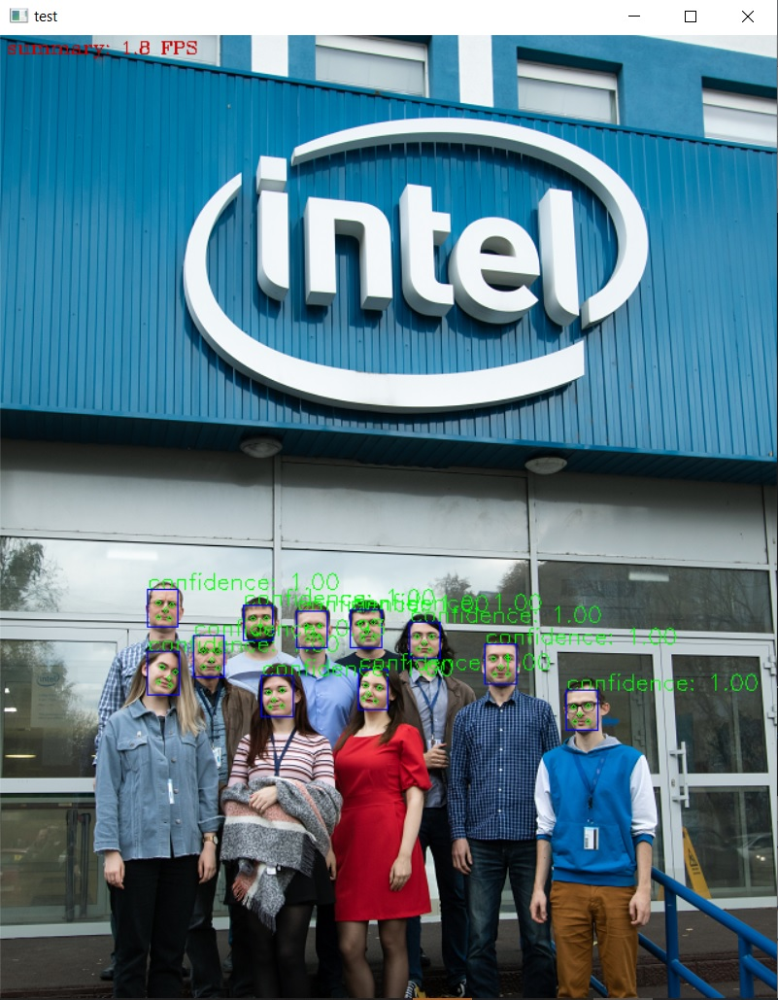

# Face Detection MTCNN Python* Demo

This demo demonstrates how to run `mtcnn` model using OpenVINO&trade;.

## How It Works

On startup, the application reads command line parameters and loads the specified networks.
Upon getting a frame from the OpenCV VideoCapture, the application performs inference of Face Detection network and displays the face position and feature points.

> **NOTE**: By default, Open Model Zoo demos expect input with BGR channels order. If you trained your model to work with RGB order, you need to manually rearrange the default channels order in the demo application or reconvert your model using the Model Optimizer tool with the `--reverse_input_channels` argument specified. For more information about the argument, refer to **When to Reverse Input Channels** section of [Converting a Model Using General Conversion Parameters](https://docs.openvinotoolkit.org/latest/_docs_MO_DG_prepare_model_convert_model_Converting_Model_General.html).

## Preparing to Run

For demo input image or video files you may refer to [Media Files Available for Demos](../../README.md#Media-Files-Available-for-Demos).
The list of models supported by the demo is in `<omz_dir>/demos/face_detection_mtcnn_demo/python/models.lst` file.
This file can be used as a parameter for [Model Downloader](../../../tools/downloader/README.md) and Converter to download and, if necessary, convert models to OpenVINO Inference Engine format (\*.xml + \*.bin).

An example of using the Model Downloader:

```sh
python3 <omz_dir>/tools/downloader/downloader.py --list models.lst
```

An example of using the Model Converter:

```sh
python3 <omz_dir>/tools/downloader/converter.py --list models.lst
```

### Supported Models

* mtcnn-o
* mtcnn-p
* mtcnn-r

> **NOTE**: Refer to the tables [Intel's Pre-Trained Models Device Support](../../../models/intel/device_support.md) and [Public Pre-Trained Models Device Support](../../../models/public/device_support.md) for the details on models inference support at different devices.

## Running

Run the application with the `-h` option to see available command-line parameters:

```
usage: face_detection_mtcnn_demo.py [-h] -i INPUT -m_p "<path>" -m_r "<path>"
                                    -m_o "<path>" [-th "<num>"]
                                    [-d "<device>"] [--loop] [--no_show]
                                    [-o OUTPUT] [-limit OUTPUT_LIMIT]
                                    [-u UTILIZATION_MONITORS]

Options:
  -h, --help            Show this help message and exit.
  -i INPUT, --input INPUT
                        Required. Path to a test image file.
  -m_p "<path>", --model_pnet "<path>"
                        Required. Path to an .xml file with a pnet model.
  -m_r "<path>", --model_rnet "<path>"
                        Required. Path to an .xml file with a rnet model.
  -m_o "<path>", --model_onet "<path>"
                        Required. Path to an .xml file with a onet model.
  -th "<num>", --threshold "<num>"
                        Optional. The threshold to define the face is
                        recognized or not.
  -d "<device>", --device "<device>"
                        Optional. Specify the target device to infer on; CPU,
                        GPU, HDDL, MYRIAD or HETERO is acceptable. The
                        demo will look for a suitable plugin for device
                        specified. Default value is CPU
  --loop                Optional. Enable reading the input in a loop.
  --no_show             Optional. Don't show output
  -o OUTPUT, --output OUTPUT
                        Optional. Name of the output file(s) to save.
  -limit OUTPUT_LIMIT, --output_limit OUTPUT_LIMIT
                        Optional. Number of frames to store in output. If 0 is
                        set, all frames are stored.
  -u UTILIZATION_MONITORS, --utilization_monitors UTILIZATION_MONITORS
                        Optional. List of monitors to show initially.
```

Running the application with an empty list of options yields the short version of the usage message and an error message.

To run the demo, please provide paths to the model in the IR format, and to an input video or image(s):

```bash
python face_detection_mtcnn_demo.py \
    -i /home/user/image_name.jpg \
    -m_p <path_to_model>/mtcnn-p.xml \
    -m_o <path_to_model>/mtcnn-o.xml \
    -m_r <path_to_model>/mtcnn-r.xml \
    -th 0.7
```

>**NOTE**: If you provide a single image as an input, the demo processes and renders it quickly, then exits. To continuously visualize inference results on the screen, apply the `loop` option, which enforces processing a single image in a loop.

You can save processed results to a Motion JPEG AVI file or separate JPEG or PNG files using the `-o` option:

* To save processed results in an AVI file, specify the name of the output file with `avi` extension, for example: `-o output.avi`.
* To save processed results as images, specify the template name of the output image file with `jpg` or `png` extension, for example: `-o output_%03d.jpg`. The actual file names are constructed from the template at runtime by replacing regular expression `%03d` with the frame number, resulting in the following: `output_000.jpg`, `output_001.jpg`, and so on.
To avoid disk space overrun in case of continuous input stream, like camera, you can limit the amount of data stored in the output file(s) with the `limit` option. The default value is 1000. To change it, you can apply the `-limit N` option, where `N` is the number of frames to store.

>**NOTE**: Windows\* systems may not have the Motion JPEG codec installed by default. If this is the case, you can download OpenCV FFMPEG back end using the PowerShell script provided with the OpenVINO &trade; install package and located at `<INSTALL_DIR>/opencv/ffmpeg-download.ps1`. The script should be run with administrative privileges if OpenVINO &trade; is installed in a system protected folder (this is a typical case). Alternatively, you can save results as images.

## Demo Output

The application uses OpenCV to display found faces' boundary, feature points and current inference performance.



## See Also

* [Open Model Zoo Demos](../../README.md)
* [Model Optimizer](https://docs.openvinotoolkit.org/latest/_docs_MO_DG_Deep_Learning_Model_Optimizer_DevGuide.html)
* [Model Downloader](../../../tools/downloader/README.md)
