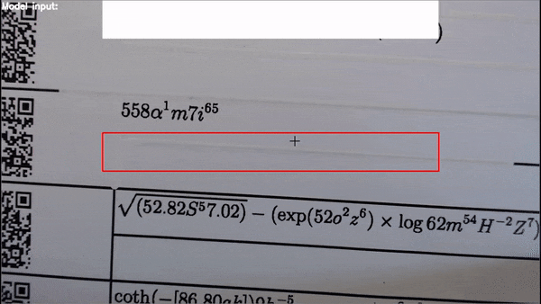
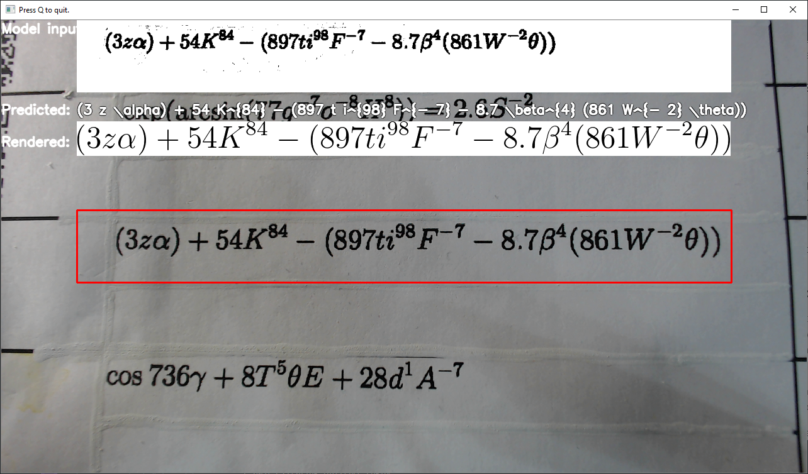
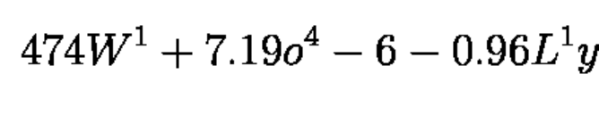

# Formula Recognition Python\* Demo



This demo shows how to run LaTeX formula recognition models. These models allow to get a LaTeX formula markup from the image.

> **NOTE**: Only batch size of 1 is supported.

## How It Works

The demo application expects a formula recognition model that is split into two parts. Every model part must be in the Intermediate Representation (IR) format.

The First model is Encoder which extracts features from an image and prepares first steps of the decoder.

* One input is `imgs` for input image
* Four outputs are:
    * Row encoding out (`row_enc_out`) extracts features from the image
    * `hidden` and
    * `context` are intermediate states of the LSTM
    * `init_0` - first state of the encoder

Second model is Decoder that takes as input:

* `row_enc_out` - extracted images features from the encoder
* Decoding state context (`dec_st_c`) and
* Decoding state hidden (`dec_st_h`) - current states of the LSTM
* `output_prev` - previous output of the Decode Step (for the first time it is `init_0` of the encoder)
* Target (`tgt`) - previous token (for the first time it is `START_TOKEN` )
Second model is being executed until current decoded token is `END_TOKEN` or length of the formula is less then `--max_formula_len` producing one token per each decode step.

The demo application takes an input with the help of the `-i` argument. This could be:

* Path to a single image
* Path to a folder with images
> In this Case non-interactive mode would be triggered. This means that demo will run the model over the input image(s) and will try to predict the formula. The output would be stored in the console or in the output file (if specified)
* Integer identifier of the device (e.g. webcam), typically 0.
* Path to a video (.avi, .mp4, etc)
> This will trigger interactive mode, which would be explained in detail later.

Vocabulary files are provided under corresponding model configuration directory.

### Non-interactive mode

Non-interactive mode assumes that demo processes inputs sequentially.
The demo workflow in non-interactive mode is the following:

1. The demo application reads a single image or iterates over all images in the given folder, then crops or resizes and inputs to fit into the input image blob of the network (`imgs`). Crop and pad is used to keep size of the font.
2. For each image, encoder extracts features from the image
3. While length of the current formula is less then `--max_formula_len` or current token is not `END_TOKEN` Decode Step produces new tokens.
4. The demo prints the decoded text to a file if `-o` parameter specified or into the console and (optionally) renders predicted formula into image.

#### Rendering of the LaTeX formula into image

User has an option to render the LaTeX formula predicted by the demo application into an image.
Regardless of what mode is selected (interactive or non-interactive) the process of the rendering of the formula is the same.

##### Requirements for rendering

Sympy package needs LaTeX system installed in the operating system.
For Windows you can use [MiKTeX\*](https://miktex.org/) (just download and install it), for Ubuntu/MacOS you can use TeX Live\*:
Ubuntu:
`apt-get update && apt-get install texlive`
MacOS:
`brew install texlive`

If you face the `RuntimeError: dvipng is not installed` error, you need to install this library. For Linux, you can do it via
`apt-get update && apt-get install dvipng`.
You might also face the missing `standalone.cls` file problem, which could be fixed with the installation of `texlive-latex-extra` package. For Linux, it can be done using this command:
`apt-get install texlive-latex-extra`.

> Note: Other LaTeX systems should also work.

### Interactive mode

The example of the interface:

When User runs demo application with the `-i` option and passes video or number of the webcam device as an argument (typically 0), window with the image similar to above should pop up.

Example of usage of the interactive mode:

```sh
python formula_recognition_demo.py <required args> -i 0
```

or

```sh
python formula_recognition_demo.py <required args> -i input_video.mp4
```

The window has four main sections:

1. A red rectangle is placed on the center of this window. This is input "target", with the help of which User, moving the camera, can capture formula.
2. Image from the input target will be binarized, preprocessed and fed to the network. Preprocessed and binarized image is placed on the top of the window (near `Model input` label)
3. If the formula will be predicted with sufficient confidence score, it will be placed right under preprocessed image (near `Predicted` label)
4. If rendering is available (see the previous Paragraph for details) and predicted formula does not contain LaTeX grammar errors, it will be rendered and placed near `Rendered` label.

Navigation keys:

* Use `q` button to quit the program
* Use `o` to decrease the size of the input (red) window
* Use `p` to increase the size of the input window

The overall process is similar to the Non-interactive mode with the exception that it runs asynchronously.
This means model inference and rendering of the formula do not block main thread, so the image from the web camera can move smoothly.

> **NOTE**: By default, Open Model Zoo demos expect input with BGR channels order. If you trained your model to work with RGB order, you need to manually rearrange the default channels order in the demo application or reconvert your model using the Model Optimizer tool with the `--reverse_input_channels` argument specified. For more information about the argument, refer to **When to Reverse Input Channels** section of [Embedding Preprocessing Computation](@ref openvino_docs_MO_DG_Additional_Optimization_Use_Cases).

The demo has two preprocessing types: Crop and Pad to target shape and Resize and pad to target shape. Two preprocessing types are used for two different datasets as model trained with concrete font size, so if one wants to run the model on inputs with bigger font size (e.g. if input is photographed in 12Mpx, while model trained to imitate scans in ~3Mpx) they should first resize the input to make font size like in train set. Example of the target font size:


## Preparing to Run

The list of models supported by the demo is in `<omz_dir>/demos/formula_recognition_demo/python/models.lst` file. This file can be used as a parameter for [Model Downloader](../../../tools/model_tools/README.md) and Converter to download and, if necessary, convert models to OpenVINO IR format (\*.xml + \*.bin).

An example of using the Model Downloader:

```sh
omz_downloader --list models.lst
```

An example of using the Model Converter:

```sh
omz_converter --list models.lst
```

### Supported Models

* formula-recognition-medium-scan-0001-im2latex-decoder
* formula-recognition-medium-scan-0001-im2latex-encoder
* formula-recognition-polynomials-handwritten-0001-decoder
* formula-recognition-polynomials-handwritten-0001-encoder

> **NOTE**: Refer to the tables [Intel's Pre-Trained Models Device Support](../../../models/intel/device_support.md) and [Public Pre-Trained Models Device Support](../../../models/public/device_support.md) for the details on models inference support at different devices.

## Running

Run the application with the `-h` option to see the following usage message:

```
usage: formula_recognition_demo.py [-h] -m_encoder M_ENCODER -m_decoder M_DECODER -i INPUT [-no_show] [-o OUTPUT_FILE] -v VOCAB_PATH [--max_formula_len MAX_FORMULA_LEN] [-t CONF_THRESH] [-d DEVICE] [--resolution RESOLUTION RESOLUTION]
                                   [--preprocessing_type {crop,resize}] [--imgs_layer IMGS_LAYER] [--row_enc_out_layer ROW_ENC_OUT_LAYER] [--hidden_layer HIDDEN_LAYER] [--context_layer CONTEXT_LAYER] [--init_0_layer INIT_0_LAYER]
                                   [--dec_st_c_layer DEC_ST_C_LAYER] [--dec_st_h_layer DEC_ST_H_LAYER] [--dec_st_c_t_layer DEC_ST_C_T_LAYER] [--dec_st_h_t_layer DEC_ST_H_T_LAYER] [--output_layer OUTPUT_LAYER]
                                   [--output_prev_layer OUTPUT_PREV_LAYER] [--logit_layer LOGIT_LAYER] [--tgt_layer TGT_LAYER]

Options:
  -h, --help            Show this help message and exit.
  -m_encoder M_ENCODER  Required. Path to an .xml file with a trained encoder part of the model
  -m_decoder M_DECODER  Required. Path to an .xml file with a trained decoder part of the model
  -i INPUT, --input INPUT
                        Required. Path to a folder with images, path to an image files, integer identifier of the camera or path to the video. See README.md for details.
  -no_show, --no_show   Optional. Suppress pop-up window with rendered formula.
  -o OUTPUT_FILE, --output_file OUTPUT_FILE
                        Optional. Path to file where to store output. If not mentioned, result will be stored in the console.
  -v VOCAB_PATH, --vocab_path VOCAB_PATH
                        Required. Path to vocab file to construct meaningful phrase
  --max_formula_len MAX_FORMULA_LEN
                        Optional. Defines maximum length of the formula (number of tokens to decode)
  -t CONF_THRESH, --conf_thresh CONF_THRESH
                        Optional. Probability threshold to treat model prediction as meaningful
  -d DEVICE, --device DEVICE
                        Optional. Specify a device to infer on (the list of available devices is shown below). Use '-d HETERO:<comma-separated_devices_list>' format to specify HETERO plugin. Use '-d MULTI:<comma-separated_devices_list>'
                        format to specify MULTI plugin. Default is CPU
  --resolution RESOLUTION RESOLUTION
                        Optional. Resolution of the demo application window. Default: 1280 720
  --preprocessing_type {crop,resize}
                        Optional. Type of the preprocessing
  --imgs_layer IMGS_LAYER
                        Optional. Encoder input name for images. See README for details.
  --row_enc_out_layer ROW_ENC_OUT_LAYER
                        Optional. Encoder output key for row_enc_out. See README for details.
  --hidden_layer HIDDEN_LAYER
                        Optional. Encoder output key for hidden. See README for details.
  --context_layer CONTEXT_LAYER
                        Optional. Encoder output key for context. See README for details.
  --init_0_layer INIT_0_LAYER
                        Optional. Encoder output key for init_0. See README for details.
  --dec_st_c_layer DEC_ST_C_LAYER
                        Optional. Decoder input key for dec_st_c. See README for details.
  --dec_st_h_layer DEC_ST_H_LAYER
                        Optional. Decoder input key for dec_st_h. See README for details.
  --dec_st_c_t_layer DEC_ST_C_T_LAYER
                        Optional. Decoder output key for dec_st_c_t. See README for details.
  --dec_st_h_t_layer DEC_ST_H_T_LAYER
                        Optional. Decoder output key for dec_st_h_t. See README for details.
  --output_layer OUTPUT_LAYER
                        Optional. Decoder output key for output. See README for details.
  --output_prev_layer OUTPUT_PREV_LAYER
                        Optional. Decoder input key for output_prev. See README for details.
  --logit_layer LOGIT_LAYER
                        Optional. Decoder output key for logit. See README for details.
  --tgt_layer TGT_LAYER
                        Optional. Decoder input key for tgt. See README for details.
```

Running the application with an empty list of options yields the short version of the usage message and an error message.

For example, to do inference with pre-trained `formula-recognition-medium-scan-0001` models, run the following command:

```bash
python formula_recognition_demo.py \
    -i sample.png \
    -m_encoder <path_to_models>/formula-recognition-medium-scan-0001-im2latex-encoder.xml \
    -m_decoder <path_to_models>/formula-recognition-medium-scan-0001-im2latex-decoder.xml \
    --vocab_path <models_dir>/models/intel/formula-recognition-medium-scan-0001/formula-recognition-medium-scan-0001-im2latex-decoder/vocab.json \
    --preprocessing resize
```

To run the demo with `formula-recognition-polynomials-handwritten-0001` models use command like:
```bash
python formula_recognition_demo.py \
    -i sample2.png \
    -m_encoder <path_to_models>/formula-recognition-polynomials-handwritten-0001-encoder.xml \
    -m_decoder <path_to_models>/formula-recognition-polynomials-handwritten-0001-decoder.xml \
    --vocab_path <models_dir>/models/intel/formula-recognition-polynomials-handwritten-0001/formula-recognition-polynomials-handwritten-0001-decoder/vocab.json \
    --preprocessing crop
```

## Demo Output

The application outputs recognized formula into the console or into the file.

## See Also

* [Open Model Zoo Demos](../../README.md)
* [Model Optimizer](https://docs.openvino.ai/2023.0/openvino_docs_MO_DG_Deep_Learning_Model_Optimizer_DevGuide.html)
* [Model Downloader](../../../tools/model_tools/README.md)
