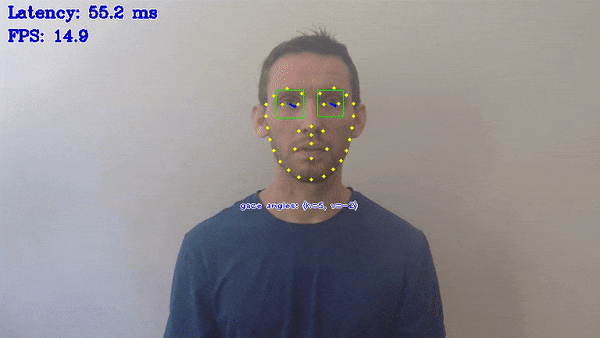

# Gaze Estimation Demo



This demo showcases the work of gaze estimation model.

The demo also relies on the following auxiliary networks:

* `face-detection-retail-0004` or `face-detection-adas-0001` detection networks for finding faces
* `head-pose-estimation-adas-0001`, which estimates head pose in Tait-Bryan angles, serving as an input for gaze estimation model
* `facial-landmarks-35-adas-0002` or `facial-landmarks-98-detection-0001`, which estimates coordinates of facial landmarks for detected faces. The keypoints at the corners of eyes are used to locate eyes regions required for the gaze estimation model
* `open-closed-eye-0001`, which estimates eyes state of detected faces.

Other demo objectives are:

* Video/Camera as inputs, via OpenCV*
* Visualization of gaze estimation results, and, optionally, results of inference on auxiliary models

## How It Works

1. The application reads command-line parameters and loads four models to OpenVINO™ Runtime plugin
2. The application gets a frame from the OpenCV VideoCapture
3. The application performs inference on auxiliary models to obtain head pose angles and images of eyes regions serving as an input for gaze estimation model
4. The application performs inference on gaze estimation model using inference results of auxiliary models
5. The application shows the results

> **NOTE**: By default, Open Model Zoo demos expect input with BGR channels order. If you trained your model to work with RGB order, you need to manually rearrange the default channels order in the demo application or reconvert your model using the Model Optimizer tool with the `--reverse_input_channels` argument specified. For more information about the argument, refer to **When to Reverse Input Channels** section of [Embedding Preprocessing Computation](@ref openvino_docs_MO_DG_Additional_Optimization_Use_Cases).

## Preparing to Run

For demo input image or video files, refer to the section **Media Files Available for Demos** in the [Open Model Zoo Demos Overview](../../README.md).
The list of models supported by the demo is in `<omz_dir>/demos/gaze_estimation_demo/cpp/models.lst` file.
This file can be used as a parameter for [Model Downloader](../../../tools/model_tools/README.md) and Converter to download and, if necessary, convert models to OpenVINO IR format (\*.xml + \*.bin).

An example of using the Model Downloader:

```sh
omz_downloader --list models.lst
```

An example of using the Model Converter:

```sh
omz_converter --list models.lst
```

### Supported Models

* facial-landmarks-35-adas-0002
* facial-landmarks-98-detection-0001
* face-detection-adas-0001
* face-detection-retail-0004
* face-detection-retail-0005
* gaze-estimation-adas-0002
* head-pose-estimation-adas-0001
* open-closed-eye-0001

> **NOTE**: Refer to the tables [Intel's Pre-Trained Models Device Support](../../../models/intel/device_support.md) and [Public Pre-Trained Models Device Support](../../../models/public/device_support.md) for the details on models inference support at different devices.

## Running

Running the application with the `-h` option yields the following usage message:

```
gaze_estimation_demo [OPTION]
Options:

    -h                       Print a usage message.
    -i                       Required. An input to process. The input must be a single image, a folder of images, video file or camera id.
    -loop                    Optional. Enable reading the input in a loop.
    -o "<path>"              Optional. Name of the output file(s) to save. Frames of odd width or height can be truncated. See https://github.com/opencv/opencv/pull/24086
    -limit "<num>"           Optional. Number of frames to store in output. If 0 is set, all frames are stored.
    -res "<WxH>"             Optional. Set camera resolution in format WxH.
    -m "<path>"              Required. Path to an .xml file with a trained Gaze Estimation model.
    -m_fd "<path>"           Required. Path to an .xml file with a trained Face Detection model.
    -m_hp "<path>"           Required. Path to an .xml file with a trained Head Pose Estimation model.
    -m_lm "<path>"           Required. Path to an .xml file with a trained Facial Landmarks Estimation model.
    -m_es "<path>"           Required. Path to an .xml file with a trained Open/Closed Eye Estimation model.
    -d "<device>"            Optional. Target device for Gaze Estimation network (the list of available devices is shown below). Use "-d HETERO:<comma-separated_devices_list>" format to specify HETERO plugin. The demo will look for a suitable plugin for a specified device. Default value is "CPU".
    -d_fd "<device>"         Optional. Target device for Face Detection network (the list of available devices is shown below). Use "-d HETERO:<comma-separated_devices_list>" format to specify HETERO plugin. The demo will look for a suitable plugin for a specified device. Default value is "CPU".
    -d_hp "<device>"         Optional. Target device for Head Pose Estimation network (the list of available devices is shown below). Use "-d HETERO:<comma-separated_devices_list>" format to specify HETERO plugin. The demo will look for a suitable plugin for a specified device. Default value is "CPU".
    -d_lm "<device>"         Optional. Target device for Facial Landmarks Estimation network (the list of available devices is shown below). Use "-d HETERO:<comma-separated_devices_list>" format to specify HETERO plugin. The demo will look for a suitable plugin for a specified device. Default value is "CPU".
    -d_es "<device>"         Optional. Target device for Open/Closed Eye network (the list of available devices is shown below). Use "-d HETERO:<comma-separated_devices_list>" format to specify HETERO plugin. The demo will look for a suitable plugin for a specified device. Default value is "CPU".
    -fd_reshape              Optional. Reshape Face Detector network so that its input resolution has the same aspect ratio as the input frame.
    -no_show                 Optional. Don't show output.
    -r                       Optional. Output inference results as raw values.
    -t                       Optional. Probability threshold for Face Detector. The default value is 0.5.
    -u                       Optional. List of monitors to show initially.
```

Running the application with an empty list of options yields an error message.

For example, to do inference on a CPU, run the following command:

```sh
./gaze_estimation_demo \
  -d CPU \
  -i <path_to_video>/input_video.mp4 \
  -m <path_to_model>/gaze-estimation-adas-0002.xml \
  -m_fd <path_to_model>/face-detection-retail-0004.xml \
  -m_hp <path_to_model>/head-pose-estimation-adas-0001.xml \
  -m_lm <path_to_model>/facial-landmarks-35-adas-0002.xml \
  -m_es <path_to_model>/open-closed-eye-0001.xml
```

### Run-Time Control Keys

The demo allows you to control what information is displayed in run-time.
The following keys are supported:

* G - to toggle displaying gaze vector
* B - to toggle displaying face detector bounding boxes
* O - to toggle displaying head pose information
* L - to toggle displaying facial landmarks
* E - to toggle displaying eyes state
* A - to switch on displaying all inference results
* N - to switch off displaying all inference results
* F - to flip frames horizontally
* Esc - to quit the demo

>**NOTE**: If you provide a single image as an input, the demo processes and renders it quickly, then exits. To continuously visualize inference results on the screen, apply the `loop` option, which enforces processing a single image in a loop.

You can save processed results to a Motion JPEG AVI file or separate JPEG or PNG files using the `-o` option:

* To save processed results in an AVI file, specify the name of the output file with `avi` extension, for example: `-o output.avi`.
* To save processed results as images, specify the template name of the output image file with `jpg` or `png` extension, for example: `-o output_%03d.jpg`. The actual file names are constructed from the template at runtime by replacing regular expression `%03d` with the frame number, resulting in the following: `output_000.jpg`, `output_001.jpg`, and so on.
To avoid disk space overrun in case of continuous input stream, like camera, you can limit the amount of data stored in the output file(s) with the `limit` option. The default value is 1000. To change it, you can apply the `-limit N` option, where `N` is the number of frames to store.

>**NOTE**: Windows\* systems may not have the Motion JPEG codec installed by default. If this is the case, you can download OpenCV FFMPEG back end using the PowerShell script provided with the OpenVINO &trade; install package and located at `<INSTALL_DIR>/opencv/ffmpeg-download.ps1`. The script should be run with administrative privileges if OpenVINO &trade; is installed in a system protected folder (this is a typical case). Alternatively, you can save results as images.

## Demo Output

The demo uses OpenCV to display the resulting frame with marked gaze vectors, and, optionally, marked facial landmarks, head pose angles, and face bounding boxes.
By default, it shows only gaze estimation results. To see inference results of auxiliary networks, use run-time control keys.
The demo reports:

* **FPS**: average rate of video frame processing (frames per second).
* **Latency**: average time required to process one frame (from reading the frame to displaying the results).

You can use these metrics to measure application-level performance.

## See Also

* [Open Model Zoo Demos](../../README.md)
* [Model Optimizer](https://docs.openvino.ai/2023.0/openvino_docs_MO_DG_Deep_Learning_Model_Optimizer_DevGuide.html)
* [Model Downloader](../../../tools/model_tools/README.md)
