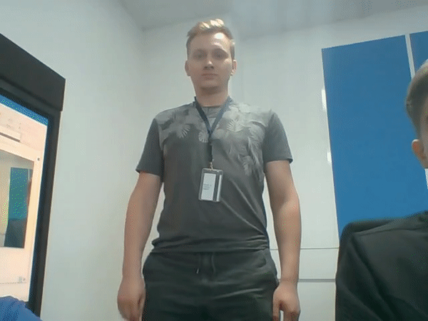

# Gesture Recognition Python\* Demo



This demo demonstrates how to run Gesture (e.g. American Sign Language (ASL) gestures) Recognition models using OpenVINO&trade; toolkit.

## How It Works

The demo application expects a gesture recognition model in the Intermediate Representation (IR) format.

As input, the demo application takes:

* a path to a video file or a device node of a webcam specified with a command line argument `--input`
* a path to a file in JSON format with gesture class names `--class_map`

The demo workflow is the following:

1. The demo application reads video frames one by one, runs person detector that extracts ROI, tracks the ROI of very first person. Additional process is used to prepare the batch of frames with constant framerate.
2. Batch of frames and extracted ROI are passed to artificial neural network that predicts the gesture.
3. The app visualizes results of its work as graphical window where following objects are shown:
    - Input frame with detected ROI.
    - Last recognized gesture.
    - Performance characteristics.

> **NOTE**: By default, Open Model Zoo demos expect input with BGR channels order. If you trained your model to work with RGB order, you need to manually rearrange the default channels order in the demo application or reconvert your model using the Model Optimizer tool with the `--reverse_input_channels` argument specified. For more information about the argument, refer to **When to Reverse Input Channels** section of [Embedding Preprocessing Computation](@ref openvino_docs_MO_DG_Additional_Optimization_Use_Cases).

## Preparing to Run

For demo input image or video files, refer to the section **Media Files Available for Demos** in the [Open Model Zoo Demos Overview](../../README.md).
The list of models supported by the demo is in `<omz_dir>/demos/gesture_recognition_demo/python/models.lst` file.
This file can be used as a parameter for [Model Downloader](../../../tools/model_tools/README.md) and Converter to download and, if necessary, convert models to OpenVINO IR format (\*.xml + \*.bin).

An example of using the Model Downloader:

```sh
omz_downloader --list models.lst
```

An example of using the Model Converter:

```sh
omz_converter --list models.lst
```

### Supported Models

* asl-recognition-0004
* common-sign-language-0001
* common-sign-language-0002
* person-detection-asl-0001

> **NOTE**: Refer to the tables [Intel's Pre-Trained Models Device Support](../../../models/intel/device_support.md) and [Public Pre-Trained Models Device Support](../../../models/public/device_support.md) for the details on models inference support at different devices.

## Running

Run the application with the `-h` option to see the following usage message:

```
usage: gesture_recognition_demo.py [-h] -m_a ACTION_MODEL -m_d DETECTION_MODEL -i INPUT [-o OUTPUT] [-limit OUTPUT_LIMIT] -c CLASS_MAP [-s SAMPLES_DIR] [-t ACTION_THRESHOLD] [-d DEVICE] [--no_show] [-u UTILIZATION_MONITORS]

Options:
  -h, --help            Show this help message and exit.
  -m_a ACTION_MODEL, --action_model ACTION_MODEL
                        Required. Path to an .xml file with a trained gesture recognition model.
  -m_d DETECTION_MODEL, --detection_model DETECTION_MODEL
                        Required. Path to an .xml file with a trained person detector model.
  -i INPUT, --input INPUT
                        Required. Path to a video file or a device node of a web-camera.
  -o OUTPUT, --output OUTPUT
                        Optional. Name of the output file(s) to save.
  -limit OUTPUT_LIMIT, --output_limit OUTPUT_LIMIT
                        Optional. Number of frames to store in output. If 0 is set, all frames are stored.
  -c CLASS_MAP, --class_map CLASS_MAP
                        Required. Path to a file with gesture classes.
  -s SAMPLES_DIR, --samples_dir SAMPLES_DIR
                        Optional. Path to a directory with video samples of gestures.
  -t ACTION_THRESHOLD, --action_threshold ACTION_THRESHOLD
                        Optional. Threshold for the predicted score of an action.
  -d DEVICE, --device DEVICE
                        Optional. Specify a device to infer on (the list of available devices is shown below). Use '-d HETERO:<comma-separated_devices_list>' format to specify HETERO plugin. Use '-d MULTI:<comma-separated_devices_list>'
                        format to specify MULTI plugin. Default is CPU
  --no_show             Optional. Do not visualize inference results.
  -u UTILIZATION_MONITORS, --utilization_monitors UTILIZATION_MONITORS
                        Optional. List of monitors to show initially.
```

Running the application with an empty list of options yields the short version of the usage message and an error message.

To run the demo, please provide paths to the gesture recognition and person detection models in the IR format, to a file with class names, and to an input video:

```bash
python gesture_recognition_demo.py \
    -m_a <path_to_model>/asl-recognition-0004.xml \
    -m_d <path_to_model>/person-detection-asl-0001.xml \
    -i 0 \
    -c <omz_dir>/data/dataset_classes/msasl100.json
```

The demo starts in person tracking mode and to switch it in the action recognition mode you should press `0-9` button with appropriate detection ID (the number in top-left of each bounding box). If frame contains only one person, they will be chosen automatically. After that you can switch back to tracking mode by pressing space button.

An example of file with class names can be found within the OMZ directory:

* MS-ASL-100: `<omz_dir>/data/dataset_classes/msasl100.json`
* Jester-27: `<omz_dir>/data/dataset_classes/jester27.json`
* Common-Sign-Language-12: `<omz_dir>/data/dataset_classes/common_sign_language12.json`

> **NOTE**: To run the demo application with video examples of gestures specify the `-s` key with valid path to the directory with video samples. The name of each video sample should be the valid name of gesture from `<omz_dir>/data/dataset_classes/msasl100.json` file. To navigate between samples use 'f' and 'b' keys for iterating next and previous video sample, respectively.

>**NOTE**: If you provide a single image as an input, the demo processes and renders it quickly, then exits. To continuously visualize inference results on the screen, apply the `loop` option, which enforces processing a single image in a loop.

You can save processed results to a Motion JPEG AVI file or separate JPEG or PNG files using the `-o` option:

* To save processed results in an AVI file, specify the name of the output file with `avi` extension, for example: `-o output.avi`.
* To save processed results as images, specify the template name of the output image file with `jpg` or `png` extension, for example: `-o output_%03d.jpg`. The actual file names are constructed from the template at runtime by replacing regular expression `%03d` with the frame number, resulting in the following: `output_000.jpg`, `output_001.jpg`, and so on.
To avoid disk space overrun in case of continuous input stream, like camera, you can limit the amount of data stored in the output file(s) with the `limit` option. The default value is 1000. To change it, you can apply the `-limit N` option, where `N` is the number of frames to store.

>**NOTE**: Windows\* systems may not have the Motion JPEG codec installed by default. If this is the case, you can download OpenCV FFMPEG back end using the PowerShell script provided with the OpenVINO &trade; install package and located at `<INSTALL_DIR>/opencv/ffmpeg-download.ps1`. The script should be run with administrative privileges if OpenVINO &trade; is installed in a system protected folder (this is a typical case). Alternatively, you can save results as images.

## Demo Output

The application uses OpenCV to display gesture recognition result.
The demo reports

* **FPS**: average rate of video frame processing (frames per second).
* **Latency**: average time required to process one frame (from reading the frame to displaying the results).
You can use both of these metrics to measure application-level performance.

## See Also

* [Open Model Zoo Demos](../../README.md)
* [Model Optimizer](https://docs.openvino.ai/2023.0/openvino_docs_MO_DG_Deep_Learning_Model_Optimizer_DevGuide.html)
* [Model Downloader](../../../tools/model_tools/README.md)
