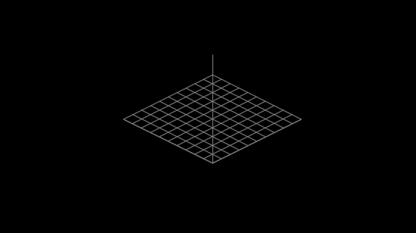

# 3D Human Pose Estimation Python\* Demo




This demo demonstrates how to run 3D Human Pose Estimation models using OpenVINO&trade;.

> **NOTE**: Only batch size of 1 is supported.

## How It Works

The demo application expects a 3D human pose estimation model in the Intermediate Representation (IR) format.

As input, the demo application can take:

* a path to a video file or a device node of a webcam.
* a list of image paths.

The demo workflow is the following:

1. The demo application reads video frames one by one and estimates 3D human poses in a given frame.
2. The app visualizes results of its work as graphical window with 2D poses, which are overlaid on input image, and canvas with corresponding 3D poses.

> **NOTE**: By default, Open Model Zoo demos expect input with BGR channels order. If you trained your model to work with RGB order, you need to manually rearrange the default channels order in the demo application or reconvert your model using the Model Optimizer tool with the `--reverse_input_channels` argument specified. For more information about the argument, refer to **When to Reverse Input Channels** section of [Converting a Model Using General Conversion Parameters](https://docs.openvinotoolkit.org/latest/_docs_MO_DG_prepare_model_convert_model_Converting_Model_General.html).

## Preparing to Run

For demo input image or video files you may refer to [Media Files Available for Demos](../../README.md#Media-Files-Available-for-Demos).
The list of models supported by the demo is in `<omz_dir>/demos/human_pose_estimation_3d_demo/python/models.lst` file.
This file can be used as a parameter for [Model Downloader](../../../tools/downloader/README.md) and Converter to download and, if necessary, convert models to OpenVINO Inference Engine format (\*.xml + \*.bin).

### Supported Models

* human-pose-estimation-3d-0001

> **NOTE**: Refer to the tables [Intel's Pre-Trained Models Device Support](../../../models/intel/device_support.md) and [Public Pre-Trained Models Device Support](../../../models/public/device_support.md) for the details on models inference support at different devices.

### Prerequisites

This demo application requires a native Python extension module to be built before you can run it.
Refer to [Open Model Zoo Demos](../../README.md) for instructions on how to build it and prepare the environment for running the demo.

## Running

Run the application with the `-h` option to see the following usage message:

```
usage: human_pose_estimation_3d_demo.py [-h] -m MODEL -i INPUT [--loop]
                                        [-o OUTPUT] [-limit OUTPUT_LIMIT]
                                        [-d DEVICE] [--height_size HEIGHT_SIZE]
                                        [--extrinsics_path EXTRINSICS_PATH]
                                        [--fx FX] [--no_show]
                                        [-u UTILIZATION_MONITORS]

Lightweight 3D human pose estimation demo. Press esc to exit, "p" to (un)pause
video or process next image.

Options:
  -h, --help            Show this help message and exit.
  -m MODEL, --model MODEL
                        Required. Path to an .xml file with a trained model.
  -i INPUT, --input INPUT
                        Required. An input to process. The input must be a single image,
                        a folder of images, video file or camera id.
  --loop                Optional. Enable reading the input in a loop.
  -o OUTPUT, --output OUTPUT
                        Optional. Name of output to save.
  -limit OUTPUT_LIMIT, --output_limit OUTPUT_LIMIT
                        Optional. Number of frames to store in output.
                        If 0 is set, all frames are stored.
  -d DEVICE, --device DEVICE
                        Optional. Specify the target device to infer on: CPU,
                        GPU, FPGA, HDDL or MYRIAD. The demo will look for a
                        suitable plugin for device specified (by default, it
                        is CPU).
  --height_size HEIGHT_SIZE
                        Optional. Network input layer height size.
  --extrinsics_path EXTRINSICS_PATH
                        Optional. Path to file with camera extrinsics.
  --fx FX               Optional. Camera focal length.
  --no_show             Optional. Do not display output.
  -u UTILIZATION_MONITORS, --utilization_monitors UTILIZATION_MONITORS
                        Optional. List of monitors to show initially.
```

Running the application with an empty list of options yields the short version of the usage message and an error message.

To run the demo, please provide paths to the model in the IR format, and to an input video or image(s):

```bash
python human_pose_estimation_3d_demo.py \
-m <path_to_model>/human-pose-estimation-3d-0001.xml \
-i <path_to_video>/video_name.mp4
```

## Demo Output

The application uses OpenCV to display found poses and current inference performance.

## See Also

* [Open Model Zoo Demos](../../README.md)
* [Model Optimizer](https://docs.openvinotoolkit.org/latest/_docs_MO_DG_Deep_Learning_Model_Optimizer_DevGuide.html)
* [Model Downloader](../../../tools/downloader/README.md)
