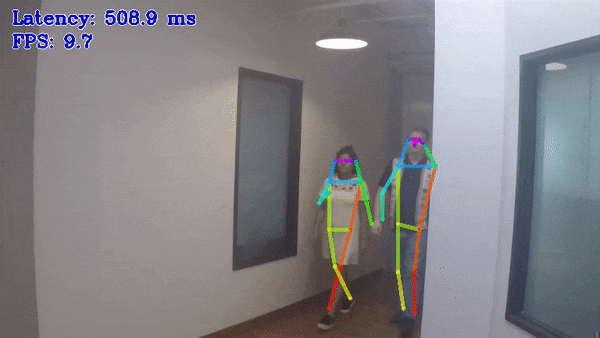

# Human Pose Estimation C++ Demo



This demo showcases the work of multi-person 2D pose estimation algorithm. The task is to predict a pose: body skeleton, which consists of keypoints and connections between them, for every person in an input video. The pose may contain up to 18 keypoints: *ears, eyes, nose, neck, shoulders, elbows, wrists, hips, knees*, and *ankles*. Some of potential use cases of the algorithm are action recognition and behavior understanding.

Other demo objectives are:

* Video/Camera as inputs, via OpenCV*
* Visualization of all estimated poses

## How It Works

On startup, the application reads command line parameters and loads human pose estimation model. Upon getting a frame from the OpenCV VideoCapture, input frame height is scaled to model height, frame width is scaled to preserve initial aspect ratio and padded to multiple of 8, then application executes human pose estimation algorithm and displays the results.

> **NOTE**: By default, Open Model Zoo demos expect input with BGR channels order. If you trained your model to work with RGB order, you need to manually rearrange the default channels order in the demo application or reconvert your model using the Model Optimizer tool with the `--reverse_input_channels` argument specified. For more information about the argument, refer to **When to Reverse Input Channels** section of [Embedding Preprocessing Computation](@ref openvino_docs_MO_DG_Additional_Optimization_Use_Cases).

## Preparing to Run

For demo input image or video files, refer to the section **Media Files Available for Demos** in the [Open Model Zoo Demos Overview](../../README.md).
The list of models supported by the demo is in `<omz_dir>/demos/human_pose_estimation_demo/cpp/models.lst` file.
This file can be used as a parameter for [Model Downloader](../../../tools/model_tools/README.md) and Converter to download and, if necessary, convert models to OpenVINO IR format (\*.xml + \*.bin).

An example of using the Model Downloader:

```sh
omz_downloader --list models.lst
```

An example of using the Model Converter:

```sh
omz_converter --list models.lst
```

### Supported Models

* architecture_type = openpose
    - human-pose-estimation-0001
* architecture_type = ae
    - human-pose-estimation-0005
    - human-pose-estimation-0006
    - human-pose-estimation-0007
* architecture_type = higherhrnet
    - higher-hrnet-w32-human-pose-estimation

> **NOTE**: Refer to the tables [Intel's Pre-Trained Models Device Support](../../../models/intel/device_support.md) and [Public Pre-Trained Models Device Support](../../../models/public/device_support.md) for the details on models inference support at different devices.

## Running

Running the demo with `-h` shows this help message:
```
human_pose_estimation_demo [OPTION]
Options:

    -h                        Print a usage message.
    -at "<type>"              Required. Type of the model, either 'ae' for Associative Embedding, 'higherhrnet' for HigherHRNet models based on ae or 'openpose' for OpenPose.
    -i                        Required. An input to process. The input must be a single image, a folder of images, video file or camera id.
    -m "<path>"               Required. Path to an .xml file with a trained model.
    -layout "<string>"        Optional. Specify inputs layouts. Ex. NCHW or input0:NCHW,input1:NC in case of more than one input.
    -o "<path>"               Optional. Name of the output file(s) to save. Frames of odd width or height can be truncated. See https://github.com/opencv/opencv/pull/24086
    -limit "<num>"            Optional. Number of frames to store in output. If 0 is set, all frames are stored.
    -tsize                    Optional. Target input size.
    -d "<device>"             Optional. Specify the target device to infer on (the list of available devices is shown below). Default value is CPU. Use "-d HETERO:<comma-separated_devices_list>" format to specify HETERO plugin. The demo will look for a suitable plugin for a specified device.
    -t                        Optional. Probability threshold for poses filtering.
    -nireq "<integer>"        Optional. Number of infer requests. If this option is omitted, number of infer requests is determined automatically.
    -nthreads "<integer>"     Optional. Number of threads.
    -nstreams                 Optional. Number of streams to use for inference on the CPU or/and GPU in throughput mode (for HETERO and MULTI device cases use format <device1>:<nstreams1>,<device2>:<nstreams2> or just <nstreams>)
    -loop                     Optional. Enable reading the input in a loop.
    -no_show                  Optional. Don't show output.
    -output_resolution        Optional. Specify the maximum output window resolution in (width x height) format. Example: 1280x720. Input frame size used by default.
    -u                        Optional. List of monitors to show initially.
```

For example, to do inference on a CPU, run the following command:

```sh
./human_pose_estimation_demo -i <path_to_video>/input_video.mp4 -m <path_to_model>/human-pose-estimation-0001.xml -d CPU -at openpose
```

>**NOTE**: If you provide a single image as an input, the demo processes and renders it quickly, then exits. To continuously visualize inference results on the screen, apply the `loop` option, which enforces processing a single image in a loop.

You can save processed results to a Motion JPEG AVI file or separate JPEG or PNG files using the `-o` option:

* To save processed results in an AVI file, specify the name of the output file with `avi` extension, for example: `-o output.avi`.
* To save processed results as images, specify the template name of the output image file with `jpg` or `png` extension, for example: `-o output_%03d.jpg`. The actual file names are constructed from the template at runtime by replacing regular expression `%03d` with the frame number, resulting in the following: `output_000.jpg`, `output_001.jpg`, and so on.
To avoid disk space overrun in case of continuous input stream, like camera, you can limit the amount of data stored in the output file(s) with the `limit` option. The default value is 1000. To change it, you can apply the `-limit N` option, where `N` is the number of frames to store.

>**NOTE**: Windows\* systems may not have the Motion JPEG codec installed by default. If this is the case, you can download OpenCV FFMPEG back end using the PowerShell script provided with the OpenVINO &trade; install package and located at `<INSTALL_DIR>/opencv/ffmpeg-download.ps1`. The script should be run with administrative privileges if OpenVINO &trade; is installed in a system protected folder (this is a typical case). Alternatively, you can save results as images.

## Demo Output

The demo uses OpenCV to display the resulting frame with estimated poses. The demo reports:

* **FPS**: average rate of video frame processing (frames per second).
* **Latency**: average time required to process one frame (from reading the frame to displaying the results).
* Latency for each of the following pipeline stages:
  * **Decoding** — capturing input data.
  * **Preprocessing** — data preparation for inference.
  * **Inference** — infering input data (images) and getting a result.
  * **Postrocessing** — preparation inference result for output.
  * **Rendering** — generating output image.

You can use these metrics to measure application-level performance.

## See Also

* [Open Model Zoo Demos](../../README.md)
* [Model Optimizer](https://docs.openvino.ai/2023.0/openvino_docs_MO_DG_Deep_Learning_Model_Optimizer_DevGuide.html)
* [Model Downloader](../../../tools/model_tools/README.md)
