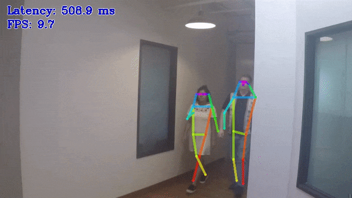

# Human Pose Estimation Python\* Demo



This demo showcases the work of multi-person 2D pose estimation algorithms. The task is to predict a pose: body skeleton, which consists of a predefined set of keypoints and connections between them, for every person in an input image/video.

## How It Works

On startup, the application reads command-line parameters and loads a model to OpenVINO™ Runtime plugin. Upon getting a frame from the OpenCV VideoCapture, it performs inference and displays the results.

> **NOTE**: By default, Open Model Zoo demos expect input with BGR channels order. If you trained your model to work with RGB order, you need to manually rearrange the default channels order in the demo application or reconvert your model using the Model Optimizer tool with the `--reverse_input_channels` argument specified. For more information about the argument, refer to **When to Reverse Input Channels** section of [Embedding Preprocessing Computation](@ref openvino_docs_MO_DG_Additional_Optimization_Use_Cases).

## Model API

The demo utilizes model wrappers, adapters and pipelines from [Python* Model API](../../common/python/model_zoo/model_api/README.md).

The generalized interface of wrappers with its unified results representation provides the support of multiple different human pose estimation model topologies in one demo.

## Preparing to Run

For demo input image or video files, refer to the section **Media Files Available for Demos** in the [Open Model Zoo Demos Overview](../../README.md).
The list of models supported by the demo is in `<omz_dir>/demos/human_pose_estimation_demo/python/models.lst` file.
This file can be used as a parameter for [Model Downloader](../../../tools/model_tools/README.md) and Converter to download and, if necessary, convert models to OpenVINO IR format (\*.xml + \*.bin).

An example of using the Model Downloader:

```sh
omz_downloader --list models.lst
```

An example of using the Model Converter:

```sh
omz_converter --list models.lst
```

### Supported Models

* architecture_type=openpose
  * human-pose-estimation-0001
* architecture_type=ae
  * human-pose-estimation-0005
  * human-pose-estimation-0006
  * human-pose-estimation-0007
* architecture_type=higherhrnet
  * higher-hrnet-w32-human-pose-estimation

> **NOTE**: Refer to the tables [Intel's Pre-Trained Models Device Support](../../../models/intel/device_support.md) and [Public Pre-Trained Models Device Support](../../../models/public/device_support.md) for the details on models inference support at different devices.

## Running

Running the application with the `-h` option yields the following usage message:

```
usage: human_pose_estimation_demo.py [-h] -m MODEL -at {ae,hrnet,openpose} -i
                                     INPUT [--loop] [-o OUTPUT]
                                     [-limit OUTPUT_LIMIT] [-d DEVICE]
                                     [-t PROB_THRESHOLD] [--tsize TSIZE]
                                     [-nireq NUM_INFER_REQUESTS]
                                     [-nstreams NUM_STREAMS]
                                     [-nthreads NUM_THREADS] [-no_show]
                                     [--output_resolution OUTPUT_RESOLUTION]
                                     [-u UTILIZATION_MONITORS] [-r]

Options:
  -h, --help            Show this help message and exit.
  -m MODEL, --model MODEL
                        Required. Path to an .xml file with a trained model.
  -at {ae,higherhrnet,openpose}, --architecture_type {ae,higherhrnet,openpose}
                        Required. Specify model' architecture type.
  -i INPUT, --input INPUT
                        Required. An input to process. The input must be a
                        single image, a folder of images, video file or camera
                        id.
  --loop                Optional. Enable reading the input in a loop.
  -o OUTPUT, --output OUTPUT
                        Optional. Name of the output file(s) to save. Frames of odd width or height can be truncated. See https://github.com/opencv/opencv/pull/24086
  -limit OUTPUT_LIMIT, --output_limit OUTPUT_LIMIT
                        Optional. Number of frames to store in output. If 0 is
                        set, all frames are stored.
  -d DEVICE, --device DEVICE
                        Optional. Specify the target device to infer on; CPU or
                        GPU is acceptable. The demo
                        will look for a suitable plugin for device specified.
                        Default value is CPU.

Common model options:
  -t PROB_THRESHOLD, --prob_threshold PROB_THRESHOLD
                        Optional. Probability threshold for poses filtering.
  --tsize TSIZE         Optional. Target input size. This demo implements
                        image pre-processing pipeline that is common to human
                        pose estimation approaches. Image is first resized to
                        some target size and then the network is reshaped to
                        fit the input image shape. By default target image
                        size is determined based on the input shape from IR.
                        Alternatively it can be manually set via this
                        parameter. Note that for OpenPose-like nets image is
                        resized to a predefined height, which is the target
                        size in this case. For Associative Embedding-like nets
                        target size is the length of a short first image side.

Inference options:
  -nireq NUM_INFER_REQUESTS, --num_infer_requests NUM_INFER_REQUESTS
                        Optional. Number of infer requests
  -nstreams NUM_STREAMS, --num_streams NUM_STREAMS
                        Optional. Number of streams to use for inference on
                        the CPU or/and GPU in throughput mode (for HETERO and
                        MULTI device cases use format
                        <device1>:<nstreams1>,<device2>:<nstreams2> or just
                        <nstreams>).
  -nthreads NUM_THREADS, --num_threads NUM_THREADS
                        Optional. Number of threads to use for inference on
                        CPU (including HETERO cases).

Input/output options:
  -no_show, --no_show   Optional. Don't show output.
  --output_resolution OUTPUT_RESOLUTION
                        Optional. Specify the maximum output window resolution
                        in (width x height) format. Example: 1280x720.
                        Input frame used by default.
  -u UTILIZATION_MONITORS, --utilization_monitors UTILIZATION_MONITORS
                        Optional. List of monitors to show initially.

Debug options:
  -r, --raw_output_message
                        Optional. Output inference results raw values showing.
```

Running the application with the empty list of options yields the short usage message and an error message.

You can use the following command to do inference on CPU with a pre-trained human pose estimation model:

```sh
python3 human_pose_estimation_demo.py \
  -d CPU \
  -i 0 \
  -m <path_to_model>/human-pose-estimation-0005.xml \
  -at ae
```

>**NOTE**: If you provide a single image as an input, the demo processes and renders it quickly, then exits. To continuously visualize inference results on the screen, apply the `loop` option, which enforces processing a single image in a loop.

You can save processed results to a Motion JPEG AVI file or separate JPEG or PNG files using the `-o` option:

* To save processed results in an AVI file, specify the name of the output file with `avi` extension, for example: `-o output.avi`.
* To save processed results as images, specify the template name of the output image file with `jpg` or `png` extension, for example: `-o output_%03d.jpg`. The actual file names are constructed from the template at runtime by replacing regular expression `%03d` with the frame number, resulting in the following: `output_000.jpg`, `output_001.jpg`, and so on.
To avoid disk space overrun in case of continuous input stream, like camera, you can limit the amount of data stored in the output file(s) with the `limit` option. The default value is 1000. To change it, you can apply the `-limit N` option, where `N` is the number of frames to store.

>**NOTE**: Windows\* systems may not have the Motion JPEG codec installed by default. If this is the case, you can download OpenCV FFMPEG back end using the PowerShell script provided with the OpenVINO &trade; install package and located at `<INSTALL_DIR>/opencv/ffmpeg-download.ps1`. The script should be run with administrative privileges if OpenVINO &trade; is installed in a system protected folder (this is a typical case). Alternatively, you can save results as images.

## Demo Output

The demo uses OpenCV to display the resulting frame with estimated poses.
The demo reports

* **FPS**: average rate of video frame processing (frames per second).
* **Latency**: average time required to process one frame (from reading the frame to displaying the results).
* Latency for each of the following pipeline stages:
  * **Decoding** — capturing input data.
  * **Preprocessing** — data preparation for inference.
  * **Inference** — infering input data (images) and getting a result.
  * **Postrocessing** — preparation inference result for output.
  * **Rendering** — generating output image.

You can use these metrics to measure application-level performance.

## See Also

* [Open Model Zoo Demos](../../README.md)
* [Model Optimizer](https://docs.openvino.ai/2023.0/openvino_docs_MO_DG_Deep_Learning_Model_Optimizer_DevGuide.html)
* [Model Downloader](../../../tools/model_tools/README.md)
