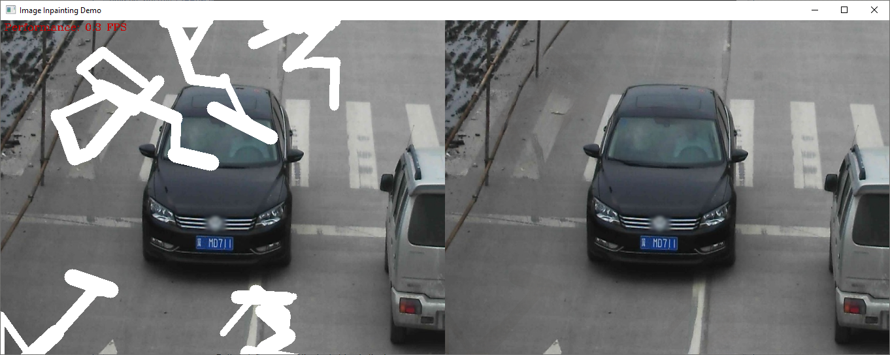

# Image Inpainting Python Demo

This demo showcases Image Inpainting with GMCNN. The task is to estimate suitable pixel information
to fill holes in images.


## How It Works

This demo can work in 2 modes:

* Interactive mode: areas for inpainting can be marked interactively using mouse painting
* Auto mode (use -ac or -ar option for it): image will be processed automatically using randomly applied mask (-ar option) or using specific color-based mask (-ac option)

## Preparing to Run

For demo input image or video files you may refer to [Media Files Available for Demos](../../README.md#Media-Files-Available-for-Demos).
The list of models supported by the demo is in `<omz_dir>/demos/image_inpainting_demo/python/models.lst` file.
This file can be used as a parameter for [Model Downloader](../../../tools/downloader/README.md) and Converter to download and, if necessary, convert models to OpenVINO Inference Engine format (\*.xml + \*.bin).

An example of using the Model Downloader:

```sh
python3 <omz_dir>/tools/downloader/downloader.py --list models.lst
```

An example of using the Model Converter:

```sh
python3 <omz_dir>/tools/downloader/converter.py --list models.lst
```

### Supported Models

* gmcnn-places2-tf

> **NOTE**: Refer to the tables [Intel's Pre-Trained Models Device Support](../../../models/intel/device_support.md) and [Public Pre-Trained Models Device Support](../../../models/public/device_support.md) for the details on models inference support at different devices.

## Running

Running the application with the `-h` option yields the following usage message:

```
usage: image_inpainting_demo.py [-h] -m MODEL [-i INPUT] [-d DEVICE]
                                [-p PARTS] [-mbw MAX_BRUSH_WIDTH]
                                [-ml MAX_LENGTH] [-mv MAX_VERTEX] [--no_show]
                                [-o OUTPUT] [-ac C C C] [-ar]

Options:
  -h, --help            Show this help message and exit.
  -m MODEL, --model MODEL
                        Required. Path to an .xml file with a trained model.
  -i INPUT, --input INPUT
                        path to image.
  -d DEVICE, --device DEVICE
                        Optional. Specify the target device to infer on; CPU,
                        GPU, HDDL or MYRIAD is acceptable. The demo will
                        look for a suitable plugin for device specified.
                        Default value is CPU
  -p PARTS, --parts PARTS
                        Optional. Number of parts to draw mask. Ignored in GUI
                        mode
  -mbw MAX_BRUSH_WIDTH, --max_brush_width MAX_BRUSH_WIDTH
                        Optional. Max width of brush to draw mask. Ignored in
                        GUI mode
  -ml MAX_LENGTH, --max_length MAX_LENGTH
                        Optional. Max strokes length to draw mask. Ignored in
                        GUI mode
  -mv MAX_VERTEX, --max_vertex MAX_VERTEX
                        Optional. Max number of vertex to draw mask. Ignored
                        in GUI mode
  --no_show             Optional. Don't show output. Cannot be used in GUI
                        mode
  -o OUTPUT, --output OUTPUT
                        Optional. Save output to the file with provided
                        filename. Ignored in GUI mode
  -ac C C C, --auto_mask_color C C C
                        Optional. Use automatic (non-interactive) mode with
                        color mask.Provide color to be treated as mask (3 RGB
                        components in range of 0...255). Cannot be used
                        together with -ar.
  -ar, --auto_mask_random
                        Optional. Use automatic (non-interactive) mode with
                        random mask for inpainting (with parameters set by -p,
                        -mbw, -mk and -mv). Cannot be used together with -ac.
```

Running the application with an empty list of options yields the usage message given above and an error message.

### Auto Mode

An example command to run inpainting demo in auto mode with inference on a CPU:

```sh
python3 ./image_inpainting_demo.py -d CPU -i <path_to_image>/car_1.bmp -m <path_to_model>/gmcnn-places2-tf.xml -ar
```

### Interactive Mode

In interactive mode user can draw mask using mouse (holding left mouse button). The brush size is adjustable using slider on the top of the screen. After the mask painting is done, inpainting processing can be started by pressing Space or Enter key.

Also, these hot keys are available:

* **Backspace or C** to clear current mask
* **Space or Enter** to inpaint
* **R** to reset all changes
* **Tab** to show/hide original image
* **Esc or Q** to quit

If Backpace, C or R keys are pressed while demo is showing original image, demo will hide original image and return back to editing mode.

## Demo Output

In auto mode this demo uses OpenCV to display the resulting image and image with mask applied and reports performance in the format of summary inference FPS. Processed image can be also written to file.

In interactive mode this demo provides interactive means to apply mask and see the result of processing instantly (see hotkeys above).

## See Also

* [Open Model Zoo Demos](../../README.md)
* [Model Optimizer](https://docs.openvinotoolkit.org/latest/_docs_MO_DG_Deep_Learning_Model_Optimizer_DevGuide.html)
* [Model Downloader](../../../tools/downloader/README.md)
