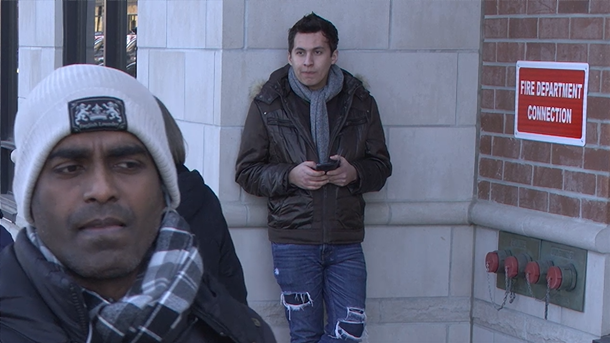
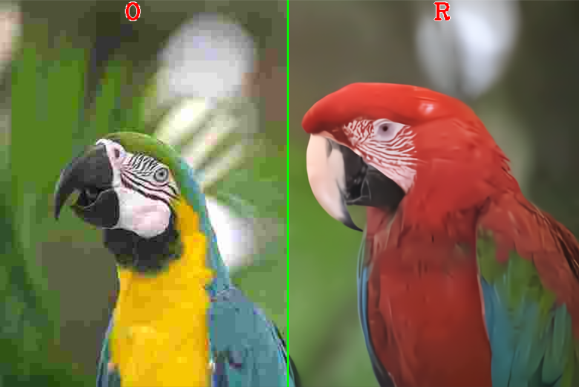
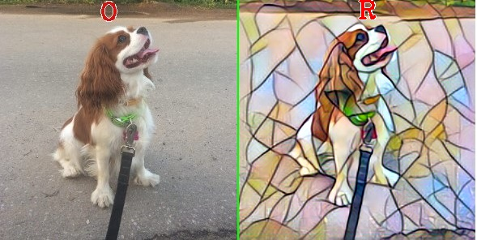

# Image Processing C++ Demo

This demo processes the image according to the selected type of processing. The demo can work with the next types:

* `super_resolution`
* `jpeg_restoration`
* `style_transfer`

## Examples

All images on result frame will be marked one of these flags:

* 'O' - original image.
* 'R' - result image.
* 'D' - difference image (|result - original|).

1. Example for super_resolution type:

Low resolution:


Bicubic interpolation:


Super resolution:



2. Example for jpeg_restoration type:



For this type of image processing user can use flag `-jc`. It allows to perform compression before the inference (useful when user wants to test model on high quality jpeg images).

3. Example for style_transfer:



## How It Works

Before running the demo, user must choose type of processing and model for this processing.\
For `super_resolution` user can choose the next models:

* [single-image-super-resolution-1032](../../../models/intel/single-image-super-resolution-1032/README.md) enhances the resolution of the input image by a factor of 4.
* [single-image-super-resolution-1033](../../../models/intel/single-image-super-resolution-1033/README.md) enhances the resolution of the input image by a factor of 3.
* [text-image-super-resolution-0001](../../../models/intel/text-image-super-resolution-0001/README.md) - a tiny model to 3x upscale scanned images with text.

For `jpeg_restoration` user can use [fbcnn](../../../models/public/fbcnn/README.md) - flexible blind convolutional neural network for JPEG artifacts removal.

For `style_transfer` user can use [fast-neural-style-mosaic-onnx](../../../models/public/fast-neural-style-mosaic-onnx/README.md) - one of the style transfer models designed to mix the content of an image with the style of another image.

The demo runs inference and shows results for each image captured from an input. Depending on number of inference requests processing simultaneously (-nireq parameter) the pipeline might minimize the time required to process each single image (for nireq 1) or maximizes utilization of the device and overall processing performance.

> **NOTE**: By default, Open Model Zoo demos expect input with BGR channels order. If you trained your model to work with RGB order, you need to manually rearrange the default channels order in the demo application or reconvert your model using the Model Optimizer tool with the `--reverse_input_channels` argument specified. For more information about the argument, refer to **When to Reverse Input Channels** section of [Embedding Preprocessing Computation](@ref openvino_docs_MO_DG_Additional_Optimization_Use_Cases).

## Preparing to Run

For demo input image or video files, refer to the section **Media Files Available for Demos** in the [Open Model Zoo Demos Overview](../../README.md).
The list of models supported by the demo is in `<omz_dir>/demos/image_processing_demo/cpp/models.lst` file.
This file can be used as a parameter for [Model Downloader](../../../tools/model_tools/README.md) and Converter to download and, if necessary, convert models to OpenVINO IR format (\*.xml + \*.bin).

### Supported Models

* single-image-super-resolution-1032
* single-image-super-resolution-1033
* text-image-super-resolution-0001
* fbcnn
* fast-neural-style-mosaic-onnx

> **NOTE**: Refer to the tables [Intel's Pre-Trained Models Device Support](../../../models/intel/device_support.md) and [Public Pre-Trained Models Device Support](../../../models/public/device_support.md) for the details on models inference support at different devices.

## Running

Running the demo with `-h` shows this help message:
```
image_processing_demo [OPTION]
Options:

    -h                        Print a usage message.
    -at "<type>"              Required. Type of the model, either 'sr' for Super Resolution task, 'sr_channel_joint' for Super Resolution model that accepts and returns 1 channel image, 'jr' for JPEGRestoration, 'style' for Style Transfer task.
    -i "<path>"               Required. An input to process. The input must be a single image, a folder of images, video file or camera id.
    -m "<path>"               Required. Path to an .xml file with a trained model.
    -layout "<string>"        Optional. Specify inputs layouts. Ex. NCHW or input0:NCHW,input1:NC in case of more than one input.
    -o "<path>"               Optional. Name of the output file(s) to save. Frames of odd width or height can be truncated. See https://github.com/opencv/opencv/pull/24086
    -limit "<num>"            Optional. Number of frames to store in output. If 0 is set, all frames are stored.
    -d "<device>"             Optional. Specify the target device to infer on (the list of available devices is shown below). Default value is CPU. Use "-d HETERO:<comma-separated_devices_list>" format to specify HETERO plugin. The demo will look for a suitable plugin for a specified device.
    -nireq "<integer>"        Optional. Number of infer requests. If this option is omitted, number of infer requests is determined automatically.
    -nthreads "<integer>"     Optional. Number of threads.
    -nstreams                 Optional. Number of streams to use for inference on the CPU or/and GPU in throughput mode (for HETERO and MULTI device cases use format <device1>:<nstreams1>,<device2>:<nstreams2> or just <nstreams>)
    -loop                     Optional. Enable reading the input in a loop.
    -no_show                  Optional. Do not show processed video. If disabled and --output_resolution isn't set, the resulting image is resized to a default view size: 1000x600 but keeping the aspect ratio
    -output_resolution        Optional. Specify the maximum output window resolution in (width x height) format. Example: 1280x720. Input frame size used by default.
    -u                        Optional. List of monitors to show initially.
    -jc                       Optional. Flag of using compression for jpeg images. Default value if false. Only for jr architecture type.
    -reverse_input_channels   Optional. Switch the input channels order from BGR to RGB.
    -mean_values              Optional. Normalize input by subtracting the mean values per channel. Example: "255.0 255.0 255.0"
    -scale_values             Optional. Divide input by scale values per channel. Division is applied after mean values subtraction. Example: "255.0 255.0 255.0"
```

You can use the following command to enhance the resolution of the images captured by a camera using a pre-trained single-image-super-resolution-1033 network:

```sh
./image_processing_demo -i 0 -m single-image-super-resolution-1033.xml -at sr
```

### Modes

Demo application supports 3 modes:

1. to display the result image.
2. to display the original image with result together (left part is result, right part is original). Position of separator is specified be slider of trackbar.
3. to display the difference image with result together. By analogy with second mode.

User is able to change mode in run time using the next keys:

* **R** to display the result.
* **O** to display the original image with result.
* **V** to display the difference image with result.
* **Esc or Q** to quit

You can save processed results to a Motion JPEG AVI file or separate JPEG or PNG files using the `-o` option:

* To save processed results in an AVI file, specify the name of the output file with `avi` extension, for example: `-o output.avi`.
* To save processed results as images, specify the template name of the output image file with `jpg` or `png` extension, for example: `-o output_%03d.jpg`. The actual file names are constructed from the template at runtime by replacing regular expression `%03d` with the frame number, resulting in the following: `output_000.jpg`, `output_001.jpg`, and so on.
To avoid disk space overrun in case of continuous input stream, like camera, you can limit the amount of data stored in the output file(s) with the `limit` option. The default value is 1000. To change it, you can apply the `-limit N` option, where `N` is the number of frames to store.

>**NOTE**: Windows\* systems may not have the Motion JPEG codec installed by default. If this is the case, you can download OpenCV FFMPEG back end using the PowerShell script provided with the OpenVINO &trade; install package and located at `<INSTALL_DIR>/opencv/ffmpeg-download.ps1`. The script should be run with administrative privileges if OpenVINO &trade; is installed in a system protected folder (this is a typical case). Alternatively, you can save results as images.

## Demo Output

The demo uses OpenCV to display and write the resulting images. The demo reports:

* **FPS**: average rate of video frame processing (frames per second).
* **Latency**: average time required to process one frame (from reading the frame to displaying the results).
* Latency for each of the following pipeline stages:
  * **Decoding** — capturing input data.
  * **Preprocessing** — data preparation for inference.
  * **Inference** — infering input data (images) and getting a result.
  * **Postrocessing** — preparation inference result for output.
  * **Rendering** — generating output image.

You can use these metrics to measure application-level performance.

## See Also

* [Open Model Zoo Demos](../../README.md)
* [Model Optimizer](https://docs.openvino.ai/2023.0/openvino_docs_MO_DG_Deep_Learning_Model_Optimizer_DevGuide.html)
* [Model Downloader](../../../tools/model_tools/README.md)
