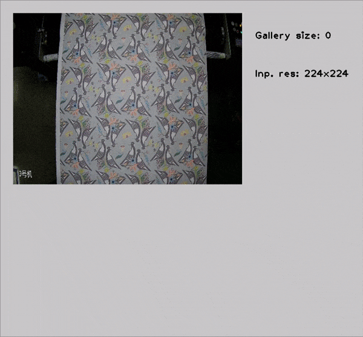

# Image Retrieval Python\* Demo



This demo demonstrates how to run Image Retrieval models using OpenVINO&trade;.

> **NOTE**: Only batch size of 1 is supported.

## How It Works

The demo application expects an image retrieval model in the Intermediate Representation (IR) format.

As input, the demo application takes:

* a path to a list of images represented by textfile with following format: 'path_to_image' 'ID'
* a path to a video file or a device node of a webcam

The demo workflow is the following:

1. The demo application reads video frames one by one, runs ROI detector that extracts ROI (moving area).
2. Extracted ROI is passed to artificial neural network that computes embedding vector for extracted frame area.
3. Then the demo application searches computed embedding in gallery of images in order to determine which image in the gallery is the most similar to what one can see on video frame.
4. The app visualizes results of it work as graphical window where following objects are shown.
     - Input frame with detected ROI.
     - Top-10 most similar images from the gallery.
     - Performance characteristics.

> **NOTE**: By default, Open Model Zoo demos expect input with BGR channels order. If you trained your model to work with RGB order, you need to manually rearrange the default channels order in the demo application or reconvert your model using the Model Optimizer tool with the `--reverse_input_channels` argument specified. For more information about the argument, refer to **When to Reverse Input Channels** section of [Embedding Preprocessing Computation](@ref openvino_docs_MO_DG_Additional_Optimization_Use_Cases).

## Preparing to Run

The demo sample input videos and gallery images can be found in this [repository](https://github.com/19900531/test). An example of file listing gallery images can be found [here](https://github.com/openvinotoolkit/training_extensions/blob/089de2f24667329a58e8560ed4e01ef203e99def/misc/tensorflow_toolkit/image_retrieval/data/gallery/gallery.txt).

The list of models supported by the demo is in `<omz_dir>/demos/image_retrieval_demo/python/models.lst` file.
This file can be used as a parameter for [Model Downloader](../../../tools/model_tools/README.md) and Converter to download and, if necessary, convert models to OpenVINO IR format (\*.xml + \*.bin).

An example of using the Model Downloader:

```sh
omz_downloader --list models.lst
```

An example of using the Model Converter:

```sh
omz_converter --list models.lst
```

### Supported Models

* image-retrieval-0001

> **NOTE**: Refer to the tables [Intel's Pre-Trained Models Device Support](../../../models/intel/device_support.md) and [Public Pre-Trained Models Device Support](../../../models/public/device_support.md) for the details on models inference support at different devices.

## Running

Run the application with the `-h` option to see the following usage message:

```
usage: image_retrieval_demo.py [-h] -m MODEL -i INPUT [--loop] [-o OUTPUT]
                               [-limit OUTPUT_LIMIT] -g GALLERY
                               [-gt GROUND_TRUTH] [-d DEVICE] [--no_show]
                               [-u UTILIZATION_MONITORS]

Options:
  -h, --help            Show this help message and exit.
  -m MODEL, --model MODEL
                        Required. Path to an .xml file with a trained model.
  -i INPUT, --input INPUT
                        Required. Path to a video file or a device node of a
                        webcam.
  --loop                Optional. Enable reading the input in a loop.
  -o OUTPUT, --output OUTPUT
                        Optional. Name of the output file(s) to save. Frames of odd width or height can be truncated. See https://github.com/opencv/opencv/pull/24086
  -limit OUTPUT_LIMIT, --output_limit OUTPUT_LIMIT
                        Optional. Number of frames to store in output.
                        If 0 is set, all frames are stored.
  -g GALLERY, --gallery GALLERY
                        Required. Path to a file listing gallery images.
  -gt GROUND_TRUTH, --ground_truth GROUND_TRUTH
                        Optional. Ground truth class.
  -d DEVICE, --device DEVICE
                        Optional. Specify the target device to infer on: CPU or
                        GPU. The demo will look for a
                        suitable plugin for device specified (by default, it
                        is CPU).
  --no_show             Optional. Do not visualize inference results.
  -u UTILIZATION_MONITORS, --utilization_monitors UTILIZATION_MONITORS
                        Optional. List of monitors to show initially.
```

Running the application with an empty list of options yields the short version of the usage message and an error message.

To run the demo, please provide paths to the model in the IR format, to a file with class labels, and to an input video, image, or folder with images:

```bash
python image_retrieval_demo.py \
  -m <path_to_model>/image-retrieval-0001.xml \
  -i <path_to_video>/4946fb41-9da0-4af7-a858-b443bee6d0f6.dav \
  -g <path_to_file>/list.txt \
  --ground_truth text_label
```

You can save processed results to a Motion JPEG AVI file or separate JPEG or PNG files using the `-o` option:

* To save processed results in an AVI file, specify the name of the output file with `avi` extension, for example: `-o output.avi`.
* To save processed results as images, specify the template name of the output image file with `jpg` or `png` extension, for example: `-o output_%03d.jpg`. The actual file names are constructed from the template at runtime by replacing regular expression `%03d` with the frame number, resulting in the following: `output_000.jpg`, `output_001.jpg`, and so on.
To avoid disk space overrun in case of continuous input stream, like camera, you can limit the amount of data stored in the output file(s) with the `limit` option. The default value is 1000. To change it, you can apply the `-limit N` option, where `N` is the number of frames to store.

>**NOTE**: Windows\* systems may not have the Motion JPEG codec installed by default. If this is the case, you can download OpenCV FFMPEG back end using the PowerShell script provided with the OpenVINO &trade; install package and located at `<INSTALL_DIR>/opencv/ffmpeg-download.ps1`. The script should be run with administrative privileges if OpenVINO &trade; is installed in a system protected folder (this is a typical case). Alternatively, you can save results as images.

## Demo Output

The application uses OpenCV to display gallery searching result.
The demo reports

* **FPS**: average rate of video frame processing (frames per second).
* **Latency**: average time required to process one frame (from reading the frame to displaying the results).
You can use both of these metrics to measure application-level performance.

## See Also

* [Open Model Zoo Demos](../../README.md)
* [Model Optimizer](https://docs.openvino.ai/2023.0/openvino_docs_MO_DG_Deep_Learning_Model_Optimizer_DevGuide.html)
* [Model Downloader](../../../tools/model_tools/README.md)
