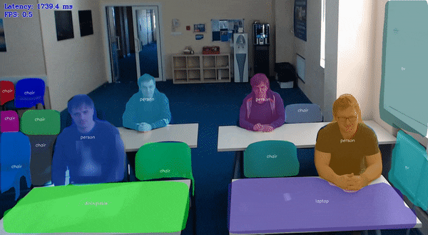

# Instance Segmentation Python\* Demo



This demo shows how to perform instance segmentation using OpenVINO.

> **NOTE**: Only batch size of 1 is supported.

## How It Works

The demo application expects an instance segmentation model in the Intermediate Representation (IR) format with the following constraints:
1. for instance segmentation models based on `Mask RCNN` approach:
    * Two inputs: `im_data` for input image and `im_info` for meta-information about the image (actual height, width and scale).
    * At least four outputs including:
        * `boxes` with absolute bounding box coordinates of the input image
        * `scores` with confidence scores for all bounding boxes
        * `classes` with object class IDs for all bounding boxes
        * `raw_masks` with fixed-size segmentation heat maps for all classes of all bounding boxes
2. for instance segmentation models based on `YOLACT` approach:
    * Single input for input image.
    * At least four outputs including:
        * `boxes` with normalized in [0, 1] range bounding box coordinates
        * `conf` with confidence scores for each class for all boxes
        * `mask` with fixed-size mask channels for all boxes.
        * `proto` with fixed-size segmentation heat maps prototypes for all boxes.

As input, the demo application accepts a path to a single image file, a video file or a numeric ID of a web camera specified with a command-line argument `-i`

The demo workflow is the following:

1. The demo application reads image/video frames one by one, resizes them to fit into the input image blob of the network (`im_data`).
2. The `im_info` input blob passes resulting resolution and scale of a pre-processed image to the network to perform inference if network has `im_info` input.
3. The demo visualizes the resulting instance segmentation masks. Certain command-line options affect the visualization:
    * If you specify `--show_boxes` and `--show_scores` arguments, bounding boxes and confidence scores are also shown.
    * By default, tracking is used to show object instance with the same color throughout the whole video.
      It assumes more or less static scene with instances in two frames being a part of the same track if intersection over union of the masks is greater than the 0.5 threshold. To disable tracking, specify the `--no_track` argument.

> **NOTE**: By default, Open Model Zoo demos expect input with BGR channels order. If you trained your model to work with RGB order, you need to manually rearrange the default channels order in the demo application or reconvert your model using the Model Optimizer tool with the `--reverse_input_channels` argument specified. For more information about the argument, refer to **When to Reverse Input Channels** section of [Converting a Model Using General Conversion Parameters](https://docs.openvinotoolkit.org/latest/_docs_MO_DG_prepare_model_convert_model_Converting_Model_General.html).

## Preparing to Run

For demo input image or video files you may refer to [Media Files Available for Demos](../../README.md#Media-Files-Available-for-Demos).
The list of models supported by the demo is in `<omz_dir>/demos/instance_segmentation_demo/python/models.lst` file.
This file can be used as a parameter for [Model Downloader](../../../tools/downloader/README.md) and Converter to download and, if necessary, convert models to OpenVINO Inference Engine format (\*.xml + \*.bin).

An example of using the Model Downloader:

```sh
python3 <omz_dir>/tools/downloader/downloader.py --list models.lst
```

An example of using the Model Converter:

```sh
python3 <omz_dir>/tools/downloader/converter.py --list models.lst
```

### Supported Models

* instance-segmentation-security-0002
* instance-segmentation-security-0091
* instance-segmentation-security-0228
* instance-segmentation-security-1039
* instance-segmentation-security-1040
* yolact-resnet50-fpn-pytorch

> **NOTE**: Refer to the tables [Intel's Pre-Trained Models Device Support](../../../models/intel/device_support.md) and [Public Pre-Trained Models Device Support](../../../models/public/device_support.md) for the details on models inference support at different devices.

## Running

Run the application with the `-h` option to see the following usage message:

```
usage: instance_segmentation_demo.py [-h] -m "<path>" --labels "<path>" -i INPUT
                                     [--loop] [-o OUTPUT] [-limit OUTPUT_LIMIT]
                                     [-d "<device>"] [-l "<absolute_path>"]
                                     [--delay "<num>"] [-pt "<num>"]
                                     [--no_keep_aspect_ratio] [--no_track]
                                     [--show_scores] [--show_boxes] [-pc] [-r]
                                     [--no_show] [-u UTILIZATION_MONITORS]

Options:
  -h, --help            Show this help message and exit.
  -m "<path>", --model "<path>"
                        Required. Path to an .xml file with a trained model.
  --labels "<path>"     Required. Path to a text file with class labels.
  -i INPUT, --input INPUT
                        Required. An input to process. The input must be a single image,
                        a folder of images, video file or camera id.
  --loop                Optional. Enable reading the input in a loop.
  -o OUTPUT, --output OUTPUT
                        Optional. Name of the output file(s) to save.
  -limit OUTPUT_LIMIT, --output_limit OUTPUT_LIMIT
                        Optional. Number of frames to store in output.
                        If 0 is set, all frames are stored.
  -d "<device>", --device "<device>"
                        Optional. Specify the target device to infer on: CPU,
                        GPU, HDDL or MYRIAD. The demo will look for a
                        suitable plugin for device specified (by default, it
                        is CPU).
  -l "<absolute_path>", --cpu_extension "<absolute_path>"
                        Required for CPU custom layers. Absolute path to a
                        shared library with the kernels implementation.
  --delay "<num>"       Optional. Interval in milliseconds of waiting for a
                        key to be pressed.
  -pt "<num>", --prob_threshold "<num>"
                        Optional. Probability threshold for detections
                        filtering.
  --no_keep_aspect_ratio
                        Optional. Force image resize not to keep aspect ratio.
  --no_track            Optional. Disable tracking.
  --show_scores         Optional. Show detection scores.
  --show_boxes          Optional. Show bounding boxes.
  -pc, --perf_counts    Optional. Report performance counters.
  -r, --raw_output_message
                        Optional. Output inference results raw values.
  --no_show             Optional. Don't show output
  -u UTILIZATION_MONITORS, --utilization_monitors UTILIZATION_MONITORS
                        Optional. List of monitors to show initially.
```

Running the application with an empty list of options yields the short version of the usage message and an error message.

To run the demo, please provide paths to the model in the IR format, to a file with class labels, and to an input video, image, or folder with images:

```bash
python3 instance_segmentation_demo/instance_segmentation_demo.py \
    -m <path_to_model>/instance-segmentation-security-0228.xml \
    --label <omz_dir>/data/dataset_classes/coco_80cl.txt \
    --no_keep_aspect_ratio \
    -i 0 \
    --delay 1
```

>**NOTE**: If you provide a single image as an input, the demo processes and renders it quickly, then exits. To continuously visualize inference results on the screen, apply the `loop` option, which enforces processing a single image in a loop.

You can save processed results to a Motion JPEG AVI file or separate JPEG or PNG files using the `-o` option:

* To save processed results in an AVI file, specify the name of the output file with `avi` extension, for example: `-o output.avi`.
* To save processed results as images, specify the template name of the output image file with `jpg` or `png` extension, for example: `-o output_%03d.jpg`. The actual file names are constructed from the template at runtime by replacing regular expression `%03d` with the frame number, resulting in the following: `output_000.jpg`, `output_001.jpg`, and so on.
To avoid disk space overrun in case of continuous input stream, like camera, you can limit the amount of data stored in the output file(s) with the `limit` option. The default value is 1000. To change it, you can apply the `-limit N` option, where `N` is the number of frames to store.

>**NOTE**: Windows\* systems may not have the Motion JPEG codec installed by default. If this is the case, you can download OpenCV FFMPEG back end using the PowerShell script provided with the OpenVINO &trade; install package and located at `<INSTALL_DIR>/opencv/ffmpeg-download.ps1`. The script should be run with administrative privileges if OpenVINO &trade; is installed in a system protected folder (this is a typical case). Alternatively, you can save results as images.

## Demo Output

The application uses OpenCV to display resulting instance segmentation masks and current inference performance.

## See Also

* [Open Model Zoo Demos](../../README.md)
* [Model Optimizer](https://docs.openvinotoolkit.org/latest/_docs_MO_DG_Deep_Learning_Model_Optimizer_DevGuide.html)
* [Model Downloader](../../../tools/downloader/README.md)
