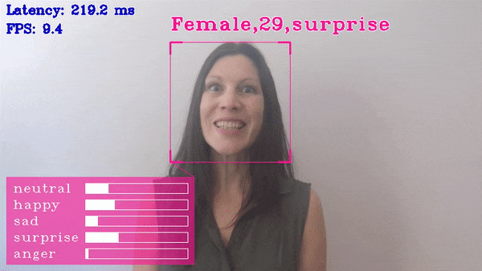

# Interactive Face Detection C++ Demo



This demo showcases Object Detection task applied for face recognition using sequence of neural networks.
Async API can improve overall frame-rate of the application, because rather than wait for inference to complete,
the application can continue operating on the host while accelerator is busy.
This demo executes five parallel infer requests for the Age/Gender Recognition, Head Pose Estimation, Emotions Recognition, Facial Landmarks Detection and Antispoofing Classifier networks that run simultaneously. You can use a set of the following pre-trained models with the demo:
* `face-detection-adas-0001`, which is a primary detection network for finding faces
* `age-gender-recognition-retail-0013`, which is executed on top of the results of the first model and reports estimated age and gender for each detected face
* `head-pose-estimation-adas-0001`, which is executed on top of the results of the first model and reports estimated head pose in Tait-Bryan angles
* `emotions-recognition-retail-0003`, which is executed on top of the results of the first model and reports an emotion for each detected face
* `facial-landmarks-35-adas-0002`, which is executed on top of the results of the first model and reports normed coordinates of estimated facial landmarks
* `anti-spoof-mn3`, which is executed on top of the results of the first model and reports estimated probability whether spoof or real face is shown

For more information about the pre-trained models, refer to the [model documentation](../../../models/intel/index.md).

Other demo objectives are:

*	Video as input support via OpenCV\*
*	Visualization of the resulting face bounding boxes from Face Detection network
*	Visualization of age/gender, spoof/real, head pose, emotion information, and facial landmarks positions for each detected face

OpenCV is used to draw resulting bounding boxes, labels, and other information. You can copy and paste this code without pulling Inference Engine demo helpers into your application.

## How It Works

1.	The application reads command-line parameters and loads up to five networks depending on `-m...` options family to the Inference
Engine.
2.	The application gets a frame from the OpenCV VideoCapture.
3.	The application performs inference on the Face Detection network.
4.	The application performs up to five simultaneous inferences, using the Age/Gender, Head Pose, Emotions, Facial Landmarks and Anti-spoof detection networks if they are specified in the command line.
5.	The application displays the results.

> **NOTE**: By default, Open Model Zoo demos expect input with BGR channels order. If you trained your model to work with RGB order, you need to manually rearrange the default channels order in the demo application or reconvert your model using the Model Optimizer tool with `--reverse_input_channels` argument specified. For more information about the argument, refer to **When to Reverse Input Channels** section of [Converting a Model Using General Conversion Parameters](https://docs.openvinotoolkit.org/latest/_docs_MO_DG_prepare_model_convert_model_Converting_Model_General.html).

The new Async API operates with a new notion of the Infer Request that encapsulates the inputs/outputs and separates scheduling and waiting for result.

## Running

Running the application with the `-h` option yields the following usage message:

```
InferenceEngine:
    API version ............ <version>
    Build .................. <number>

interactive_face_detection_demo [OPTION]
Options:

    -h                         Print a usage message
    -i                         Required. An input to process. The input must be a single image, a folder of images, video file or camera id.
    -loop                      Optional. Enable reading the input in a loop.
    -o "<path>"                Optional. Name of output to save.
    -limit "<num>"             Optional. Number of frames to store in output. If 0 is set, all frames are stored.
    -m "<path>"                Required. Path to an .xml file with a trained Face Detection model.
    -m_ag "<path>"             Optional. Path to an .xml file with a trained Age/Gender Recognition model.
    -m_hp "<path>"             Optional. Path to an .xml file with a trained Head Pose Estimation model.
    -m_em "<path>"             Optional. Path to an .xml file with a trained Emotions Recognition model.
    -m_lm "<path>"             Optional. Path to an .xml file with a trained Facial Landmarks Estimation model.
    -m_am "<path>"             Optional. Path to an .xml file with a trained Antispoofing Classification model.
      -l "<absolute_path>"     Required for CPU custom layers. Absolute path to a shared library with the kernels implementation.
          Or
      -c "<absolute_path>"     Required for GPU custom kernels. Absolute path to an .xml file with the kernels description.
    -d "<device>"              Optional. Target device for Face Detection network (the list of available devices is shown below). Default value is CPU. Use "-d HETERO:<comma-separated_devices_list>" format to specify HETERO plugin. The demo will look for a suitable plugin for a specified device.
    -d_ag "<device>"           Optional. Target device for Age/Gender Recognition network (the list of available devices is shown below). Default value is CPU. Use "-d HETERO:<comma-separated_devices_list>" format to specify HETERO plugin. The demo will look for a suitable plugin for a specified device.
    -d_hp "<device>"           Optional. Target device for Head Pose Estimation network (the list of available devices is shown below). Default value is CPU. Use "-d HETERO:<comma-separated_devices_list>" format to specify HETERO plugin. The demo will look for a suitable plugin for a specified device.
    -d_em "<device>"           Optional. Target device for Emotions Recognition network (the list of available devices is shown below). Default value is CPU. Use "-d HETERO:<comma-separated_devices_list>" format to specify HETERO plugin. The demo will look for a suitable plugin for a specified device.
    -d_lm "<device>"           Optional. Target device for Facial Landmarks Estimation network (the list of available devices is shown below). Default value is CPU. Use "-d HETERO:<comma-separated_devices_list>" format to specify HETERO plugin. The demo will look for a suitable plugin for a specified device.
    -d_am "<device>"           Optional. Target device for Antispoofing Classification network (the list of available devices is shown below). Default value is CPU. Use "-d HETERO:<comma-separated_devices_list>" format to specify HETERO plugin. The demo will look for a suitable plugin for a specified device.
    -n_ag "<num>"              Optional. Number of maximum simultaneously processed faces for Age/Gender Recognition network (by default, it is 16)
    -n_hp "<num>"              Optional. Number of maximum simultaneously processed faces for Head Pose Estimation network (by default, it is 16)
    -n_em "<num>"              Optional. Number of maximum simultaneously processed faces for Emotions Recognition network (by default, it is 16)
    -n_lm "<num>"              Optional. Number of maximum simultaneously processed faces for Facial Landmarks Estimation network (by default, it is 16)
    -n_am "<num>"              Optional. Number of maximum simultaneously processed faces for Antispoofing Classification network (by default, it is 16)
    -dyn_ag                    Optional. Enable dynamic batch size for Age/Gender Recognition network
    -dyn_hp                    Optional. Enable dynamic batch size for Head Pose Estimation network
    -dyn_em                    Optional. Enable dynamic batch size for Emotions Recognition network
    -dyn_lm                    Optional. Enable dynamic batch size for Facial Landmarks Estimation network
    -dyn_am                    Optional. Enable dynamic batch size for Antispoofing Classification network"
    -async                     Optional. Enable asynchronous mode
    -no_show                   Optional. Do not show processed video.
    -pc                        Optional. Enable per-layer performance report
    -r                         Optional. Output inference results as raw values
    -t                         Optional. Probability threshold for detections
    -bb_enlarge_coef           Optional. Coefficient to enlarge/reduce the size of the bounding box around the detected face
    -dx_coef                   Optional. Coefficient to shift the bounding box around the detected face along the Ox axis
    -dy_coef                   Optional. Coefficient to shift the bounding box around the detected face along the Oy axis
    -fps                       Optional. Maximum FPS for playing video
    -no_smooth                 Optional. Do not smooth person attributes
    -no_show_emotion_bar       Optional. Do not show emotion bar
    -u                         Optional. List of monitors to show initially.
```

Running the application with an empty list of options yields the usage message given above and an error message.

To run the demo, you can use public or Intel pre-trained models. You can download models and, if necessary, convert them into Inference Engine format using the [Model Downloader and other automation tools](../../../tools/downloader/README.md) as shown in the examples below. The models which are supported by the demo are listed in the [models.lst](./models.lst) file.

An example of using the Model Downloader:
```
python3 <omz_dir>/tools/downloader/downloader.py --list models.lst
```

An example of using the Model Converter:
```
python3 <omz_dir>/tools/downloader/converter.py --list models.lst
```

For example, to do inference on a GPU with the OpenVINO&trade; toolkit pre-trained models, run the following command:

```sh
./interactive_face_detection_demo -i <path_to_video>/<input_video>.mp4 -m <path_to_model>/face-detection-adas-0001.xml -m_ag <path_to_model>/age-gender-recognition-retail-0013.xml -m_hp <path_to_model>/head-pose-estimation-adas-0001.xml -m_em <path_to_model>/emotions-recognition-retail-0003.xml -m_lm <path_to_model>/facial-landmarks-35-adas-0002.xml -m_am <path_to_model>/anti-spoof-mn3.xml -d GPU
```

## Demo Output

The demo uses OpenCV to display the resulting frame with detections (rendered as bounding boxes and labels, if provided).
The demo reports total image throughput which includes frame decoding time, inference time, time to render bounding boxes and labels, and time to display the results.

> **NOTE**: On VPU devices (Intel® Movidius™ Neural Compute Stick, Intel® Neural Compute Stick 2, and Intel® Vision Accelerator Design with Intel® Movidius™ VPUs) this demo has been tested on the following Model Downloader available topologies:
>* `age-gender-recognition-retail-0013`
>* `emotions-recognition-retail-0003`
>* `face-detection-adas-0001`
>* `facial-landmarks-35-adas-0002`
>* `head-pose-estimation-adas-0001`
>* `anti-spoof-mn3`
> Other models may produce unexpected results on these devices.

## See Also
* [Using Open Model Zoo demos](../../README.md)
* [Model Optimizer](https://docs.openvinotoolkit.org/latest/_docs_MO_DG_Deep_Learning_Model_Optimizer_DevGuide.html)
* [Model Downloader](../../../tools/downloader/README.md)
