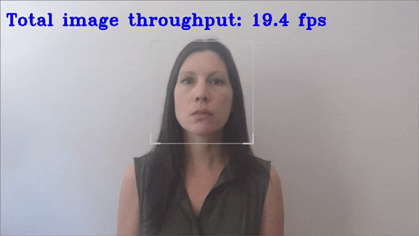

# G-API Interactive Face Detection Demo



This demo showcases Object Detection task applied for face recognition using sequence of neural networks.
The pipeline is based on [G-API framework](https://docs.opencv.org/master/d0/d1e/gapi.html). This demo executes six [kernels](https://docs.opencv.org/master/d0/d25/gapi_kernel_api.html), five of them infer networks and another one is a postprocessing kernel.
This demo executes the Face Detection, Age/Gender Recognition, Head Pose Estimation, Emotions Recognition, Facial Landmarks Detection and Antispoofing Classifier networks. You can use a set of the following pre-trained models with the demo:

* `face-detection-adas-0001`, which is a primary detection network for finding faces
* `age-gender-recognition-retail-0013`, which is executed on top of the results of the first model and reports estimated age and gender for each detected face
* `head-pose-estimation-adas-0001`, which is executed on top of the results of the first model and reports estimated head pose in Tait-Bryan angles
* `emotions-recognition-retail-0003`, which is executed on top of the results of the first model and reports an emotion for each detected face
* `facial-landmarks-35-adas-0002`, which is executed on top of the results of the first model and reports normed coordinates of estimated facial landmarks
* `anti-spoof-mn3`, which is executed on top of the results of the first model and reports estimated probability whether spoof or real face is shown

Other demo objectives are:

* Video as input support via OpenCV\*
* Visualization of the resulting face bounding boxes from Face Detection network
* Visualization of age/gender, spoof/real, head pose, emotion information, and facial landmarks positions for each detected face

OpenCV is used to draw resulting bounding boxes, labels, and other information.

## How It Works

1. The application reads command-line parameters and loads up to five networks depending on `-m...` options family to the Inference
Engine.
2. G-API pipeline gets a video/image/camera like a source, using the OpenCV VideoCapture.
3. G-API pipeline performs inference on the Face Detection network.
4. G-API pipeline runs post processing kernel.
5. G-API pipeline performs four inferences, using the Age/Gender, Head Pose, Emotions, Facial Landmarks detection and Anti-spoof detection networks if they are specified in the command line.
6. The application displays the results.

> **NOTE**: By default, Open Model Zoo demos expect input with BGR channels order. If you trained your model to work with RGB order, you need to manually rearrange the default channels order in the demo application or reconvert your model using the Model Optimizer tool with the `--reverse_input_channels` argument specified. For more information about the argument, refer to **When to Reverse Input Channels** section of [Embedding Preprocessing Computation](@ref openvino_docs_MO_DG_Additional_Optimization_Use_Cases).

## Preparing to Run

For demo input image or video files, refer to the section **Media Files Available for Demos** in the [Open Model Zoo Demos Overview](../../README.md).
The list of models supported by the demo is in `<omz_dir>/demos/interactive_face_detection_demo/cpp_gapi/models.lst` file.
This file can be used as a parameter for [Model Downloader](../../../tools/model_tools/README.md) and Converter to download and, if necessary, convert models to OpenVINO IR format (\*.xml + \*.bin).

An example of using the Model Downloader:

```sh
omz_downloader --list models.lst
```

An example of using the Model Converter:

```sh
omz_converter --list models.lst
```

### Supported Models

* age-gender-recognition-retail-0013
* anti-spoof-mn3
* emotions-recognition-retail-0003
* face-detection-adas-0001
* face-detection-retail-0004
* face-detection-retail-0005
* facial-landmarks-35-adas-0002
* head-pose-estimation-adas-0001

> **NOTE**: Refer to the tables [Intel's Pre-Trained Models Device Support](../../../models/intel/device_support.md) and [Public Pre-Trained Models Device Support](../../../models/public/device_support.md) for the details on models inference support at different devices.

## Running

Running the demo with `-h` shows this help message:

```
    [ -h]                                         show the help message and exit
    [--help]                                      print help on all arguments
      -m <MODEL FILE>                             path to an .xml file with a trained Face Detection model
    [ -i <INPUT>]                                 an input to process. The input must be a single image, a folder of images, video file or camera id. Default is 0
    [--bb_enlarge_coef <NUMBER>]                  coefficient to enlarge/reduce the size of the bounding box around the detected face. Default is 1.2
    [ -d <DEVICE>]                                specify a device to infer on (the list of available devices is shown below). Use '-d HETERO:<comma-separated_devices_list>' format to specify HETERO plugin. Use '-d MULTI:<comma-separated_devices_list>' format to specify MULTI plugin. Default is CPU
    [--dag <DEVICE>]                              target device for Age/Gender Recognition network (the list of available devices is shown below). The demo will look for a suitable plugin for a specified device. Default is CPU
    [--dam <DEVICE>]                              target device for Antispoofing Classification network (the list of available devices is shown below). Use \"-d HETERO:<comma-separated_devices_list>\" format to specify HETERO plugin. The demo will look for a suitable plugin for a specified device. Default is CPU
    [--dem <DEVICE>]                              target device for Emotions Recognition network (the list of available devices is shown below). The demo will look for a suitable plugin for a specified device. Default is CPU
    [--dhp <DEVICE>]                              target device for Head Pose Estimation network (the list of available devices is shown below). The demo will look for a suitable plugin for a specified device. Default is CPU
    [--dlm <DEVICE>]                              target device for Facial Landmarks Estimation network (the list of available devices is shown below). The demo will look for a suitable plugin for device specified. Default is CPU
    [--dx_coef <NUMBER>]                          coefficient to shift the bounding box around the detected face along the Ox axis
    [--dy_coef <NUMBER>]                          coefficient to shift the bounding box around the detected face along the Oy axis
    [--fps <NUMBER>]                              maximum FPS for playing video
    [--lim <NUMBER>]                              number of frames to store in output. If 0 is set, all frames are stored. Default is 1000
    [--loop]                                      enable reading the input in a loop
    [--mag <MODEL FILE>]                          path to an .xml file with a trained Age/Gender Recognition model
    [--mam <MODEL FILE>]                          path to an .xml file with a trained Antispoofing Classification model
    [--mem <MODEL FILE>]                          path to an .xml file with a trained Emotions Recognition model
    [--mhp <MODEL FILE>]                          path to an .xml file with a trained Head Pose Estimation model
    [--mlm <MODEL FILE>]                          path to an .xml file with a trained Facial Landmarks Estimation model
    [ -o <OUTPUT>]                                name of the output file(s) to save
    [ -r]                                         output inference results as raw values
    [--show] ([--noshow])                         (don't) show output
    [--show_emotion_bar] ([--noshow_emotion_bar]) (don't) show emotion bar
    [--smooth] ([--nosmooth])                     (don't) smooth person attributes
    [ -t <NUMBER>]                                probability threshold for detections. Default is 0.5
    [ -u <DEVICE>]                                resource utilization graphs. Default is cdm. c - average CPU load, d - load distribution over cores, m - memory usage, h - hide
    Key bindings:
        Q, q, Esc - Quit
        P, p, 0, spacebar - Pause
        C - average CPU load, D - load distribution over cores, M - memory usage, H - hide
```

For example, to do inference on a GPU with the OpenVINO&trade; toolkit pre-trained models, run the following command:

```sh
./interactive_face_detection_demo_gapi \
  -d GPU \
  -i <path_to_video>/inputVideo.mp4 \
  -m <path_to_model>/face-detection-adas-0001.xml \
  --mag <path_to_model>/age-gender-recognition-retail-0013.xml \
  --mhp <path_to_model>/head-pose-estimation-adas-0001.xml \
  --mem <path_to_model>/emotions-recognition-retail-0003.xml \
  --mlm <path_to_model>/facial-landmarks-35-adas-0002.xml \
  --mam <path_to_model>/anti-spoof-mn3.xml
```

>**NOTE**: If you provide a single image as an input, the demo processes and renders it quickly, then exits. To continuously visualize inference results on the screen, apply the `loop` option, which enforces processing a single image in a loop.

You can save processed results to a Motion JPEG AVI file or separate JPEG or PNG files using the `-o` option:

* To save processed results in an AVI file, specify the name of the output file with `avi` extension, for example: `-o output.avi`.
* To save processed results as images, specify the template name of the output image file with `jpg` or `png` extension, for example: `-o output_%03d.jpg`. The actual file names are constructed from the template at runtime by replacing regular expression `%03d` with the frame number, resulting in the following: `output_000.jpg`, `output_001.jpg`, and so on.
To avoid disk space overrun in case of continuous input stream, like camera, you can limit the amount of data stored in the output file(s) with the `--lim` option. The default value is 1000. To change it, you can apply the `--lim N` option, where `N` is the number of frames to store.

>**NOTE**: Windows\* systems may not have the Motion JPEG codec installed by default. If this is the case, you can download OpenCV FFMPEG back end using the PowerShell script provided with the OpenVINO &trade; install package and located at `<INSTALL_DIR>/opencv/ffmpeg-download.ps1`. The script should be run with administrative privileges if OpenVINO &trade; is installed in a system protected folder (this is a typical case). Alternatively, you can save results as images.

## Demo Output

The demo uses OpenCV to display the resulting frame with detections (rendered as bounding boxes and labels, if provided).
The demo reports:

* **FPS**: average rate of video frame processing (frames per second).

You can use this metric to measure application-level performance.

## See Also

* [Open Model Zoo Demos](../../README.md)
* [Model Optimizer](https://docs.openvino.ai/2023.0/openvino_docs_MO_DG_Deep_Learning_Model_Optimizer_DevGuide.html)
* [Model Downloader](../../../tools/model_tools/README.md)
