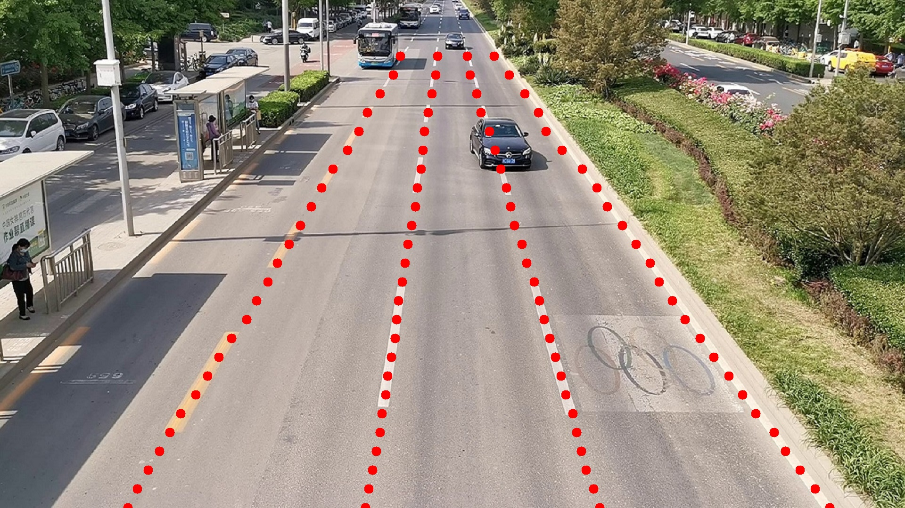

# Lane Detection Python\* Demo



This demo demonstrates how to run erfnet models using OpenVINO.

> **NOTE**: Only batch size of 1 is supported.

## How It Works

The demo application expects a lane detection model in the Intermediate Representation (IR) format.

As input, the demo application takes:

* a path to an image
* a path to a video file

The demo workflow is the following:

1. Plugin initialization for specified device and load extensions library if specified.
2. Reading the IR generated by the Model Optimizer (.xml and .bin files).
3. Load CPU extension for support specific layer.
4. Preparing inputs.
5. Loading model to the plugin.
6. Doing inference.
7. Group Normalize.
8. Run the net.
9. Fetch detected center lane.
10. Post processing.

> **NOTE**: By default, Open Model Zoo demos expect input with BGR channels order. If you trained your model to work with RGB order, you need to manually rearrange the default channels order in the demo application or reconvert your model using the Model Optimizer tool with the `--reverse_input_channels` argument specified. For more information about the argument, refer to **When to Reverse Input Channels** section of [Embedding Preprocessing Computation](@ref openvino_docs_MO_DG_Additional_Optimization_Use_Cases).

## Preparing to Run

For demo input image or video files, refer to the section **Media Files Available for Demos** in the [Open Model Zoo Demos Overview](../../README.md).
The list of models supported by the demo is in `<omz_dir>/demos/lane_detection_demo/python/models.lst` file.
This file can be used as a parameter for [Model Downloader](../../../tools/model_tools/README.md) and Converter to download and, if necessary, convert models to OpenVINO IR format (\*.xml + \*.bin).

An example of using the Model Downloader:

```sh
omz_downloader --list models.lst
```

An example of using the Model Converter:

```sh
omz_converter --list models.lst
```

### Supported Models

* erfnet

> **NOTE**: Refer to the tables [Intel's Pre-Trained Models Device Support](../../../models/intel/device_support.md) and [Public Pre-Trained Models Device Support](../../../models/public/device_support.md) for the details on models inference support at different devices.

## Running

Run the application with the `-h` option to see the following usage message:

```
usage: lane_detection_demo.py [-h] -m MODEL -i INPUT
```

Running the application with an empty list of options yields the short version of the usage message and an error message.

To run the demo, please provide paths to the model in the IR format, to directory with gallery images, and to an input video, image, or folder with images:

```bash
python3 lane_detection_demo.py \
  -m <path_to_model>/torch-save.xml \
  -i <path_to_file>/lane_detection.jpg \
```
## Demo Output

The application uses OpenCV to display gallery searching result.
The demo reports

* **FPS**: average rate of video frame processing (frames per second).
You can use both of these metrics to measure application-level performance.

## See Also

* [Open Model Zoo Demos](../../README.md)
* [Model Optimizer](https://docs.openvino.ai/latest/openvino_docs_MO_DG_Deep_Learning_Model_Optimizer_DevGuide.html)
* [Model Downloader](../../../tools/model_tools/README.md)
