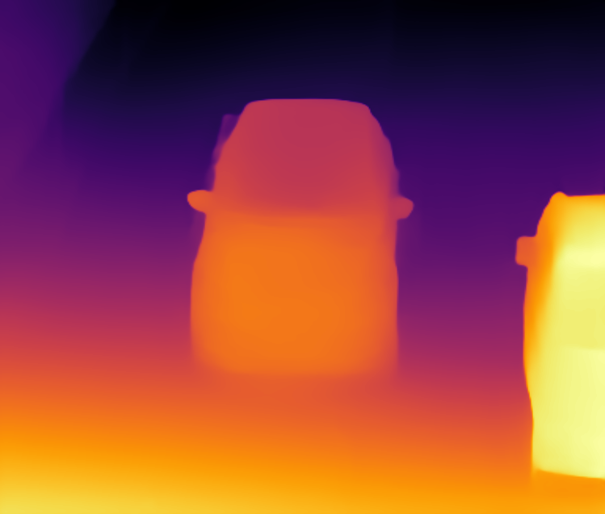

# MonoDepth Python Demo

This topic demonstrates how to run the MonoDepth demo application, which produces a disparity map for a given input image.
To this end, the code uses the network described in [Towards Robust Monocular Depth Estimation: Mixing Datasets for Zero-shot Cross-dataset Transfer](https://arxiv.org/abs/1907.01341).

Below is the `midasnet` model inference result for `<openvino_dir>/deployment_tools/demo/car_1.bmp` sample image



## How It Works

On startup, the demo application reads command-line parameters and loads a network and an image to the
Inference Engine plugin. When inference is done, the application outputs the disparity map in PFM and PNG format (color-coded).

> **NOTE**: By default, Open Model Zoo demos expect input with BGR channels order. If you trained your model to work with RGB order, you need to manually rearrange the default channels order in the demo application or reconvert your model using the Model Optimizer tool with the `--reverse_input_channels` argument specified. For more information about the argument, refer to **When to Reverse Input Channels** section of [Converting a Model Using General Conversion Parameters](https://docs.openvinotoolkit.org/latest/_docs_MO_DG_prepare_model_convert_model_Converting_Model_General.html).

## Preparing to Run

For demo input image or video files, refer to the section **Media Files Available for Demos** in the [Open Model Zoo Demos Overview](../../README.md).
The list of models supported by the demo is in `<omz_dir>/demos/monodepth_demo/python/models.lst` file.
This file can be used as a parameter for [Model Downloader](../../../tools/downloader/README.md) and Converter to download and, if necessary, convert models to OpenVINO Inference Engine format (\*.xml + \*.bin).

An example of using the Model Downloader:

```sh
python3 <omz_dir>/tools/downloader/downloader.py --list models.lst
```

An example of using the Model Converter:

```sh
python3 <omz_dir>/tools/downloader/converter.py --list models.lst
```

### Supported Models

* fcrn-dp-nyu-depth-v2-tf
* midasnet

> **NOTE**: Refer to the tables [Intel's Pre-Trained Models Device Support](../../../models/intel/device_support.md) and [Public Pre-Trained Models Device Support](../../../models/public/device_support.md) for the details on models inference support at different devices.

## Running

Running the application with the `-h` option yields the following usage message:

```
usage: monodepth_demo.py [-h] -m MODEL -i INPUT [-d DEVICE] [-nireq NUM_INFER_REQUESTS] [-nstreams NUM_STREAMS]
                         [-nthreads NUM_THREADS] [--loop] [-o OUTPUT] [-limit OUTPUT_LIMIT] [--no_show]
                         [--output_resolution OUTPUT_RESOLUTION] [-u UTILIZATION_MONITORS]

Options:
  -h, --help            Show this help message and exit.
  -m MODEL, --model MODEL
                        Required. Path to an .xml file with a trained model.
  -i INPUT, --input INPUT
                        Required. An input to process. The input must be a single image, a folder of images, video
                        file or camera id.
  -d DEVICE, --device DEVICE
                        Optional. Specify the target device to infer on; CPU, GPU, HDDL or MYRIAD is acceptable. The
                        demo will look for a suitable plugin for device specified. Default value is CPU.

Inference options:
  -nireq NUM_INFER_REQUESTS, --num_infer_requests NUM_INFER_REQUESTS
                        Optional. Number of infer requests.
  -nstreams NUM_STREAMS, --num_streams NUM_STREAMS
                        Optional. Number of streams to use for inference on the CPU or/and GPU in throughput mode (for
                        HETERO and MULTI device cases use format <device1>:<nstreams1>,<device2>:<nstreams2> or just
                        <nstreams>).
  -nthreads NUM_THREADS, --num_threads NUM_THREADS
                        Optional. Number of threads to use for inference on CPU (including HETERO cases).

Input/output options:
  --loop                Optional. Enable reading the input in a loop.
  -o OUTPUT, --output OUTPUT
                        Optional. Name of the output file(s) to save.
  -limit OUTPUT_LIMIT, --output_limit OUTPUT_LIMIT
                        Optional. Number of frames to store in output. If 0 is set, all frames are stored.
  --no_show             Optional. Don't show output.
  --output_resolution OUTPUT_RESOLUTION
                        Optional. Specify the maximum output window resolution in (width x height) format. Example:
                        1280x720. Input frame size used by default.
  -u UTILIZATION_MONITORS, --utilization_monitors UTILIZATION_MONITORS
                        Optional. List of monitors to show initially.
```

Running the application with the empty list of options yields the usage message given above and an error message.

## Demo Output

The application outputs are the floating disparity map (PFM) as well as a color-coded version (PNG).
The demo reports

* **Latency**: total processing time required to process input data (from reading the data to displaying the results).

## See Also

* [Open Model Zoo Demos](../../README.md)
* [Model Optimizer](https://docs.openvinotoolkit.org/latest/_docs_MO_DG_Deep_Learning_Model_Optimizer_DevGuide.html)
* [Model Downloader](../../../tools/downloader/README.md)
