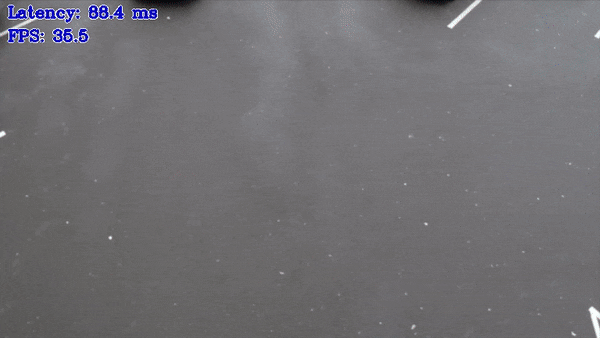

# Object Detection C++ Demo



This demo showcases inference of Object Detection networks using Async API.
Async API usage can improve overall frame-rate of the application, because rather than wait for inference to complete,
the app can continue doing things on the host, while accelerator is busy.
Specifically, this demo keeps the number of Infer Requests that you have set using `nireq` flag. While some of the Infer Requests are processed by Inference Engine, the other ones can be filled with new frame data and asynchronously started or the next output can be taken from the Infer Request and displayed.

This technique can be generalized to any available parallel slack, for example, doing inference and simultaneously encoding the resulting
(previous) frames or running further inference, like some emotion detection on top of the face detection results.
There are important performance caveats though, for example the tasks that run in parallel should try to avoid oversubscribing the shared compute resources.
For example, if the inference is performed on the HDDL, and the CPU is essentially idle, than it makes sense to do things on the CPU
in parallel. But if the inference is performed, say on the GPU, than it can take little gain to do the (resulting video) encoding
on the same GPU in parallel, because the device is already busy.

This and other performance implications and tips for the Async API are covered in the [Optimization Guide](https://docs.openvinotoolkit.org/latest/_docs_optimization_guide_dldt_optimization_guide.html)

Other demo objectives are:

* Video as input support via OpenCV
* Visualization of the resulting bounding boxes and text labels (from the labels file, see `-labels` option) or class number (if no file is provided)
* OpenCV is used to draw resulting bounding boxes, labels, so you can copy paste this code without
need to pull Inference Engine demos helpers to your app
* Demonstration of the Async API in action
* Demonstration of multiple models architectures support (including pre- and postprocessing) in one application

## How It Works

On startup, the application reads command-line parameters and loads a network to the Inference Engine. Upon getting a frame from the OpenCV VideoCapture it performs inference and displays the results.

> **NOTE**: By default, Open Model Zoo demos expect input with BGR channels order. If you trained your model to work with RGB order, you need to manually rearrange the default channels order in the demo application or reconvert your model using the Model Optimizer tool with the `--reverse_input_channels` argument specified. For more information about the argument, refer to **When to Reverse Input Channels** section of [Converting a Model Using General Conversion Parameters](https://docs.openvinotoolkit.org/latest/_docs_MO_DG_prepare_model_convert_model_Converting_Model_General.html).

This demo operates in asynchronous manner by using "Infer Requests" that encapsulate the inputs/outputs and separates *scheduling and waiting for result*,
as shown in code mockup below:

```cpp
    while (true) {
        capture frame
        take empty InferRequest from pool
        if(empty InferRequest available) {
            populate empty InferRequest
            set completion callback
            submit InferRequest
        }

        while (there're completed InferRequests) {
            get inference results from InferRequest
            process inference results
            display the frame
        }
    }
```

For more details on the requests-based Inference Engine API, including the Async execution, refer to [Integrate the Inference Engine with Your Application](https://docs.openvinotoolkit.org/latest/_docs_IE_DG_Integrate_with_customer_application_new_API.html).

## Preparing to Run

For demo input image or video files you may refer to [Media Files Available for Demos](../../README.md#Media-Files-Available-for-Demos).
The list of models supported by the demo is in `<omz_dir>/demos/object_detection_demo/cpp/models.lst` file.
This file can be used as a parameter for [Model Downloader](../../../tools/downloader/README.md) and Converter to download and, if necessary, convert models to OpenVINO Inference Engine format (\*.xml + \*.bin).

An example of using the Model Downloader:

```sh
python3 <omz_dir>/tools/downloader/downloader.py --list models.lst
```

An example of using the Model Converter:

```sh
python3 <omz_dir>/tools/downloader/converter.py --list models.lst
```

### Supported Models

* architecture_type = centernet
  - ctdet_coco_dlav0_384
  - ctdet_coco_dlav0_512
* architecture_type = faceboxes
  - faceboxes-pytorch
* architecture_type = ssd
  - efficientdet-d0-tf
  - efficientdet-d1-tf
  - face-detection-adas-0001
  - face-detection-retail-0004
  - face-detection-retail-0005
  - face-detection-retail-0044
  - faster-rcnn-resnet101-coco-sparse-60-0001
  - pedestrian-and-vehicle-detector-adas-0001
  - pedestrian-detection-adas-0002
  - pelee-coco
  - person-detection-0106
  - person-detection-0200
  - person-detection-0201
  - person-detection-0202
  - person-detection-0203
  - person-detection-retail-0013
  - person-vehicle-bike-detection-2000
  - person-vehicle-bike-detection-2001
  - person-vehicle-bike-detection-2002
  - person-vehicle-bike-detection-2003
  - person-vehicle-bike-detection-2004
  - product-detection-0001
  - rfcn-resnet101-coco-tf
  - retinanet-tf
  - ssd300
  - ssd512
  - ssd-resnet34-1200-onnx
  - ssd_mobilenet_v1_coco
  - ssd_mobilenet_v1_fpn_coco
  - ssd_mobilenet_v2_coco
  - ssd_resnet50_v1_fpn_coco
  - ssdlite_mobilenet_v2
  - vehicle-detection-0200
  - vehicle-detection-0201
  - vehicle-detection-0202
  - vehicle-detection-adas-0002
  - vehicle-license-plate-detection-barrier-0106
  - vehicle-license-plate-detection-barrier-0123
* architecture_type = yolo
  - person-vehicle-bike-detection-crossroad-yolov3-1020
  - yolo-v3-tf
  - yolo-v3-tiny-tf

> **NOTE**: Refer to the tables [Intel's Pre-Trained Models Device Support](../../../models/intel/device_support.md) and [Public Pre-Trained Models Device Support](../../../models/public/device_support.md) for the details on models inference support at different devices.

## Running

Running the application with the `-h` option yields the following usage message:

```
InferenceEngine:
    API version ............ <version>
    Build .................. <number>

object_detection_demo [OPTION]
Options:

    -h                        Print a usage message.
    -at "<type>"              Required. Architecture type: centernet, faceboxes, retinaface, ssd or yolo
    -i                        Required. An input to process. The input must be a single image, a folder of images, video file or camera id.
    -m "<path>"               Required. Path to an .xml file with a trained model.
    -o "<path>"               Optional. Name of the output file(s) to save.
    -limit "<num>"            Optional. Number of frames to store in output. If 0 is set, all frames are stored.
      -l "<absolute_path>"    Required for CPU custom layers. Absolute path to a shared library with the kernel implementations.
          Or
      -c "<absolute_path>"    Required for GPU custom kernels. Absolute path to the .xml file with the kernel descriptions.
    -d "<device>"             Optional. Specify the target device to infer on (the list of available devices is shown below). Default value is CPU. Use "-d HETERO:<comma-separated_devices_list>" format to specify HETERO plugin. The demo will look for a suitable plugin for a specified device.
    -labels "<path>"          Optional. Path to a file with labels mapping.
    -pc                       Optional. Enables per-layer performance report.
    -r                        Optional. Inference results as raw values.
    -t                        Optional. Probability threshold for detections.
    -iou_t                    Optional. Filtering intersection over union threshold for overlapping boxes.
    -auto_resize              Optional. Enables resizable input with support of ROI crop & auto resize.
    -nireq "<integer>"        Optional. Number of infer requests. If this option is omitted, number of infer requests is determined automatically.
    -nthreads "<integer>"     Optional. Number of threads.
    -nstreams                 Optional. Number of streams to use for inference on the CPU or/and GPU in throughput mode (for HETERO and MULTI device cases use format <device1>:<nstreams1>,<device2>:<nstreams2> or just <nstreams>)
    -loop                     Optional. Enable reading the input in a loop.
    -no_show                  Optional. Don't show output.
    -output_resolution        Optional. Specify the maximum output window resolution in (width x height) format. Example: 1280x720. Input frame size used by default.
    -u                        Optional. List of monitors to show initially.
    -yolo_af                  Optional. Use advanced postprocessing/filtering algorithm for YOLO.
```

Running the application with the empty list of options yields the usage message given above and an error message.

If labels file is used, it should correspond to model output. Demo treat labels, listed in the file, to be indexed from 0, one line - one label (that is very first line contains label for ID 0). Note that some models may return labels IDs in range 1..N, in this case label file should contain "background" label at the very first line.

You can use the following command to do inference on GPU with a pre-trained object detection model:

```sh
./object_detection_demo \
  -d GPU \
  -i <path_to_video>/inputVideo.mp4 \
  -m <path_to_model>/ssd300.xml \
  -at ssd \
  -labels <omz_dir>/data/dataset_classes/voc_20cl_bkgr.txt
```

>**NOTE**: If you provide a single image as an input, the demo processes and renders it quickly, then exits. To continuously visualize inference results on the screen, apply the `loop` option, which enforces processing a single image in a loop.

You can save processed results to a Motion JPEG AVI file or separate JPEG or PNG files using the `-o` option:

* To save processed results in an AVI file, specify the name of the output file with `avi` extension, for example: `-o output.avi`.
* To save processed results as images, specify the template name of the output image file with `jpg` or `png` extension, for example: `-o output_%03d.jpg`. The actual file names are constructed from the template at runtime by replacing regular expression `%03d` with the frame number, resulting in the following: `output_000.jpg`, `output_001.jpg`, and so on.
To avoid disk space overrun in case of continuous input stream, like camera, you can limit the amount of data stored in the output file(s) with the `limit` option. The default value is 1000. To change it, you can apply the `-limit N` option, where `N` is the number of frames to store.

>**NOTE**: Windows\* systems may not have the Motion JPEG codec installed by default. If this is the case, you can download OpenCV FFMPEG back end using the PowerShell script provided with the OpenVINO &trade; install package and located at `<INSTALL_DIR>/opencv/ffmpeg-download.ps1`. The script should be run with administrative privileges if OpenVINO &trade; is installed in a system protected folder (this is a typical case). Alternatively, you can save results as images.

## Demo Output

The demo uses OpenCV to display the resulting frame with detections (rendered as bounding boxes and labels, if provided).
The demo reports:

* **FPS**: average rate of video frame processing (frames per second).
* **Latency**: average time required to process one frame (from reading the frame to displaying the results).
You can use both of these metrics to measure application-level performance.

## See Also

* [Open Model Zoo Demos](../../README.md)
* [Model Optimizer](https://docs.openvinotoolkit.org/latest/_docs_MO_DG_Deep_Learning_Model_Optimizer_DevGuide.html)
* [Model Downloader](../../../tools/downloader/README.md)
