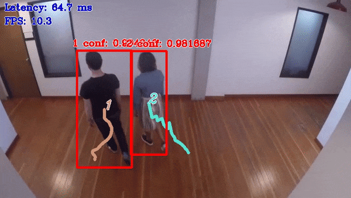

# Pedestrian Tracker C++ Demo



This demo showcases Pedestrian Tracking scenario: it reads frames from an input video sequence, detects pedestrians in the frames, and builds trajectories of movement of the pedestrians in a frame-by-frame manner.

## How It Works

On startup, the application reads command line parameters and loads the specified networks.

Upon getting a frame from the input video sequence (either a video file or a folder with images), the app performs inference of the pedestrian detector network.

After that, the bounding boxes describing the detected pedestrians are passed to the instance of the tracker class that matches the appearance of the pedestrians with the known
(already tracked) persons.
In obvious cases (when pixel-to-pixel similarity of a detected pedestrian is sufficiently close to the latest pedestrian image from one of the known tracks),
the match is made without inference of the reidentification network. In more complicated cases, the demo uses the reidentification network to make a decision
if a detected pedestrian is the next position of a known person or the first position of a new tracked person.

After that, the application displays the tracks and the latest detections on the screen and goes to the next frame.

> **NOTE**: By default, Open Model Zoo demos expect input with BGR channels order. If you trained your model to work with RGB order, you need to manually rearrange the default channels order in the demo application or reconvert your model using the Model Optimizer tool with the `--reverse_input_channels` argument specified. For more information about the argument, refer to **When to Reverse Input Channels** section of [Embedding Preprocessing Computation](@ref openvino_docs_MO_DG_Additional_Optimization_Use_Cases).

## Preparing to Run

For demo input image or video files, refer to the section **Media Files Available for Demos** in the [Open Model Zoo Demos Overview](../../README.md).
The list of models supported by the demo is in `<omz_dir>/demos/pedestrian_tracker_demo/cpp/models.lst` file.
This file can be used as a parameter for [Model Downloader](../../../tools/model_tools/README.md) and Converter to download and, if necessary, convert models to OpenVINO IR format (\*.xml + \*.bin).

An example of using the Model Downloader:

```sh
omz_downloader --list models.lst
```

An example of using the Model Converter:

```sh
omz_converter --list models.lst
```

### Supported Models

* architecture_type = centernet
  - ctdet_coco_dlav0_512
* architecture_type = ssd
  - efficientdet-d0-tf
  - efficientdet-d1-tf
  - faster-rcnn-resnet101-coco-sparse-60-0001
  - pedestrian-and-vehicle-detector-adas-0001
  - pedestrian-detection-adas-0002
  - pelee-coco
  - person-detection-0106
  - person-detection-0200
  - person-detection-0201
  - person-detection-0202
  - person-detection-0203
  - person-detection-retail-0002
  - person-detection-retail-0013
  - person-vehicle-bike-detection-2000
  - person-vehicle-bike-detection-2001
  - person-vehicle-bike-detection-2002
  - person-vehicle-bike-detection-2003
  - person-vehicle-bike-detection-2004
  - rfcn-resnet101-coco-tf
  - retinanet-tf
  - ssd300
  - ssd512
  - ssd-resnet34-1200-onnx
  - ssd_mobilenet_v1_coco
  - ssd_mobilenet_v1_fpn_coco
  - ssdlite_mobilenet_v2
  - vehicle-detection-adas-0002
* architecture_type = yolo
  - person-vehicle-bike-detection-crossroad-yolov3-1020
  - yolo-v3-tf
  - yolo-v3-tiny-tf
  - yolo-v1-tiny-tf
  - yolo-v2-ava-0001
  - yolo-v2-ava-sparse-35-0001
  - yolo-v2-ava-sparse-70-0001
  - yolo-v2-tf
  - yolo-v2-tiny-ava-0001
  - yolo-v2-tiny-ava-sparse-30-0001
  - yolo-v2-tiny-ava-sparse-60-0001
  - yolo-v2-tiny-tf
  - yolo-v2-tiny-vehicle-detection-0001
* reidentification models
  - person-reidentification-retail-0277
  - person-reidentification-retail-0286
  - person-reidentification-retail-0287
  - person-reidentification-retail-0288

> **NOTE**: Refer to the tables [Intel's Pre-Trained Models Device Support](../../../models/intel/device_support.md) and [Public Pre-Trained Models Device Support](../../../models/public/device_support.md) for the details on models inference support at different devices.

## Running

Running the demo with `-h` shows this help message:
```
pedestrian_tracker_demo [OPTION]
Options:

    -h                           Print a usage message.
    -i                           Required. An input to process. The input must be a single image, a folder of images, video file or camera id.
    -loop                        Optional. Enable reading the input in a loop.
    -first                       Optional. The index of the first frame of the input to process. The actual first frame captured depends on cv::VideoCapture implementation and may have slightly different number.
    -read_limit                  Optional. Read length limit before stopping or restarting reading the input.
    -o "<path>"                  Optional. Name of the output file(s) to save.
    -limit "<num>"               Optional. Number of frames to store in output. If 0 is set, all frames are stored.
    -m_det "<path>"              Required. Path to the Pedestrian Detection Retail model (.xml) file.
    -m_reid "<path>"             Required. Path to the Pedestrian Reidentification Retail model (.xml) file.
    -d_det "<device>"            Optional. Specify the target device for pedestrian detection (the list of available devices is shown below). Default value is CPU. Use "-d HETERO:<comma-separated_devices_list>" format to specify HETERO plugin.
    -d_reid "<device>"           Optional. Specify the target device for pedestrian reidentification (the list of available devices is shown below). Default value is CPU. Use "-d HETERO:<comma-separated_devices_list>" format to specify HETERO plugin.
    -layout_det "<string>"       Optional. Specify inputs layouts. Ex. NCHW or input0:NCHW,input1:NC in case of more than one input.
    -r                           Optional. Output pedestrian tracking results in a raw format (compatible with MOTChallenge format).
    -no_show                     Optional. Don't show output.
    -delay                       Optional. Delay between frames used for visualization. If negative, the visualization is turned off (like with the option 'no_show'). If zero, the visualization is made frame-by-frame.
    -out "<path>"                Optional. The file name to write output log file with results of pedestrian tracking. The format of the log file is compatible with MOTChallenge format.
    -u                           Optional. List of monitors to show initially.
    -at "<type>"              Required. Architecture type for detector model: centernet, ssd or yolo.
    -t                          Optional. Probability threshold for detections.
    -auto_resize                Optional. Enables resizable input with support of ROI crop & auto resize.
    -iou_t                      Optional. Filtering intersection over union threshold for overlapping boxes.
    -yolo_af                    Optional. Use advanced postprocessing/filtering algorithm for YOLO.
    -labels "<path>"          Optional. Path to a file with labels mapping.
    -nireq "<integer>"        Optional. Number of infer requests for detector model. If this option is omitted, number of infer requests is determined automatically.
    -nstreams                   Optional. Number of streams to use for inference on the CPU or/and GPU in throughput mode for detector model (for HETERO and MULTI device cases use format <device1>:<nstreams1>,<device2>:<nstreams2> or just <nstreams>)
    -nthreads "<integer>"     Optional. Number of threads for detector model.
    -person_label               Optional. Label of class person for detector. Default -1 for tracking all objects
```

For example, to run the application with the OpenVINO&trade; toolkit pre-trained models with inferencing pedestrian detector on a GPU and pedestrian reidentification on a CPU, run the following command:

```sh
./pedestrian_tracker_demo -i <path_video_file> \
                          -m_det <path_to_model>/person-detection-retail-0013.xml \
                          -m_reid <path_to_model>/person-reidentification-retail-0277.xml \
                          -d_det GPU
                          -at ssd
```

>**NOTE**: If you provide a single image as an input, the demo processes and renders it quickly, then exits. To continuously visualize inference results on the screen, apply the `loop` option, which enforces processing a single image in a loop.

You can save processed results to a Motion JPEG AVI file or separate JPEG or PNG files using the `-o` option:

* To save processed results in an AVI file, specify the name of the output file with `avi` extension, for example: `-o output.avi`.
* To save processed results as images, specify the template name of the output image file with `jpg` or `png` extension, for example: `-o output_%03d.jpg`. The actual file names are constructed from the template at runtime by replacing regular expression `%03d` with the frame number, resulting in the following: `output_000.jpg`, `output_001.jpg`, and so on.
To avoid disk space overrun in case of continuous input stream, like camera, you can limit the amount of data stored in the output file(s) with the `limit` option. The default value is 1000. To change it, you can apply the `-limit N` option, where `N` is the number of frames to store.

>**NOTE**: Windows\* systems may not have the Motion JPEG codec installed by default. If this is the case, you can download OpenCV FFMPEG back end using the PowerShell script provided with the OpenVINO &trade; install package and located at `<INSTALL_DIR>/opencv/ffmpeg-download.ps1`. The script should be run with administrative privileges if OpenVINO &trade; is installed in a system protected folder (this is a typical case). Alternatively, you can save results as images.

## Demo Output

The demo uses OpenCV to display the resulting frame with detections rendered as bounding boxes, curves (for trajectories displaying), and text. The demo reports:

* **FPS**: average rate of video frame processing (frames per second).
* **Latency**: average time required to process one frame (from reading the frame to displaying the results).

You can use these metrics to measure application-level performance.

## See Also

* [Open Model Zoo Demos](../../README.md)
* [Model Optimizer](https://docs.openvino.ai/latest/openvino_docs_MO_DG_Deep_Learning_Model_Optimizer_DevGuide.html)
* [Model Downloader](../../../tools/model_tools/README.md)
