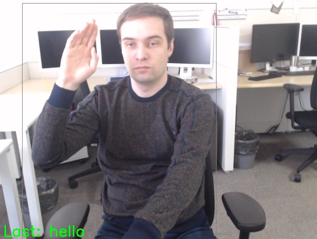

# ASL Recognition Python* Demo

This demo demonstrates how to run ASL (American Sign Language) Recognition models using OpenVINO&trade; toolkit.

## How It Works

The demo application expects an ASL recognition model in the Intermediate Representation (IR) format.

As input, the demo application takes:
* a path to a video file or a device node of a web-camera specified with a command line argument `--input`
* a path to a file in JSON format with ASL class names `--class_map`

The demo workflow is the following:

1. The demo application reads video frames one by one, runs person detector that extracts ROI, tracks the ROI of very first person. Additional process is used to prepare the batch of frames with constant framerate.
2. Batch of frames and extracted ROI are passed to artificial neural network that predicts the ASL gesture.
3. The app visualizes results of its work as graphical window where following objects are shown:
    - Input frame with detected ROI.
    - Last recognized ASL gesture.
    - Performance characteristics.

> **NOTE**: By default, Open Model Zoo demos expect input with BGR channels order. If you trained your model to work with RGB order, you need to manually rearrange the default channels order in the demo application or reconvert your model using the Model Optimizer tool with `--reverse_input_channels` argument specified. For more information about the argument, refer to **When to Reverse Input Channels** section of [Converting a Model Using General Conversion Parameters](https://docs.openvinotoolkit.org/latest/_docs_MO_DG_prepare_model_convert_model_Converting_Model_General.html).

## Running

Run the application with the `-h` option to see the following usage message:

```
usage: asl_recognition_demo.py [-h] -m_a ACTION_MODEL -m_d DETECTION_MODEL -i
                               INPUT -c CLASS_MAP [-s SAMPLES_DIR] [-d DEVICE]
                               [-l CPU_EXTENSION] [--no_show]

Options:
  -h, --help            Show this help message and exit.
  -m_a ACTION_MODEL, --action_model ACTION_MODEL
                        Required. Path to an .xml file with a trained asl
                        recognition model.
  -m_d DETECTION_MODEL, --detection_model DETECTION_MODEL
                        Required. Path to an .xml file with a trained person
                        detector model.
  -i INPUT, --input INPUT
                        Required. Path to a video file or a device node of a
                        web-camera.
  -c CLASS_MAP, --class_map CLASS_MAP
                        Required. Path to a file with ASL classes.
  -s SAMPLES_DIR, --samples_dir SAMPLES_DIR
                        Optional. Path to a directory with video samples of
                        gestures.
  -d DEVICE, --device DEVICE
                        Optional. Specify the target device to infer on: CPU,
                        GPU, FPGA, HDDL or MYRIAD. The demo will look for a
                        suitable plugin for device specified (by default, it
                        is CPU).
  -l CPU_EXTENSION, --cpu_extension CPU_EXTENSION
                        Optional. Required for CPU custom layers. Absolute
                        path to a shared library with the kernels
                        implementations.
  --no_show             Optional. Do not visualize inference results.
```

Running the application with an empty list of options yields the short version of the usage message and an error message.

To run the demo, you can use public or pre-trained models. To download the pre-trained models, use the OpenVINO [Model Downloader](../../../tools/downloader/README.md) or go to [https://download.01.org/opencv/](https://download.01.org/opencv/).

> **NOTE**: Before running the demo with a trained model, make sure the model is converted to the Inference Engine format (`*.xml` + `*.bin`) using the [Model Optimizer tool](https://docs.openvinotoolkit.org/latest/_docs_MO_DG_Deep_Learning_Model_Optimizer_DevGuide.html).

To run the demo, please provide paths to the ASL recognition and person detection models in the IR format, to a file with class names, and to an input video:
```bash
python asl_recognition_demo.py \
-m_a /home/user/asl-recognition-0003.xml \
-m_d /home/user/person-detection-asl-0001.xml \
-i 0 \
-c ./classes.json
```

The demo starts in person tracking mode and to switch it in the action recognition mode you should press `0-9` button with appropriate detection ID (the number in top-left of each bounding box). After that you can switch back to tracking mode by pressing space button.

An example of file with class names can be found [here](./classes.json).

> **NOTE**: To run the demo application with video examples of ASL gestures specify the `-s` key with valid path to the directory with video samples (you can find some ASL gesture video samples [here](https://github.com/intel-iot-devkit/sample-videos)). The name of each video sample should be the valid name of gesture from the `./classes.json` file. To navigate between samples use 'f' and 'b' buttom keys for iterating next and previous respectively video sample.

## Demo Output

The application uses OpenCV to display ASL gesture recognition result and current inference performance.



## See Also
* [Using Open Model Zoo demos](../../README.md)
* [Model Optimizer](https://docs.openvinotoolkit.org/latest/_docs_MO_DG_Deep_Learning_Model_Optimizer_DevGuide.html)
* [Model Downloader](../../../tools/downloader/README.md)
