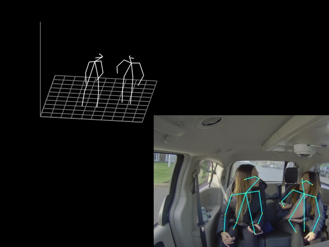

# 3D Human Pose Estimation Python* Demo

This demo demonstrates how to run 3D Human Pose Estimation models using OpenVINO&trade;. The following pre-trained models can be used:

* `human-pose-estimation-3d-0001`.

For more information about the pre-trained models, refer to the [model documentation](../../../models/public/index.md).

> **NOTE**: Only batch size of 1 is supported.
## How It Works

The demo application expects a 3D human pose estimation model in the Intermediate Representation (IR) format.

As input, the demo application can take:
* a path to a video file or a device node of a web-camera.
* a list of image paths.

The demo workflow is the following:

1. The demo application reads video frames one by one and estimates 3D human poses in a given frame.
2. The app visualizes results of its work as graphical window with 2D poses, which are overlaid on input image, and canvas with corresponding 3D poses.

> **NOTE**: By default, Open Model Zoo demos expect input with BGR channels order. If you trained your model to work with RGB order, you need to manually rearrange the default channels order in the demo application or reconvert your model using the Model Optimizer tool with `--reverse_input_channels` argument specified. For more information about the argument, refer to **When to Reverse Input Channels** section of [Converting a Model Using General Conversion Parameters](https://docs.openvinotoolkit.org/latest/_docs_MO_DG_prepare_model_convert_model_Converting_Model_General.html).
## Prerequisites

This demo application requires a native Python extension module to be built before you can run it.
Refer to [Using Open Model Zoo demos](../../README.md), for instructions on how to build it and prepare the environment for running the demo.

## Running

Run the application with the `-h` option to see the following usage message:

```
usage: human_pose_estimation_3d_demo.py [-h] -m MODEL [-i INPUT [INPUT ...]]
                                        [-d DEVICE]
                                        [--height_size HEIGHT_SIZE]
                                        [--extrinsics_path EXTRINSICS_PATH]
                                        [--fx FX] [--no_show]

Lightweight 3D human pose estimation demo. Press esc to exit, "p" to (un)pause
video or process next image.

Options:
  -h, --help            Show this help message and exit.
  -m MODEL, --model MODEL
                        Required. Path to an .xml file with a trained model.
  -i INPUT [INPUT ...], --input INPUT [INPUT ...]
                        Required. Path to input image, images, video file or
                        camera id.
  -d DEVICE, --device DEVICE
                        Optional. Specify the target device to infer on: CPU,
                        GPU, FPGA, HDDL or MYRIAD. The demo will look for a
                        suitable plugin for device specified (by default, it
                        is CPU).
  --height_size HEIGHT_SIZE
                        Optional. Network input layer height size.
  --extrinsics_path EXTRINSICS_PATH
                        Optional. Path to file with camera extrinsics.
  --fx FX               Optional. Camera focal length.
  --no_show             Optional. Do not display output.

```

Running the application with an empty list of options yields the short version of the usage message and an error message.

To run the demo, you can use public or pre-trained models. To download the pre-trained models, use the OpenVINO [Model Downloader](../../../tools/downloader/README.md) or go to [https://download.01.org/opencv/](https://download.01.org/opencv/).

> **NOTE**: Before running the demo with a trained model, make sure the model is converted to the Inference Engine format (`*.xml` + `*.bin`) using the [Model Optimizer tool](https://docs.openvinotoolkit.org/latest/_docs_MO_DG_Deep_Learning_Model_Optimizer_DevGuide.html).
To run the demo, please provide paths to the model in the IR format, and to an input video or image(s):
```bash
python human_pose_estination_3d_demo.py \
-m /home/user/human-pose-estimation-3d-0001.xml \
-i /home/user/video_name.mp4
```

## Demo Output

The application uses OpenCV to display found poses and current inference performance.



## See Also
* [Using Open Model Zoo demos](../../README.md)
* [Model Optimizer](https://docs.openvinotoolkit.org/latest/_docs_MO_DG_Deep_Learning_Model_Optimizer_DevGuide.html)
* [Model Downloader](../../../tools/downloader/README.md)
