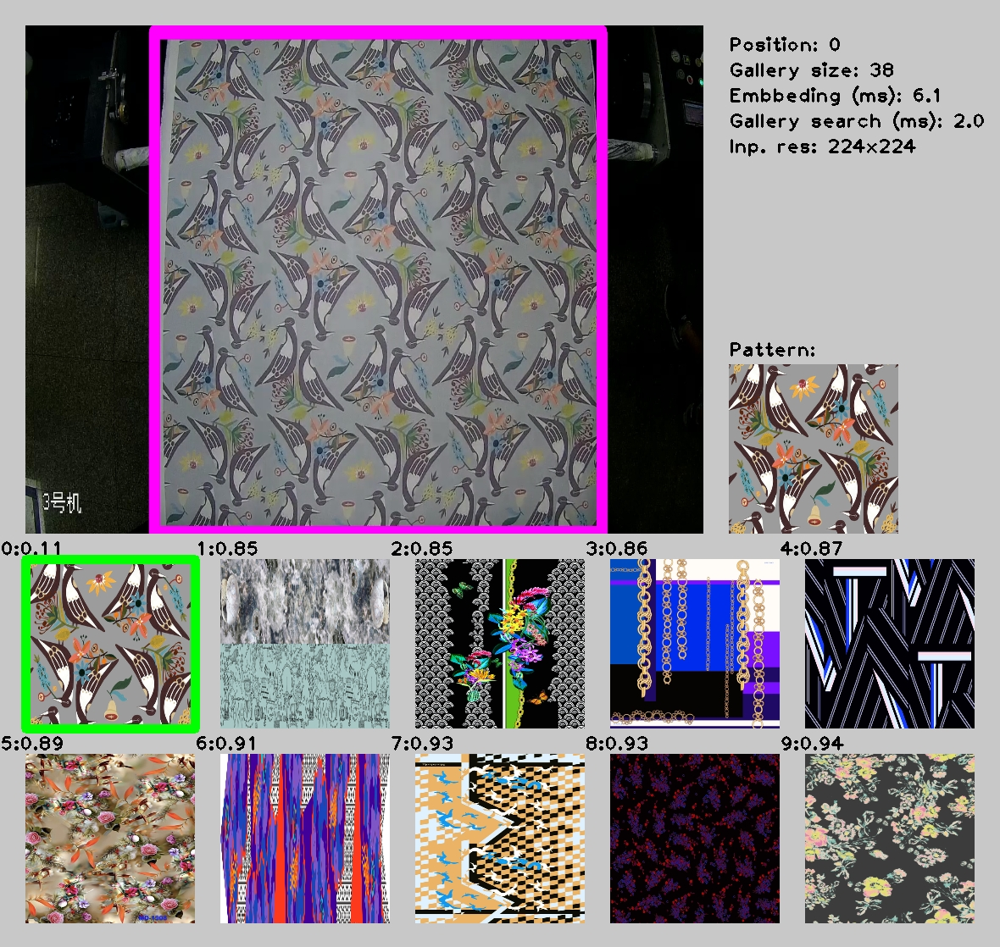

# Image Retrieval Python* Demo

This demo demonstrates how to run Image Retrieval models using OpenVINO&trade;.

> **NOTE**: Only batch size of 1 is supported.

## How It Works

The demo application expects an image retrieval model in the Intermediate Representation (IR) format.

As input, the demo application takes:
* a path to a list of images represeneted by textfile with following format 'path_to_image' 'ID' `--images`
* a path to a video file or a device node of a web-camera specified with a command line argument `--video`

The demo workflow is the following:

1. The demo application reads video frames one by one, runs ROI detector that extracts ROI (moving area).
2. Extracted ROI is passed to artificial neural network that computes embedding vector for extracted frame area.
3. Then the demo application searches computed embedding in gallery of images in order to determine which image in the gallery is the most similar to what one can see on video frame.
4. The app visualizes results of it work as graphical window where following objects are shown.
    - Input frame with detected ROI.
    - Top-10 most similar images from the gallery.
    - Performance characteristics.

> **NOTE**: By default, Open Model Zoo demos expect input with BGR channels order. If you trained your model to work with RGB order, you need to manually rearrange the default channels order in the demo application or reconvert your model using the Model Optimizer tool with `--reverse_input_channels` argument specified. For more information about the argument, refer to **When to Reverse Input Channels** section of [Converting a Model Using General Conversion Parameters](https://docs.openvinotoolkit.org/latest/_docs_MO_DG_prepare_model_convert_model_Converting_Model_General.html).

## Running

Run the application with the `-h` option to see the following usage message:

```
usage: image_retrieval_demo.py [-h] -m MODEL -i I -g GALLERY
                               [-gt GROUND_TRUTH] [-d DEVICE]
                               [-l CPU_EXTENSION]

Options:
  -h, --help            Show this help message and exit.
  -m MODEL, --model MODEL
                        Required. Path to an .xml file with a trained model.
  -i I                  Required. Path to a video file or a device node of a web-camera.
  -g GALLERY, --gallery GALLERY
                        Required. Path to a file listing gallery images.
  -gt GROUND_TRUTH, --ground_truth GROUND_TRUTH
                        Optional. Ground truth class.
  -d DEVICE, --device DEVICE
                        Optional. Specify the target device to infer on: CPU,
                        GPU, FPGA, HDDL or MYRIAD. The demo will look for a
                        suitable plugin for device specified (by default, it
                        is CPU).
  -l CPU_EXTENSION, --cpu_extension CPU_EXTENSION
                        Optional. Required for CPU custom layers. Absolute
                        path to a shared library with the kernels
                        implementations.
```

Running the application with an empty list of options yields the short version of the usage message and an error message.

To run the demo, you can use public or pre-trained models. To download the pre-trained models, use the OpenVINO [Model Downloader](../../../tools/downloader/README.md) or go to [https://download.01.org/opencv/](https://download.01.org/opencv/).

> **NOTE**: Before running the demo with a trained model, make sure the model is converted to the Inference Engine format (`*.xml` + `*.bin`) using the [Model Optimizer tool](https://docs.openvinotoolkit.org/latest/_docs_MO_DG_Deep_Learning_Model_Optimizer_DevGuide.html).

To run the demo, please provide paths to the model in the IR format, to a file with class labels, and to an input video, image, or folder with images:
```bash
python image_retrieval_demo.py \
-m /home/user/image-retrieval-0001.xml \
-v /home/user/video.dav.mp4 \
-i /home/user/list.txt \
-l /opt/intel/openvino/inference_engine/lib/intel64/libcpu_extension_avx512.so \
--ground_truth text_label
```

## Demo Output

The application uses OpenCV to display gallery searching result and current inference performance.



## See Also
* [Using Open Model Zoo demos](../../README.md)
* [Model Optimizer](https://docs.openvinotoolkit.org/latest/_docs_MO_DG_Deep_Learning_Model_Optimizer_DevGuide.html)
* [Model Downloader](../../../tools/downloader/README.md)
