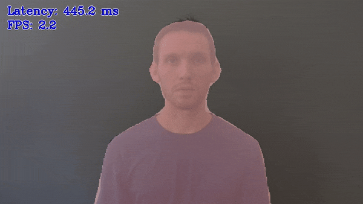

# Image Segmentation C++ Demo



This topic demonstrates how to run the Image Segmentation demo application, which does inference using semantic segmentation networks.

> **NOTE:** This topic describes usage of C++ implementation of the Image Segmentation Demo. For the Python* implementation, refer to [Image Segmentation Python\* Demo](../python/README.md).

## How It Works

On startup the demo application reads command line parameters and loads a network. The demo runs inference and shows results for each image captured from an input. Depending on number of inference requests processing simultaneously (-nireq parameter) the pipeline might minimize the time required to process each single image (for nireq 1) or maximizes utilization of the device and overall processing performance.

> **NOTE**: By default, Open Model Zoo demos expect input with BGR channels order. If you trained your model to work with RGB order, you need to manually rearrange the default channels order in the demo application or reconvert your model using the Model Optimizer tool with the `--reverse_input_channels` argument specified. For more information about the argument, refer to **When to Reverse Input Channels** section of [Converting a Model Using General Conversion Parameters](https://docs.openvinotoolkit.org/latest/_docs_MO_DG_prepare_model_convert_model_Converting_Model_General.html).

## Preparing to Run

For demo input image or video files you may refer to [Media Files Available for Demos](../../README.md#Media-Files-Available-for-Demos).
The list of models supported by the demo is in `<omz_dir>/demos/segmentation_demo/cpp/models.lst` file.
This file can be used as a parameter for [Model Downloader](../../../tools/downloader/README.md) and Converter to download and, if necessary, convert models to OpenVINO Inference Engine format (\*.xml + \*.bin).

An example of using the Model Downloader:

```sh
python3 <omz_dir>/tools/downloader/downloader.py --list models.lst
```

An example of using the Model Converter:

```sh
python3 <omz_dir>/tools/downloader/converter.py --list models.lst
```

### Supported Models

* deeplabv3
* fastseg-large
* fastseg-small
* hrnet-v2-c1-segmentation
* icnet-camvid-ava-0001
* icnet-camvid-ava-sparse-30-0001
* icnet-camvid-ava-sparse-60-0001
* pspnet-pytorch
* road-segmentation-adas-0001
* semantic-segmentation-adas-0001
* unet-camvid-onnx-0001

> **NOTE**: Refer to the tables [Intel's Pre-Trained Models Device Support](../../../models/intel/device_support.md) and [Public Pre-Trained Models Device Support](../../../models/public/device_support.md) for the details on models inference support at different devices.

## Running

Running the application with the `-h` option yields the following usage message:

```
[ INFO ] InferenceEngine: <version>

segmentation_demo [OPTION]
Options:

    -h                        Print a usage message.
    -i                        Required. An input to process. The input must be a single image, a folder of images, video file or camera id.
    -m "<path>"               Required. Path to an .xml file with a trained model.
    -o "<path>"               Optional. Name of the output file(s) to save.
    -limit "<num>"            Optional. Number of frames to store in output. If 0 is set, all frames are stored.
      -l "<absolute_path>"    Required for CPU custom layers. Absolute path to a shared library with the kernel implementations.
          Or
      -c "<absolute_path>"    Required for GPU custom kernels. Absolute path to the .xml file with the kernel descriptions.
    -d "<device>"             Optional. Specify the target device to infer on (the list of available devices is shown below). Default value is CPU. Use "-d HETERO:<comma-separated_devices_list>" format to specify HETERO plugin. The demo will look for a suitable plugin for a specified device.
    -pc                       Optional. Enables per-layer performance report.
    -nireq "<integer>"        Optional. Number of infer requests. If this option is omitted, number of infer requests is determined automatically.
    -auto_resize              Optional. Enables resizable input with support of ROI crop & auto resize.
    -nthreads "<integer>"     Optional. Number of threads.
    -nstreams                 Optional. Number of streams to use for inference on the CPU or/and GPU in throughput mode (for HETERO and MULTI device cases use format <device1>:<nstreams1>,<device2>:<nstreams2> or just <nstreams>)
    -loop                     Optional. Enable reading the input in a loop.
    -no_show                  Optional. Don't show output.
    -output_resolution        Optional. Specify the maximum output window resolution in (width x height) format. Example: 1280x720. Input frame size used by default.
    -u                        Optional. List of monitors to show initially.
```

Running the application with the empty list of options yields an error message.

You can use the following command to do inference on CPU on images captured by a camera using a pre-trained network:

```sh
./segmentation_demo -d CPU -i 0 -m <path_to_model>/semantic-segmentation-adas-0001.xml
```

>**NOTE**: If you provide a single image as an input, the demo processes and renders it quickly, then exits. To continuously visualize inference results on the screen, apply the `loop` option, which enforces processing a single image in a loop.

You can save processed results to a Motion JPEG AVI file or separate JPEG or PNG files using the `-o` option:

* To save processed results in an AVI file, specify the name of the output file with `avi` extension, for example: `-o output.avi`.
* To save processed results as images, specify the template name of the output image file with `jpg` or `png` extension, for example: `-o output_%03d.jpg`. The actual file names are constructed from the template at runtime by replacing regular expression `%03d` with the frame number, resulting in the following: `output_000.jpg`, `output_001.jpg`, and so on.
To avoid disk space overrun in case of continuous input stream, like camera, you can limit the amount of data stored in the output file(s) with the `limit` option. The default value is 1000. To change it, you can apply the `-limit N` option, where `N` is the number of frames to store.

>**NOTE**: Windows\* systems may not have the Motion JPEG codec installed by default. If this is the case, you can download OpenCV FFMPEG back end using the PowerShell script provided with the OpenVINO &trade; install package and located at `<INSTALL_DIR>/opencv/ffmpeg-download.ps1`. The script should be run with administrative privileges if OpenVINO &trade; is installed in a system protected folder (this is a typical case). Alternatively, you can save results as images.

## Demo Output

The demo uses OpenCV to display the resulting images with blended segmentation mask.

## See Also

* [Open Model Zoo Demos](../../README.md)
* [Model Optimizer](https://docs.openvinotoolkit.org/latest/_docs_MO_DG_Deep_Learning_Model_Optimizer_DevGuide.html)
* [Model Downloader](../../../tools/downloader/README.md)
