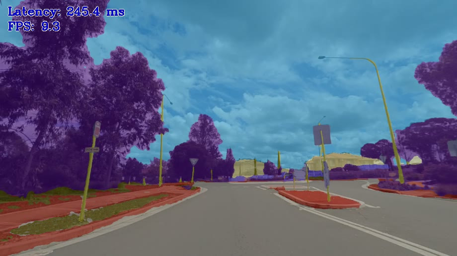

# Image Segmentation Python\* Demo


This topic demonstrates how to run the Image Segmentation demo application, which does inference using semantic segmentation networks.

> **NOTE:** This topic describes usage of Python\* implementation of the Image Segmentation Demo. For the C++ implementation, refer to [Image Segmentation C++ Demo](../cpp/README.md).

## How It Works

On startup the demo application reads command line parameters and loads a model to OpenVINO™ Runtime plugin. The demo runs inference and shows results for each image captured from an input. Demo provides default mapping of classes to colors and optionally, allows to specify mapping of classes to colors from simple text file, with using `--colors` argument. Depending on number of inference requests processing simultaneously (-nireq parameter) the pipeline might minimize the time required to process each single image (for nireq 1) or maximize utilization of the device and overall processing performance.

> **NOTE**: By default, Open Model Zoo demos expect input with BGR channels order. If you trained your model to work with RGB order, you need to manually rearrange the default channels order in the demo application or reconvert your model using the Model Optimizer tool with the `--reverse_input_channels` argument specified. For more information about the argument, refer to **When to Reverse Input Channels** section of [Embedding Preprocessing Computation](@ref openvino_docs_MO_DG_Additional_Optimization_Use_Cases).

## Model API

The demo utilizes model wrappers, adapters and pipelines from [Python* Model API](../../common/python/model_zoo/model_api/README.md).

The generalized interface of wrappers with its unified results representation provides the support of multiple different semantic segmentation model topologies in one demo.

## Preparing to Run

For demo input image or video files, refer to the section **Media Files Available for Demos** in the [Open Model Zoo Demos Overview](../../README.md).
The list of models supported by the demo is in `<omz_dir>/demos/segmentation_demo/python/models.lst` file.
This file can be used as a parameter for [Model Downloader](../../../tools/model_tools/README.md) and Converter to download and, if necessary, convert models to OpenVINO IR format (\*.xml + \*.bin).

An example of using the Model Downloader:

```sh
omz_downloader --list models.lst
```

An example of using the Model Converter:

```sh
omz_converter --list models.lst
```

### Supported Models

* architecture_type = segmentation
  - deeplabv3
  - drn-d-38
  - erfnet
  - fastseg-large
  - fastseg-small
  - hrnet-v2-c1-segmentation
  - icnet-camvid-ava-0001
  - icnet-camvid-ava-sparse-30-0001
  - icnet-camvid-ava-sparse-60-0001
  - pspnet-pytorch
  - road-segmentation-adas-0001
  - semantic-segmentation-adas-0001
  - unet-camvid-onnx-0001
* architecture_type = salient_object_detection
  - f3net

> **NOTE**: Refer to the tables [Intel's Pre-Trained Models Device Support](../../../models/intel/device_support.md) and [Public Pre-Trained Models Device Support](../../../models/public/device_support.md) for the details on models inference support at different devices.

> **NOTE**: The results can significantly differ depending on the model used for background segmentation and outdoors camera images segmentation.



## Running

Running the application with the `-h` option yields the following usage message:

```
usage: segmentation_demo.py [-h] -m MODEL -i INPUT
                            [-at {segmentation,salient_object_detection}]
                            [--adapter {openvino,ovms}] [-d DEVICE] [-c COLORS]
                            [-nireq NUM_INFER_REQUESTS]
                            [-nstreams NUM_STREAMS]
                            [-nthreads NUM_THREADS]
                            [--loop] [-o OUTPUT]
                            [-limit OUTPUT_LIMIT] [--no_show]
                            [--output_resolution OUTPUT_RESOLUTION]
                            [-u UTILIZATION_MONITORS]
Options:
  -h, --help            Show this help message and exit.
  -m MODEL, --model MODEL
                        Required. Path to an .xml file with a trained model or
                        address of model inference service if using OVMS adapter.
  -at {segmentation, salient_object_detection}, --architecture_type {segmentation, salient_object_detection}
                        Required. Specify model's architecture type.
  -i INPUT, --input INPUT
                        Required. An input to process. The input must be a
                        single image, a folder of images, video file or camera id.
  --adapter {openvino,ovms}
                        Optional. Specify the model adapter. Default is
                        openvino.
  -d DEVICE, --device DEVICE
                        Optional. Specify the target device to infer on; CPU or
                        GPU is acceptable. The demo
                        will look for a suitable plugin for device specified.
                        Default value is CPU.

Common model options:
  -c COLORS, --colors COLORS
                        Optional. Path to a text file containing colors for
                        classes.
  --labels LABELS       Optional. Labels mapping file.

Inference options:
  -nireq NUM_INFER_REQUESTS, --num_infer_requests NUM_INFER_REQUESTS
                        Optional. Number of infer requests.
  -nstreams NUM_STREAMS, --num_streams NUM_STREAMS
                        Optional. Number of streams to use for inference on
                        the CPU or/and GPU in throughput mode (for HETERO and
                        MULTI device cases use format
                        <device1>:<nstreams1>,<device2>:<nstreams2> or just
                        <nstreams>).
  -nthreads NUM_THREADS, --num_threads NUM_THREADS
                        Optional. Number of threads to use for inference on
                        CPU (including HETERO cases).

Input/output options:
  --loop                Optional. Enable reading the input in a loop.
  -o OUTPUT, --output OUTPUT
                        Optional. Name of the output file(s) to save. Frames of odd width or height can be truncated. See https://github.com/opencv/opencv/pull/24086
  -limit OUTPUT_LIMIT, --output_limit OUTPUT_LIMIT
                        Optional. Number of frames to store in output.
                        If 0 is set, all frames are stored.
  --no_show             Optional. Don't show output.
  --output_resolution OUTPUT_RESOLUTION
                        Optional. Specify the maximum output window resolution
                        in (width x height) format. Example: 1280x720.
                        Input frame size used by default.
  -u UTILIZATION_MONITORS, --utilization_monitors UTILIZATION_MONITORS
                        Optional. List of monitors to show initially.
  --only_masks          Optional. Display only masks. Could be switched by TAB key.

Debug options:
  -r, --raw_output_message
                        Optional. Output inference results as mask histogram.
```

Running the application with the empty list of options yields the usage message given above and an error message.

You can use the following command to do inference on CPU on images captured by a camera using a pre-trained network:

```sh
    python3 segmentation_demo.py -d CPU -i 0 -at segmentation -m <path_to_model>/semantic-segmentation-adas-0001.xml
```

>**NOTE**: If you provide a single image as an input, the demo processes and renders it quickly, then exits. To continuously visualize inference results on the screen, apply the `loop` option, which enforces processing a single image in a loop.

You can save processed results to a Motion JPEG AVI file or separate JPEG or PNG files using the `-o` option:

* To save processed results in an AVI file, specify the name of the output file with `avi` extension, for example: `-o output.avi`.
* To save processed results as images, specify the template name of the output image file with `jpg` or `png` extension, for example: `-o output_%03d.jpg`. The actual file names are constructed from the template at runtime by replacing regular expression `%03d` with the frame number, resulting in the following: `output_000.jpg`, `output_001.jpg`, and so on.
To avoid disk space overrun in case of continuous input stream, like camera, you can limit the amount of data stored in the output file(s) with the `limit` option. The default value is 1000. To change it, you can apply the `-limit N` option, where `N` is the number of frames to store.

>**NOTE**: Windows\* systems may not have the Motion JPEG codec installed by default. If this is the case, you can download OpenCV FFMPEG back end using the PowerShell script provided with the OpenVINO &trade; install package and located at `<INSTALL_DIR>/opencv/ffmpeg-download.ps1`. The script should be run with administrative privileges if OpenVINO &trade; is installed in a system protected folder (this is a typical case). Alternatively, you can save results as images.

### Color Palettes

The color palette is used to visualize predicted classes. By default, the colors from PASCAL VOC dataset are applied. In case when the number of output classes is larger than number of classes provided by PASCAL VOC dataset, the rest classes are randomly colorized. Also, one can use predefined colors from other datasets, like CAMVID.

Available colors files located in the `<omz_dir>/data/palettes` folder. If you want to assign custom colors for classes, you should create a `.txt` file, where each line contains colors in `(R, G, B)` format. The demo application treats the number of each line as a dataset class identificator and applies specified color to pixels belonging to this class.

## Running with OpenVINO Model Server

You can also run this demo with model served in [OpenVINO Model Server](https://github.com/openvinotoolkit/model_server). Refer to [`OVMSAdapter`](../../common/python/model_zoo/model_api/adapters/ovms_adapter.md) to learn about running demos with OVMS.

Exemplary command:

```sh
    python3 segmentation_demo.py -i 0 -at segmentation -m localhost:9000/models/image_segmentation --adapter ovms
```

## Demo Output

The demo uses OpenCV to display the resulting images with a blended segmentation mask by default. By setting `--only_mask` option (or pressing the `TAB` key during demo running) the resulting image would contain only masks.

> **NOTE**: the output file contains the same image as displayed one.

The demo reports

* **FPS**: average rate of video frame processing (frames per second).
* **Latency**: average time required to process one frame (from reading the frame to displaying the results).
* Latency for each of the following pipeline stages:
  * **Decoding** — capturing input data.
  * **Preprocessing** — data preparation for inference.
  * **Inference** — infering input data (images) and getting a result.
  * **Postrocessing** — preparation inference result for output.
  * **Rendering** — generating output image.

You can use these metrics to measure application-level performance.

## See Also

* [Open Model Zoo Demos](../../README.md)
* [Model Optimizer](https://docs.openvino.ai/2023.0/openvino_docs_MO_DG_Deep_Learning_Model_Optimizer_DevGuide.html)
* [Model Downloader](../../../tools/model_tools/README.md)
