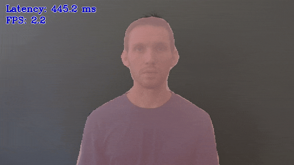

# Image Segmentation Python\* Demo



This topic demonstrates how to run the Image Segmentation demo application, which does inference using semantic segmentation networks.

> **NOTE:** This topic describes usage of Python\* implementation of the Image Segmentation Demo. For the C++ implementation, refer to [Image Segmentation C++ Demo](../cpp/README.md).

## How It Works

Upon the start-up the demo application reads command line parameters and loads a network. The demo runs inference and shows results for each image captured from an input. Demo provides default mapping of classes to colors and optionally, allow to specify mapping of classes to colors from simple text file, with using `--colors` argument. Depending on number of inference requests processing simultaneously (-nireq parameter) the pipeline might minimize the time required to process each single image (for nireq 1) or maximize utilization of the device and overall processing performance.

> **NOTE**: By default, Open Model Zoo demos expect input with BGR channels order. If you trained your model to work with RGB order, you need to manually rearrange the default channels order in the demo application or reconvert your model using the Model Optimizer tool with `--reverse_input_channels` argument specified. For more information about the argument, refer to **When to Reverse Input Channels** section of [Converting a Model Using General Conversion Parameters](https://docs.openvinotoolkit.org/latest/_docs_MO_DG_prepare_model_convert_model_Converting_Model_General.html).

## Running

Running the application with the `-h` option yields the following usage message:

```
python3 segmentation_demo.py -h
```

The command yields the following usage message:

```
usage: segmentation_demo.py [-h] -m MODEL -i INPUT
                            [-at {segmentation,salient_object_detection}
                            [-d DEVICE] [-c COLORS]
                            [-nireq NUM_INFER_REQUESTS]
                            [-nstreams NUM_STREAMS]
                            [-nthreads NUM_THREADS]
                            [--loop] [-o OUTPUT]
                            [-limit OUTPUT_LIMIT] [--no_show]
                            [--output_resolution OUTPUT_RESOLUTION]
                            [-u UTILIZATION_MONITORS]
Options:
  -h, --help            Show this help message and exit.
  -m MODEL, --model MODEL
                        Required. Path to an .xml file with a trained model.
  -at {segmentation, salient_object_detection}, --architecture_type {segmentation, salient_object_detection}
                        Optional. Default value is segmentation. Specify model's architecture type.
  -i INPUT, --input INPUT
                        Required. An input to process. The input must be a
                        single image, a folder of images, video file or camera id.
  -d DEVICE, --device DEVICE
                        Optional. Specify the target device to infer on; CPU,
                        GPU, FPGA, HDDL or MYRIAD is acceptable. The demo
                        will look for a suitable plugin for device specified.
                        Default value is CPU.

Common model options:
  -c COLORS, --colors COLORS
                        Optional. Path to a text file containing colors for
                        classes.

Inference options:
  -nireq NUM_INFER_REQUESTS, --num_infer_requests NUM_INFER_REQUESTS
                        Optional. Number of infer requests.
  -nstreams NUM_STREAMS, --num_streams NUM_STREAMS
                        Optional. Number of streams to use for inference on
                        the CPU or/and GPU in throughput mode (for HETERO and
                        MULTI device cases use format
                        <device1>:<nstreams1>,<device2>:<nstreams2> or just
                        <nstreams>).
  -nthreads NUM_THREADS, --num_threads NUM_THREADS
                        Optional. Number of threads to use for inference on
                        CPU (including HETERO cases).

Input/output options:
  --loop                Optional. Enable reading the input in a loop.
  -o OUTPUT, --output OUTPUT
                        Optional. Name of output to save.
  -limit OUTPUT_LIMIT, --output_limit OUTPUT_LIMIT
                        Optional. Number of frames to store in output.
                        If 0 is set, all frames are stored.
  --no_show             Optional. Don't show output.
  --output_resolution OUTPUT_RESOLUTION
                        Optional. Specify the maximum output window resolution
                        in (width x height) format. Example: 1280x720.
                        Input frame size used by default.
  -u UTILIZATION_MONITORS, --utilization_monitors UTILIZATION_MONITORS
                        Optional. List of monitors to show initially.
```

Running the application with the empty list of options yields the usage message given above and an error message.

To run the demo, you can use public or pre-trained models. You can download the pre-trained models with the OpenVINO [Model Downloader](../../../tools/downloader/README.md). The list of models supported by the demo is in [models.lst](./models.lst).

> **NOTE**: Before running the demo with a trained model, make sure the model is converted to the Inference Engine format (\*.xml + \*.bin) using the [Model Optimizer tool](https://docs.openvinotoolkit.org/latest/_docs_MO_DG_Deep_Learning_Model_Optimizer_DevGuide.html).


You can use the following command to do inference on CPU on images captured by a camera using a pre-trained semantic-segmentation-adas-0001 network:
```
    python3 segmentation_demo.py -i 0 -m <path_to_model>/semantic-segmentation-adas-0001.xml
```

## Color palettes

The color palette is used to visualize predicted classes. By default, the colors from PASCAL VOC dataset are applied. In case then the number of output classes is larger than number of classes provided by PASCAL VOC dataset, the rest classes are randomly colorized.
Also, one can use predefined colors from other datasets, like CAMVID.

Available colors files are in `<omz_dir>/data/palettes`.
If you want to assign custom colors for classes, you should create a `.txt` file, where the each line contains colors in `(R, G, B)` format.

## Demo Output

The demo uses OpenCV to display the resulting images with blended segmentation mask.


## See Also
* [Using Open Model Zoo demos](../../README.md)
* [Model Optimizer](https://docs.openvinotoolkit.org/latest/_docs_MO_DG_Deep_Learning_Model_Optimizer_DevGuide.html)
* [Model Downloader](../../../tools/downloader/README.md)
