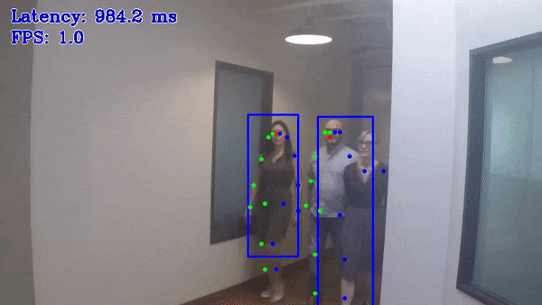

# Single Human Pose Estimation Demo (top-down pipeline)



This demo showcases top-down pipeline for human pose estimation on video or image. The task is to predict bboxes for every person on frame and then to predict a pose for every detected person. The pose may contain up to 17 keypoints: ears, eyes, nose, shoulders, elbows, wrists, hips, knees, and ankles.

## How It Works

On startup, the application reads command line parameters and loads detection person model and single human pose estimation model. Upon getting a frame from the OpenCV VideoCapture, the demo executes top-down pipeline for this frame and displays the results.

> **NOTE**: By default, Open Model Zoo demos expect input with BGR channels order. If you trained your model to work with RGB order, you need to manually rearrange the default channels order in the demo application or reconvert your model using the Model Optimizer tool with the `--reverse_input_channels` argument specified. For more information about the argument, refer to **When to Reverse Input Channels** section of [Embedding Preprocessing Computation](@ref openvino_docs_MO_DG_Additional_Optimization_Use_Cases).

## Preparing to Run

For demo input image or video files, refer to the section **Media Files Available for Demos** in the [Open Model Zoo Demos Overview](../../README.md).
The list of models supported by the demo is in `<omz_dir>/demos/single_human_pose_estimation_demo/python/models.lst` file.
This file can be used as a parameter for [Model Downloader](../../../tools/model_tools/README.md) and Converter to download and, if necessary, convert models to OpenVINO IR format (\*.xml + \*.bin).

An example of using the Model Downloader:

```sh
omz_downloader --list models.lst
```

An example of using the Model Converter:

```sh
omz_converter --list models.lst
```

### Supported Models

* pedestrian-and-vehicle-detector-adas-0001
* pedestrian-detection-adas-0002
* person-detection-retail-0013
* person-vehicle-bike-detection-crossroad-0078
* person-vehicle-bike-detection-crossroad-1016
* ssd_mobilenet_v1_coco
* ssd_mobilenet_v1_fpn_coco
* ssdlite_mobilenet_v2
* single-human-pose-estimation-0001

> **NOTE**: Refer to the tables [Intel's Pre-Trained Models Device Support](../../../models/intel/device_support.md) and [Public Pre-Trained Models Device Support](../../../models/public/device_support.md) for the details on models inference support at different devices.

## Running

Running the application with the `-h` option yields the following usage message:

```
usage: single_human_pose_estimation_demo.py [-h] -m_od MODEL_OD -m_hpe MODEL_HPE
                                            -i INPUT [--loop] [-o OUTPUT]
                                            [-limit OUTPUT_LIMIT] [-d DEVICE]
                                            [--person_label PERSON_LABEL]
                                            [--no_show]
                                            [-u UTILIZATION_MONITORS]

optional arguments:
  -h, --help            Show this help message and exit.
  -m_od MODEL_OD, --model_od MODEL_OD
                        Required. Path to model of object detector in .xml format.
  -m_hpe MODEL_HPE, --model_hpe MODEL_HPE
                        Required. Path to model of human pose estimator in .xml format.
  -i INPUT, --input INPUT
                        Required. An input to process. The input must be a single image,
                        a folder of images, video file or camera id.
  --loop                Optional. Enable reading the input in a loop.
  -o OUTPUT, --output OUTPUT
                        Optional. Name of the output file(s) to save. Frames of odd width or height can be truncated. See https://github.com/opencv/opencv/pull/24086
  -limit OUTPUT_LIMIT, --output_limit OUTPUT_LIMIT
                        Optional. Number of frames to store in output.
                        If 0 is set, all frames are stored.
  -d DEVICE, --device DEVICE
                        Optional. Specify the target to infer on CPU or GPU.
  --person_label PERSON_LABEL
                        Optional. Label of class person for detector.
  --no_show             Optional. Do not display output.
  -u UTILIZATION_MONITORS, --utilization_monitors UTILIZATION_MONITORS
                        Optional. List of monitors to show initially.
```

For example, to do inference on a CPU, run the following command:

```sh
python3 single_human_pose_estimation_demo.py -d CPU --model_od <path_to_model>/ssdlite_mobilenet_v2.xml --model_hpe <path_to_model>/single-human-pose-estimation-0001.xml --input <path_to_video>/back-passengers.avi
```

>**NOTE**: If you provide a single image as an input, the demo processes and renders it quickly, then exits. To continuously visualize inference results on the screen, apply the `loop` option, which enforces processing a single image in a loop.

You can save processed results to a Motion JPEG AVI file or separate JPEG or PNG files using the `-o` option:

* To save processed results in an AVI file, specify the name of the output file with `avi` extension, for example: `-o output.avi`.
* To save processed results as images, specify the template name of the output image file with `jpg` or `png` extension, for example: `-o output_%03d.jpg`. The actual file names are constructed from the template at runtime by replacing regular expression `%03d` with the frame number, resulting in the following: `output_000.jpg`, `output_001.jpg`, and so on.
To avoid disk space overrun in case of continuous input stream, like camera, you can limit the amount of data stored in the output file(s) with the `limit` option. The default value is 1000. To change it, you can apply the `-limit N` option, where `N` is the number of frames to store.

>**NOTE**: Windows\* systems may not have the Motion JPEG codec installed by default. If this is the case, you can download OpenCV FFMPEG back end using the PowerShell script provided with the OpenVINO &trade; install package and located at `<INSTALL_DIR>/opencv/ffmpeg-download.ps1`. The script should be run with administrative privileges if OpenVINO &trade; is installed in a system protected folder (this is a typical case). Alternatively, you can save results as images.

## Demo Output

The demo uses OpenCV to display the resulting frame with estimated poses.
The demo reports

* **FPS**: average rate of video frame processing (frames per second).
* **Latency**: average time required to process one frame (from reading the frame to displaying the results).
You can use both of these metrics to measure application-level performance.

## See Also

* [Open Model Zoo Demos](../../README.md)
* [Model Optimizer](https://docs.openvino.ai/2023.0/openvino_docs_MO_DG_Deep_Learning_Model_Optimizer_DevGuide.html)
* [Model Downloader](../../../tools/model_tools/README.md)
