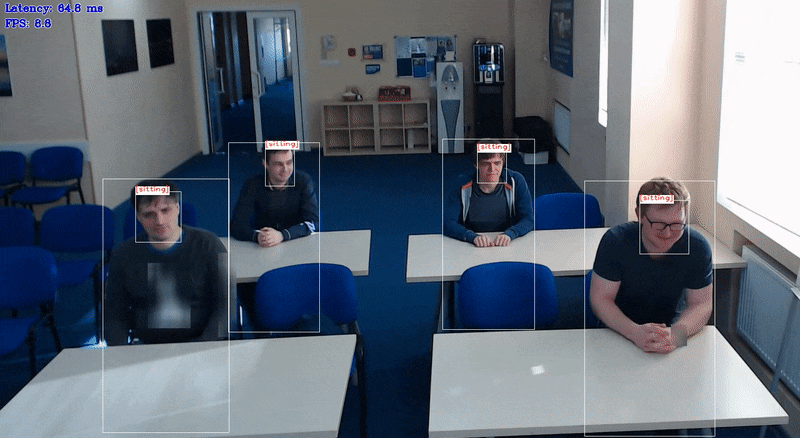

# Smart Classroom C++ Demo



The demo shows an example of joint usage of several neural networks to detect student actions (sitting, standing, raising hand for the `person-detection-action-recognition-0005` model and sitting, writing, raising hand, standing, turned around, lie on the desk for the `person-detection-action-recognition-0006` model) and recognize people by faces in the classroom environment. The demo uses Async API for action and face detection networks. It allows to parallelize execution of face recognition and detection: while face recognition is running on one accelerator, face and action detection could be performed on another. You can use a set of the following pre-trained models with the demo:

* `face-detection-adas-0001`, which is a primary detection network for finding faces.
* `landmarks-regression-retail-0009`, which is executed on top of the results from the first network and outputs
a vector of facial landmarks for each detected face.
* `face-reidentification-retail-0095`,  which is executed on top of the results from the first network and outputs
a vector of features for each detected face.
* `person-detection-action-recognition-0005`, which is a detection network for finding persons and simultaneously predicting their current actions (3 actions - sitting, standing, raising hand).
* `person-detection-action-recognition-0006`, which is a detection network for finding persons and simultaneously predicting their current actions (6 actions: sitting, writing, raising hand, standing, turned around, lie on the desk).
* `person-detection-raisinghand-recognition-0001`, which is a detection network for finding students and simultaneously predicting their current actions (in contrast with the previous model, predicts only if a student raising hand or not).
* `person-detection-action-recognition-teacher-0002`, which is a detection network for finding persons and simultaneously predicting their current actions.

## How It Works

On startup, the application reads command line parameters and loads four models to OpenVINO™ Runtime plugin for execution on different devices depending on `-m...` options family. Upon getting a frame from the OpenCV VideoCapture, it performs inference of Face Detection and Action Detection networks. After that, the ROIs obtained by Face Detector are fed to the Facial Landmarks Regression network. Then landmarks are used to align faces by affine transform and feed them to the Face Recognition network. The recognized faces are matched with detected actions to find an action for a recognized person for each frame.

> **NOTE**: By default, Open Model Zoo demos expect input with BGR channels order. If you trained your model to work with RGB order, you need to manually rearrange the default channels order in the demo application or reconvert your model using the Model Optimizer tool with the `--reverse_input_channels` argument specified. For more information about the argument, refer to **When to Reverse Input Channels** section of [Embedding Preprocessing Computation](@ref openvino_docs_MO_DG_Additional_Optimization_Use_Cases).

## Creating a Gallery for Face Recognition

To recognize faces on a frame, the demo needs a gallery of reference images. Each image should contain a tight crop of face. You can create the gallery from an arbitrary list of images:

1. Put images containing tight crops of frontal-oriented faces to a separate empty folder. Each identity must have only one image. Name images as `id_name0.png, id_name1.png, ...`.
2. Run the `python3 <omz_dir>/demos/smart_classroom_demo/utils/create_list.py <path_to_folder_with_images>` command, which will create a `faces_gallery.json` file with list of files and identities.

## Preparing to Run

For demo input image or video files, refer to the section **Media Files Available for Demos** in the [Open Model Zoo Demos Overview](../../README.md).
The list of models supported by the demo is in `<omz_dir>/demos/smart_classroom_demo/cpp/models.lst` file.
This file can be used as a parameter for [Model Downloader](../../../tools/model_tools/README.md) and Converter to download and, if necessary, convert models to OpenVINO IR format (\*.xml + \*.bin).

An example of using the Model Downloader:

```sh
omz_downloader --list models.lst
```

An example of using the Model Converter:

```sh
omz_converter --list models.lst
```

### Supported Models

* face-detection-adas-0001
* face-recognition-resnet100-arcface-onnx
* face-reidentification-retail-0095
* facenet-20180408-102900
* landmarks-regression-retail-0009
* person-detection-action-recognition-0005
* person-detection-action-recognition-0006
* person-detection-action-recognition-teacher-0002
* person-detection-raisinghand-recognition-0001

> **NOTE**: Refer to the tables [Intel's Pre-Trained Models Device Support](../../../models/intel/device_support.md) and [Public Pre-Trained Models Device Support](../../../models/public/device_support.md) for the details on models inference support at different devices.

## Running

Running the application with the `-h` option yields the following usage message:

```
smart_classroom_demo [OPTION]
Options:

    -h                             Print a usage message.
    -i                             Required. An input to process. The input must be a single image, a folder of images, video file or camera id.
    -loop                          Optional. Enable reading the input in a loop.
    -read_limit                    Optional. Read length limit before stopping or restarting reading the input.
    -o "<path>"                    Optional. Name of the output file(s) to save. Frames of odd width or height can be truncated. See https://github.com/opencv/opencv/pull/24086
    -limit "<num>"                 Optional. Number of frames to store in output. If 0 is set, all frames are stored.
    -m_act '<path>'                Required. Path to the Person/Action Detection Retail model (.xml) file.
    -m_fd '<path>'                 Required. Path to the Face Detection model (.xml) file.
    -m_lm '<path>'                 Optional. Path to the Facial Landmarks Regression Retail model (.xml) file.
    -m_reid '<path>'               Optional. Path to the Face Reidentification Retail model (.xml) file.
    -d_act '<device>'              Optional. Specify the target device for Person/Action Detection Retail (the list of available devices is shown below). Default value is CPU. Use "-d HETERO:<comma-separated_devices_list>" format to specify HETERO plugin. The application looks for a suitable plugin for the specified device.
    -d_fd '<device>'               Optional. Specify the target device for Face Detection Retail (the list of available devices is shown below). Default value is CPU. Use "-d HETERO:<comma-separated_devices_list>" format to specify HETERO plugin. The application looks for a suitable plugin for the specified device.
    -d_lm '<device>'               Optional. Specify the target device for Landmarks Regression Retail (the list of available devices is shown below). Default value is CPU. Use "-d HETERO:<comma-separated_devices_list>" format to specify HETERO plugin. The application looks for a suitable plugin for the specified device.
    -d_reid '<device>'             Optional. Specify the target device for Face Reidentification Retail (the list of available devices is shown below). Default value is CPU. Use "-d HETERO:<comma-separated_devices_list>" format to specify HETERO plugin. The application looks for a suitable plugin for the specified device.
    -greedy_reid_matching          Optional. Use faster greedy matching algorithm in face reid.
    -r                             Optional. Output Inference results as raw values.
    -ad                            Optional. Output file name to save per-person action statistics in. Requires -teacher_id and -a_top to be unset and -fg to be set
    -t_ad                          Optional. Probability threshold for person/action detection.
    -t_ar                          Optional. Probability threshold for action recognition.
    -t_fd                          Optional. Probability threshold for face detections.
    -inh_fd                        Optional. Input image height for face detector.
    -inw_fd                        Optional. Input image width for face detector.
    -exp_r_fd                      Optional. Expand ratio for bbox before face recognition.
    -t_reid                        Optional. Cosine distance threshold between two vectors for face reidentification.
    -fg                            Optional. Path to a faces gallery in .json format.
    -teacher_id                    Optional. ID of a teacher. You must also set a faces gallery parameter (-fg) to use it.
    -no_show                       Optional. Don't show output.
    -min_ad                        Optional. Minimum action duration in seconds.
    -d_ad                          Optional. Maximum time difference between actions in seconds.
    -student_ac                    Optional. List of student actions separated by a comma.
    -top_ac                        Optional. List of student actions (for top-k mode) separated by a comma.
    -teacher_ac                    Optional. List of teacher actions separated by a comma.
    -top_id                        Optional. Target action name.
    -a_top                         Optional. Number of first K students. If this parameter is positive, the demo detects first K persons with the action, pointed by the parameter 'top_id'
    -crop_gallery                  Optional. Crop images during faces gallery creation.
    -t_reg_fd                      Optional. Probability threshold for face detections during database registration.
    -min_size_fr                   Optional. Minimum input size for faces during database registration.
    -al                            Optional. Output file name to save per-person action detections in.
    -ss_t                          Optional. Number of frames to smooth actions.
    -u                             Optional. List of monitors to show initially.
```

Running the application with the empty list of options yields an error message.

Example of a valid command line to run the application with pre-trained models for recognizing students actions:

```sh
./smart_classroom_demo \
    -i <path_to_video> \
    -m_act <path_to_model>/person-detection-action-recognition-0005.xml \
    -student_ac "sitting, standing, raising hand" \
    -m_fd <path_to_model>/face-detection-adas-0001.xml \
    -m_reid <path_to_model>/face-reidentification-retail-0095.xml \
    -m_lm <path_to_model>/landmarks-regression-retail-0009.xml \
    -t_reid 0.8 \
    -fg <path_to_faces_gallery.json>
```

> **NOTE**: To recognize actions of students, use `person-detection-action-recognition-0005` model for 3 basic actions and `person-detection-action-recognition-0006` model for 6 actions. See model description for more details on the list of recognized actions.

Example of a valid command line to run the application for recognizing actions of a teacher:

```sh
./smart_classroom_demo \
    -i <path_to_video> \
    -m_act <path_to_model>/person-detection-action-recognition-teacher-0002.xml \
    -m_fd <path_to_model>/face-detection-adas-0001.xml \
    -m_reid <path_to_model>/face-reidentification-retail-0095.xml \
    -m_lm <path_to_model>/landmarks-regression-retail-0009.xml \
    -fg <path to faces_gallery.json> \
    -top_id \
    -teacher_id <ID of a teacher in the face gallery>
```

> **NOTE**: To recognize actions of a teacher, use `person-detection-action-recognition-teacher-0002` model. See model description for more details on the list of recognized actions.

Example of a valid command line to run the application for recognizing first raised-hand students:

```sh
./smart_classroom_demo \
    -i <path_to_video> \
    -m_act <path_to_model>/person-detection-raisinghand-recognition-0001.xml \
    -a_top <number of first raised-hand students>
```

> **NOTE**: To recognize raising hand action of students, use `person-detection-raisinghand-recognition-0001` model.

>**NOTE**: If you provide a single image as an input, the demo processes and renders it quickly, then exits. To continuously visualize inference results on the screen, apply the `loop` option, which enforces processing a single image in a loop.

You can save processed results to a Motion JPEG AVI file or separate JPEG or PNG files using the `-o` option:

* To save processed results in an AVI file, specify the name of the output file with `avi` extension, for example: `-o output.avi`.
* To save processed results as images, specify the template name of the output image file with `jpg` or `png` extension, for example: `-o output_%03d.jpg`. The actual file names are constructed from the template at runtime by replacing regular expression `%03d` with the frame number, resulting in the following: `output_000.jpg`, `output_001.jpg`, and so on.
To avoid disk space overrun in case of continuous input stream, like camera, you can limit the amount of data stored in the output file(s) with the `limit` option. The default value is 1000. To change it, you can apply the `-limit N` option, where `N` is the number of frames to store.

>**NOTE**: Windows\* systems may not have the Motion JPEG codec installed by default. If this is the case, you can download OpenCV FFMPEG back end using the PowerShell script provided with the OpenVINO &trade; install package and located at `<INSTALL_DIR>/opencv/ffmpeg-download.ps1`. The script should be run with administrative privileges if OpenVINO &trade; is installed in a system protected folder (this is a typical case). Alternatively, you can save results as images.

## Demo Output

The demo uses OpenCV to display the resulting frame with labeled actions and faces. The demo reports:

* **FPS**: average rate of video frame processing (frames per second).
* **Latency**: average time required to process one frame (from reading the frame to displaying the results).

You can use these metrics to measure application-level performance.

## See Also

* [Open Model Zoo Demos](../../README.md)
* [Model Optimizer](https://docs.openvino.ai/2023.0/openvino_docs_MO_DG_Deep_Learning_Model_Optimizer_DevGuide.html)
* [Model Downloader](../../../tools/model_tools/README.md)
