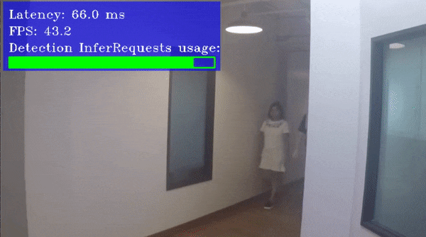

# Social Distance C++ Demo



This demo showcases a retail social distance application that detects people and measures the distance between them. If this distance is less than a value previously provided by the user, then an alert is triggered.

Other demo objectives are:
* Video/Camera as inputs, via OpenCV\*
* Example of complex asynchronous networks pipelining: Person Re-Identification network is executed on top of the Person Detection results
* Visualization of the minimum social distancing threshold violation

## How It Works

On the start-up, the application reads command line parameters and loads the specified networks. Both Person Detection and Re-Identification networks are required.

The core component of the application pipeline is the Worker class, which executes incoming instances of a `Task` class.
`Task` is an abstract class that describes data to process and how to process the data.
For example, a `Task` can be to read a frame or to get detection results.
There is a pool of `Task` instances. These `Task`s are awaiting to be executed.
When a `Task` from the pool is being executed, it may create and/or submit another `Task` to the pool.
Each `Task` stores a smart pointer to an instance of `VideoFrame`, which represents an image the `Task` works with.
When the sequence of `Task`s is completed and none of the `Task`s require a `VideoFrame` instance, the `VideoFrame` is destroyed.
This triggers creation of a new sequence of `Task`s.
The pipeline of this demo executes the following sequence of `Task`s:
* `Reader`, which reads a new frame
* `InferTask`, which starts detection inference
* `DetectionsProcessor`, which waits for detection inference to complete and runs a Re-Identification model
* `ResAggregator`, which draws the results of the inference on the frame
* `Drawer`, which shows the frame with the inference results

At the end of the sequence, the `VideoFrame` is destroyed and the sequence starts again for the next frame.

> **NOTE**: By default, Open Model Zoo demos expect input with BGR channels order. If you trained your model to work with RGB order, you need to manually rearrange the default channels order in the demo application or reconvert your model using the Model Optimizer tool with the `--reverse_input_channels` argument specified. For more information about the argument, refer to **When to Reverse Input Channels** section of [Embedding Preprocessing Computation](@ref openvino_docs_MO_DG_Additional_Optimization_Use_Cases).

## Preparing to Run

For demo input image or video files, refer to the section **Media Files Available for Demos** in the [Open Model Zoo Demos Overview](../../README.md).
The list of models supported by the demo is in `<omz_dir>/demos/social_distance_demo/cpp/models.lst` file.
This file can be used as a parameter for [Model Downloader](../../../tools/model_tools/README.md) and Converter to download and, if necessary, convert models to OpenVINO IR format (\*.xml + \*.bin).

An example of using the Model Downloader:

```sh
omz_downloader --list models.lst
```

An example of using the Model Converter:

```sh
omz_converter --list models.lst
```

### Supported Models

* person-detection-0200
* person-detection-0201
* person-detection-0202
* person-detection-retail-0013
* person-reidentification-retail-0277
* person-reidentification-retail-0286
* person-reidentification-retail-0287
* person-reidentification-retail-0288

> **NOTE**: Refer to the tables [Intel's Pre-Trained Models Device Support](../../../models/intel/device_support.md) and [Public Pre-Trained Models Device Support](../../../models/public/device_support.md) for the details on models inference support at different devices.

## Running

Running the application with the `-h` option yields the following usage message:
```
social_distance_demo [OPTION]
Options:

    -h                         Print a usage message.
    -i "<path1>" "<path2>"     Required for video or image files input. Path to video or image files.
    -m_det "<path>"            Required. Path to the Person Detection model .xml file.
    -m_reid "<path>"           Optional. Path to the Person Re-Identification model .xml file.
    -d_det "<device>"          Optional. Specify the target device for Person Detection (the list of available devices is shown below). Default value is CPU. Use "-d HETERO:<comma-separated_devices_list>" format to specify HETERO plugin. The application looks for a suitable plugin for the specified device.
    -d_reid "<device>"         Optional. Specify the target device for Person Re-Identification (the list of available devices is shown below). Default value is CPU. Use "-d_reid HETERO:<comma-separated_devices_list>" format to specify HETERO plugin. The application looks for a suitable plugin for the specified device.
    -r                         Optional. Output inference results as raw values.
    -t                         Optional. Probability threshold for person detections.
    -no_show                   Optional. Do not show processed video.
    -auto_resize               Optional. Enable resizable input with support of ROI crop and auto resize.
    -nireq                     Optional. Number of infer requests. 0 sets the number of infer requests equal to the number of inputs.
    -nc                        Required for web camera input. Maximum number of processed camera inputs (web cameras).
    -loop_video                Optional. Enable playing video on a loop.
    -n_iqs                     Optional. Number of allocated frames. It is a multiplier of the number of inputs.
    -ni                        Optional. Specify the number of channels generated from provided inputs (with -i and -nc keys). For example, if only one camera is provided, but -ni is set to 2, the demo will process frames as if they are captured from two cameras. 0 sets the number of input channels equal to the number of provided inputs.
    -fps                       Optional. Set the playback speed not faster than the specified FPS. 0 removes the upper bound.
    -n_wt                      Optional. Set the number of threads including the main thread a Worker class will use.
    -display_resolution        Optional. Specify the maximum output window resolution.
    -nstreams "<integer>"      Optional. Number of streams to use for inference on the CPU or/and GPU in throughput mode (for HETERO and MULTI device cases use format <device1>:<nstreams1>,<device2>:<nstreams2> or just <nstreams>)
    -nthreads "<integer>"      Optional. Number of threads to use for inference on the CPU (including HETERO and MULTI cases).
    -u                         Optional. List of monitors to show initially.
```

Running the application with an empty list of options yields an error message.

For example, to do inference on a GPU with the OpenVINO toolkit pre-trained models, run the following command:

```sh
./social_distance_demo -i <path_to_video>/inputVideo.mp4 -m_det <path_to_model>/person-detection-retail-0013.xml -m_reid <path_to_model>/person-reidentification-retail-0277.xml -d_det GPU
```

To do inference for two video inputs using two asynchronous infer request on CPU with the OpenVINO toolkit pre-trained models, run the following command:
```sh
./social_distance_demo -i <path_to_video>/inputVideo_0.mp4 <path_to_video>/inputVideo_1.mp4 -m_det <path_to_model>/person-detection-retail-0013.xml -m_reid <path_to_model>/person-reidentification-retail-0277.xml -d_det CPU -d_reid CPU -nireq 2
```

## Demo Output

The demo uses OpenCV to display the resulting frame with detections rendered as bounding boxes and text. The demo reports:

* **FPS**: average rate of video frame processing (frames per second).
* **Latency**: average time required to process one frame (from reading the frame to displaying the results).

You can use these metrics to measure application-level performance.

## See Also
* [Open Model Zoo Demos](../../README.md)
* [Model Optimizer](https://docs.openvino.ai/2023.0/openvino_docs_MO_DG_Deep_Learning_Model_Optimizer_DevGuide.html)
* [Model Downloader](../../../tools/model_tools/README.md)
