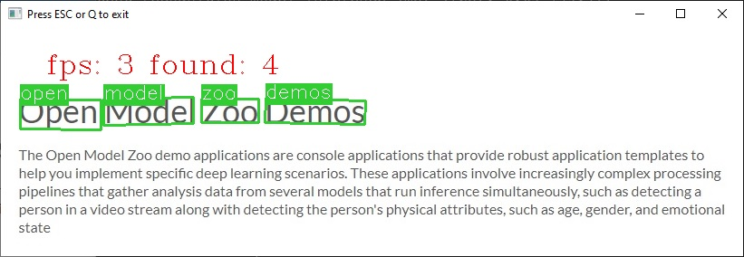

# Text Detection C++ Demo



The demo shows an example of using neural networks to detect and recognize printed text rotated at any angle in various environment. You can use the following pre-trained models with the demo:

* `text-detection-0003`, which is a detection network for finding text.
* `text-detection-0004`, which is a lightweight detection network for finding text.
* `horizontal-text-detection-0001`, which is a detection network that works much faster than models above, but it is applicable to finding more or less horizontal text only.
* `text-recognition-0012`, which is a recognition network for recognizing text.
* `text-recognition-0014`, which is a recognition network for recognizing text. You should add option `-tr_pt_first` and specify output layer name via `-tr_o_blb_nm "logits"` option for this model (see model [description](../../../models/intel/text-recognition-0014/README.md) for details).
* `text-recognition-0015`, which is a recognition network for recognizing text. You should add options `-tr_pt_first`, `-m_tr_ss "?0123456789abcdefghijklmnopqrstuvwxyzABCDEFGHIJKLMNOPQRSTUVWXYZ"` (supported symbols set), `-tr_o_blb_nm "decoder_output"` (to specify output name) and `-dt simple` (to specify decoder type). You can also specify `-lower` option to convert predicted text to lower-case. See model [description](../../../models/intel/text-recognition-0015/README.md) for details.
* `text-recognition-0016`, which is a recognition network for recognizing text. You should add options `-tr_pt_first`, `-m_tr_ss "?0123456789abcdefghijklmnopqrstuvwxyz"` (supported symbols set), `-tr_o_blb_nm "decoder_output"` (to specify output name) and `-dt simple` (to specify decoder type). You can also specify `-lower` option to convert predicted text to lower-case. See model [description](../../../models/intel/text-recognition-0016/README.md) for details.
* `text-recognition-resnet-fc`, which is a recognition network for recognizing text. You should add option `-tr_pt_first` and `-dt simple` (to specify decoder type).
* `handwritten-score-recognition-0003`, which is a recognition network for recognizing handwritten score marks like `<digit>` or `<digit>.<digit>`. You should add options `-m_tr_ss "0123456789._"` (supported symbols set) and `-dt ctc` (to specify decoder type).
* `vitstr-small-patch16-224`, which is a recognition network for recognizing text. You should add options `-tr_pt_first`, `-m_tr_ss <path to vocab file>/.vocab.txt` (supported symbols set), `-dt simple` (to specify decoder type), `-start_index 1` (to process output from provided index) and `-pad " "` (to use specific pad symbol).

## How It Works

On startup, the application reads command line parameters and loads a model to OpenVINO™ Runtime plugin for execution. Upon getting an image, it performs inference of text detection and prints the result as four points (`x1`, `y1`), (`x2`, `y2`), (`x3`, `y3`), (`x4`, `y4`) for each text bounding box.

If text recognition model is provided, the demo prints recognized text as well.

> **NOTE**: By default, Open Model Zoo demos expect input with BGR channels order. If you trained your model to work with RGB order, you need to manually rearrange the default channels order in the demo application or reconvert your model using the Model Optimizer tool with the `--reverse_input_channels` argument specified. For more information about the argument, refer to **When to Reverse Input Channels** section of [Embedding Preprocessing Computation](@ref openvino_docs_MO_DG_Additional_Optimization_Use_Cases).

## Preparing to Run

For demo input image or video files, refer to the section **Media Files Available for Demos** in the [Open Model Zoo Demos Overview](../../README.md).
The list of models supported by the demo is in `<omz_dir>/demos/text_detection_demo/cpp/models.lst` file.
This file can be used as a parameter for [Model Downloader](../../../tools/model_tools/README.md) and Converter to download and, if necessary, convert models to OpenVINO IR format (\*.xml + \*.bin).

An example of using the Model Downloader:

```sh
omz_downloader --list models.lst
```

An example of using the Model Converter:

```sh
omz_converter --list models.lst
```

### Supported Models

* handwritten-score-recognition-0003
* horizontal-text-detection-0001
* text-detection-0003
* text-detection-0004

* decoder_type = ctc
  * text-recognition-0012
  * text-recognition-0014
* decoder_type = simple
  * text-recognition-0015
  * text-recognition-0016
  * text-recognition-resnet-fc
  * vitstr-small-patch16-224

> **NOTE**: Refer to the tables [Intel's Pre-Trained Models Device Support](../../../models/intel/device_support.md) and [Public Pre-Trained Models Device Support](../../../models/public/device_support.md) for the details on models inference support at different devices.

> ```

## Running

Running the application with the `-h` option yields the following usage message:

```
text_detection_demo [OPTION]
Options:

    -h                             Print a usage message.
    -i                             Required. An input to process. The input must be a single image, a folder of images, video file or camera id.
    -loop                          Optional. Enable reading the input in a loop.
    -o "<path>"                    Optional. Name of the output file(s) to save. Frames of odd width or height can be truncated. See https://github.com/opencv/opencv/pull/24086
    -limit "<num>"                 Optional. Number of frames to store in output. If 0 is set, all frames are stored.
    -m_td "<path>"                 Required. Path to the Text Detection model (.xml) file.
    -m_tr "<path>"                 Required. Path to the Text Recognition model (.xml) file.
    -dt "<type>"                   Optional. Type of the decoder, either 'simple' for SimpleDecoder or 'ctc' for CTC greedy and CTC beam search decoders. Default is 'ctc'
    -m_tr_ss "<value>" or "<path>" Optional. String or vocabulary file with symbol set for the Text Recognition model.
    -tr_pt_first                   Optional. Specifies if pad token is the first symbol in the alphabet. Default is false
    -lower                         Optional. Set this flag to convert recognized text to lowercase
    -out_enc_hidden_name "<value>" Optional. Name of the text recognition model encoder output hidden blob
    -out_dec_hidden_name "<value>" Optional. Name of the text recognition model decoder output hidden blob
    -in_dec_hidden_name "<value>"  Optional. Name of the text recognition model decoder input hidden blob
    -features_name "<value>"       Optional. Name of the text recognition model features blob
    -in_dec_symbol_name "<value>"  Optional. Name of the text recognition model decoder input blob (prev. decoded symbol)
    -out_dec_symbol_name "<value>" Optional. Name of the text recognition model decoder output blob (probability distribution over tokens)
    -tr_o_blb_nm "<value>"         Optional. Name of the output blob of the model which would be used as model output. If not stated, first blob of the model would be used.
    -cc                            Optional. If it is set, then in case of absence of the Text Detector, the Text Recognition model takes a central image crop as an input, but not full frame.
    -w_td "<value>"                Optional. Input image width for Text Detection model.
    -h_td "<value>"                Optional. Input image height for Text Detection model.
    -thr "<value>"                 Optional. Specify a recognition confidence threshold. Text detection candidates with text recognition confidence below specified threshold are rejected.
    -cls_pixel_thr "<value>"       Optional. Specify a confidence threshold for pixel classification. Pixels with classification confidence below specified threshold are rejected.
    -link_pixel_thr "<value>"      Optional. Specify a confidence threshold for pixel linkage. Pixels with linkage confidence below specified threshold are not linked.
    -max_rect_num "<value>"        Optional. Maximum number of rectangles to recognize. If it is negative, number of rectangles to recognize is not limited.
    -d_td "<device>"               Optional. Specify the target device for the Text Detection model to infer on (the list of available devices is shown below). The demo will look for a suitable plugin for a specified device. By default, it is CPU.
    -d_tr "<device>"               Optional. Specify the target device for the Text Recognition model to infer on (the list of available devices is shown below). The demo will look for a suitable plugin for a specified device. By default, it is CPU.
    -no_show                       Optional. If it is true, then detected text will not be shown on image frame. By default, it is false.
    -r                             Optional. Output Inference results as raw values.
    -u                             Optional. List of monitors to show initially.
    -b                             Optional. Bandwidth for CTC beam search decoder. Default value is 0, in this case CTC greedy decoder will be used.
    -start_index                   Optional. Start index for Simple decoder. Default value is 0.
    -pad                           Optional. Pad symbol. Default value is '#'.
```

Running the application with the empty list of options yields the usage message given above and an error message.

For example, use the following command line command to run the application:

```sh
./text_detection_demo \
  -i <path_to_image>/sample.jpg \
  -m_td <path_to_model>/text-detection-0004.xml \
  -m_tr <path_to_model>/text-recognition-0014.xml \
  -dt ctc \
  -tr_pt_first \
  -tr_o_blb_nm "logits"
```

For `text-recognition-resnet-fc`, `text-recgonition-0015` and `text-recognition-0016` you should use `simple` decoder for `-dt` option. For the rest models use `ctc` decoder (default decoder). In case of `text-recognition-0015` and `text-recognition-0016` models, specify path to `text-recognition-0015-encoder` (`text-recognition-0016-encoder`) models for `-m_tr` key and decoder part (`text-recognition-0015-decoder` and `text-recognition-0015-encoder`, correspondingly) will be found automatically as shown on example below:

```sh
./text_detection_demo \
  -i <path_to_image>/sample.jpg \
  -m_td <path_to_model>/text-detection-0003.xml \
  -m_tr <path_to_model>/text-recognition-0015/text-recognition-0015-encoder/<precision>/text-recognition-0015-encoder.xml \
  -dt simple \
  -tr_pt_first \
  -tr_o_blb_nm "logits" \
  -m_tr_ss "?0123456789abcdefghijklmnopqrstuvwxyzABCDEFGHIJKLMNOPQRSTUVWXYZ"
```

>**NOTE**: If you provide a single image as an input, the demo processes and renders it quickly, then exits. To continuously visualize inference results on the screen, apply the `loop` option, which enforces processing a single image in a loop.

You can save processed results to a Motion JPEG AVI file or separate JPEG or PNG files using the `-o` option:

* To save processed results in an AVI file, specify the name of the output file with `avi` extension, for example: `-o output.avi`.
* To save processed results as images, specify the template name of the output image file with `jpg` or `png` extension, for example: `-o output_%03d.jpg`. The actual file names are constructed from the template at runtime by replacing regular expression `%03d` with the frame number, resulting in the following: `output_000.jpg`, `output_001.jpg`, and so on.
To avoid disk space overrun in case of continuous input stream, like camera, you can limit the amount of data stored in the output file(s) with the `limit` option. The default value is 1000. To change it, you can apply the `-limit N` option, where `N` is the number of frames to store.

>**NOTE**: Windows\* systems may not have the Motion JPEG codec installed by default. If this is the case, you can download OpenCV FFMPEG back end using the PowerShell script provided with the OpenVINO &trade; install package and located at `<INSTALL_DIR>/opencv/ffmpeg-download.ps1`. The script should be run with administrative privileges if OpenVINO &trade; is installed in a system protected folder (this is a typical case). Alternatively, you can save results as images.

## Demo Output

The demo uses OpenCV to display the resulting frame with detections rendered as bounding boxes and text. The demo reports:

* **FPS**: average rate of video frame processing (frames per second).
* **Latency**: average time required to process one frame (from reading the frame to displaying the results).
* Latency for the following pipeline stages:
  * **Text detection inference** — infering input data (images) and getting a result for text detection model.
  * **Text detection postprocessing** — preparation inference result for output for text detection model.
  * **Text recognition inference** — infering input data (images) and getting a result for text recognition model.
  * **Text recognition postprocessing** — preparation inference result for output for text recognition model.
  * **Text crop** — crop bounding boxes with text from input image.

You can use these metrics to measure application-level performance.

## See Also

* [Open Model Zoo Demos](../../README.md)
* [Model Optimizer](https://docs.openvino.ai/2023.0/openvino_docs_MO_DG_Deep_Learning_Model_Optimizer_DevGuide.html)
* [Model Downloader](../../../tools/model_tools/README.md)
