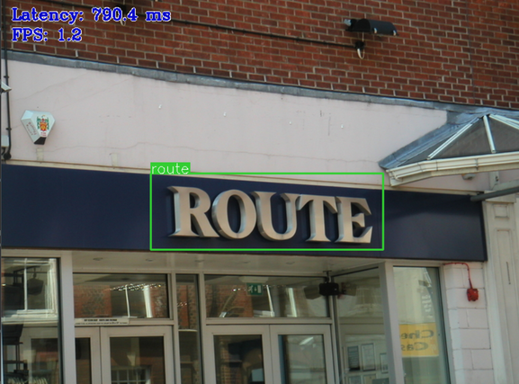

# Text Detection Python\* Demo



This demo shows how to run the pre-trained models to detect and recognize printed text in various environment.

For more information about the pre-trained models, refer to the [model documentation](../../../models/intel/index.md).

## How It Works

On the start-up, the application reads command line parameters and loads one network to the Inference Engine. Upon getting a frame from the OpenCV VideoCapture, it performs inference of text detection model and processes the result as four points (`x1`, `y1`), (`x2`, `y2`), (`x3`, `y3`), (`x4`, `y4`) for each text bounding box.

Next, bounding boxes are submitted to text recognition model. Once the inference of recognition network is done, the demo displays bounding boxes and recognized texts for a frame.

> **NOTE**: By default, Open Model Zoo demos expect input with BGR channels order. If you trained your model to work
with RGB order, you need to manually rearrange the default channels order in the demo application or reconvert your
model using the Model Optimizer tool with `--reverse_input_channels` argument specified. For more information about
the argument, refer to **When to Reverse Input Channels** section of
[Converting a Model Using General Conversion Parameters](https://docs.openvinotoolkit.org/latest/_docs_MO_DG_prepare_model_convert_model_Converting_Model_General.html).

## Running

Running the application with the `-h` option yields the following usage message:
```
python3 text_detection_demo.py -h
```
The command yields the following usage message:
```
usage: text_detection_demo.py [-h] -i INPUT -m_td MODEL_DETECTION
                                    -m_tr MODEL_RECOGNITION
                                    [-d_td DEVICE_DETECTION] [-d_tr DEVICE_RECOGNITION]
                                    [-t PROB_THRESHOLD] [-a ALPHABET]
                                    [--tr_pt_first TR_PT_FIRST] [-b BANDWIDTH]
                                    [--num_requests_td DETECTION_REQUESTS]
                                    [--num_streams_td DETECTION_NSTREAMS]
                                    [--num_threads_td DETECTION_NTHREADS]
                                    [--num_requests_tr RECOGNITION_REQUESTS]
                                    [--num_streams_tr RECOGNITION_NSTREAMS]
                                    [--num_threads_tr RECOGNITION_NTHREADS]
                                    [--loop] [-o OUTPUT] [-limit OUTPUT_LIMIT]
                                    [--no_show] [-u UTILIZATION_MONITORS]
Options:
  -h, --help            Show this help message and exit.
  -i INPUT, --input INPUT
                        Required. An input to process. The input must be a single image,
                        a folder of images, video file or camera id.
  -m_td MODEL_DETECTION
                        Required. Path to an .xml file with a Text Detection model.
  -m_tr MODEL_RECOGNITION
                        Required. Path to an .xml file with a Text Recognition model.
  -d_td DEVICE_DETECTION, --device_td DEVICE_DETECTION
                        Optional. Specify the target device to infer on Detection
                        stage; CPU, GPU, FPGA, HDDL or MYRIAD is
                        acceptable. The sample will look for a suitable plugin
                        for device specified. Default value is CPU.
  -d_tr DEVICE_RECOGNITION, --device_tr DEVICE_RECOGNITION
                        Optional. Specify the target device to infer on Recognition
                        stage; CPU, GPU, FPGA, HDDL or MYRIAD is
                        acceptable. The sample will look for a suitable plugin
                        for device specified. Default value is CPU.

Common model options:
  -t PROB_THRESHOLD, --prob_threshold PROB_THRESHOLD
                        Optional. Probability threshold for text detections filtering.
  -a ALPHABET, --alphabet ALPHABET
                        Optional. Alphabet used for text decoding.
                        Default: "0123456789abcdefghijklmnopqrstuvwxyz"
  --tr_pt_first         Specifies if pad token is the first symbol in the alphabet.
  -b BANDWIDTH, --bandwidth BANDWIDTH
                        Optional. Bandwidth for CTC beam search decoder. Default value is 0,
                        in this case CTC greedy decoder will be used.

Inference options:
  -nireq_td DETECTION_REQUESTS --num_requests_td DETECTION_REQUESTS
                        Optional. Number of infer requests for Detection stage.
  -nstreams_td DETECTION_NSTREAMS --num_streams_td DETECTION_NSTREAMS
                        Optional. Number of streams to use for inference on
                        the CPU or/and GPU in throughput mode (for HETERO and
                        MULTI device cases use format <device1>:<nstreams1>,
                        <device2>:<nstreams2> or just <nstreams>) for Detection stage.
  -nthreads_td DETECTION_NTHREADS --num_threads_td DETECTION_NTHREADS
                        Optional. Number of threads to use for inference on
                        CPU (including HETERO cases) for Detection stage.
  -nireq_tr RECOGNITION_REQUESTS --num_requests_tr RECOGNITION_REQUESTS
                        Optional. Number of infer requests for Recognition stage.
  -nstreams_tr RECOGNITION_NSTREAMS --num_streams_tr RECOGNITION_NSTREAMS
                        Optional. Number of streams to use for inference on
                        the CPU or/and GPU in throughput mode (for HETERO and
                        MULTI device cases use format <device1>:<nstreams1>,
                        <device2>:<nstreams2> or just <nstreams>) for Recognition stage.
  -nthreads_tr RECOGNITION_NTHREADS --num_threads_tr RECOGNITION_NTHREADS
                        Optional. Number of threads to use for inference on
                        CPU (including HETERO cases) for Recognition stage.

Input/output options:
  --loop                Optional. Enable reading the input in a loop.
  -o OUTPUT, --output OUTPUT
                        Optional. Name of output to save.
  -limit OUTPUT_LIMIT, --output_limit OUTPUT_LIMIT
                        Optional. Number of frames to store in output. If 0
                        is set, all frames are stored.
  --no_show             Optional. Don't show output.
  -u UTILIZATION_MONITORS, --utilization_monitors UTILIZATION_MONITORS
                        Optional. List of monitors to show initially.
```

The number of Infer Requests is specified by `-nireq` flag. An increase of this number usually leads to an increase
of performance (throughput), since in this case several Infer Requests can be processed simultaneously if the device
supports parallelization. However, a large number of Infer Requests increases the latency because each frame still
has to wait before being sent for inference.

For higher FPS, it is recommended that you set `-nireq` to slightly exceed the `-nstreams` value,
summed across all devices used.

> **NOTE**: This demo is based on the callback functionality from the Inference Engine Python API.
  The selected approach makes the execution in multi-device mode optimal by preventing wait delays caused by
  the differences in device performance. However, the internal organization of the callback mechanism in Python API
  leads to FPS decrease. Please, keep it in mind and use the C++ version of this demo for performance-critical cases.

Running the application with the empty list of options yields the usage message given above and an error message.
You can use the following command to do inference on GPU with a pre-trained object detection model:
```
python3 text_detection_demo.py -i <path_to_video>/inputVideo.mp4 -m_td <path_to_model>/ctpn.xml -m_tr <path_to_model>/text-recognition-0012.xml
```

To run the demo, you can use public or pre-trained models. You can download the pre-trained models with the OpenVINO
[Model Downloader](../../../tools/downloader/README.md).

> **NOTE**: Before running the demo with a trained model, make sure the model is converted to the Inference Engine
format (\*.xml + \*.bin) using the
[Model Optimizer tool](https://docs.openvinotoolkit.org/latest/_docs_MO_DG_Deep_Learning_Model_Optimizer_DevGuide.html).

## Demo Output

The demo uses OpenCV to display the resulting frame with detections rendered as bounding boxes and text.
The demo reports
* **FPS**: average rate of video frame processing (frames per second)
* **Latency**: average time required to process one frame (from reading the frame to displaying the results)
You can use both of these metrics to measure application-level performance.

## See Also
* [Using Open Model Zoo demos](../../README.md)
* [Model Optimizer](https://docs.openvinotoolkit.org/latest/_docs_MO_DG_Deep_Learning_Model_Optimizer_DevGuide.html)
* [Model Downloader](../../../tools/downloader/README.md)
