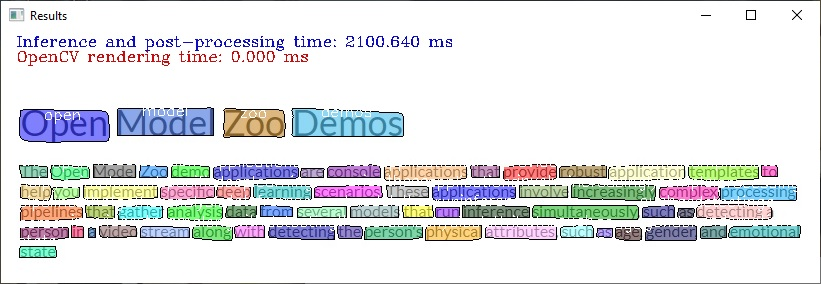

# Text Spotting Python\* Demo



This demo shows how to run Text Spotting models. Text Spotting models allow us to simultaneously detect and recognize text.

> **NOTE**: Only batch size of 1 is supported.

## How It Works

The demo application expects a text spotting model that is split into three parts. Every model part must be in the Intermediate Representation (IR) format.

First model is Mask-RCNN like text detector with the following constraints:

* Two inputs: `im_data` for input image and `im_info` for meta-information about the image (actual height, width and scale).
* At least five outputs including:
  * `boxes` with absolute bounding box coordinates of the input image
  * `scores` with confidence scores for all bounding boxes
  * `classes` with object class IDs for all bounding boxes
  * `raw_masks` with fixed-size segmentation heat maps for all classes of all bounding boxes
  * `text_features` with text features which are fed to Text Recognition Head further

Second model is Text Recognition Encoder that takes `text_features` as input and produces `encoded text`.

Third model is Text Recognition Decoder that takes `encoded text` from Text Recognition Encoder ,`previous symbol` and `hidden state`. On the first step special `Start Of Sequence (SOS)` symbol and zero `hidden state` are fed to Text Recognition Decoder. The decoder produces `symbols distribution`, `current hidden state` each step until `End Of Sequence (EOS)` symbol is generated.

Examples of valid inputs to specify with a command-line argument `-i` are a path to a video file or a numeric ID of a web camera.

The demo workflow is the following:

1. The demo application reads frames from the provided input, resizes them to fit into the input image blob of the network (`im_data`).
2. The `im_info` input blob passes resulting resolution and scale of a pre-processed image to the network to perform inference of Mask-RCNN-like text detector.
3. The Text Recognition Encoder takes input from the text detector and produces output.
4. The Text Recognition Decoder takes output from the Text Recognition Encoder output as input and produces output.
5. The demo visualizes the resulting text spotting results. Certain command-line options affect the visualization:
    * If you specify `--show_boxes` and `--show_scores` arguments, bounding boxes and confidence scores are also shown.
    * By default, tracking is used to show text instance with the same color throughout the whole video.
      It assumes more or less static scene with instances in two frames being a part of the same track if intersection over union of the masks is greater than the 0.5 threshold. To disable tracking, specify the `--no_track` argument.

> **NOTE**: By default, Open Model Zoo demos expect input with BGR channels order. If you trained your model to work with RGB order, you need to manually rearrange the default channels order in the demo application or reconvert your model using the Model Optimizer tool with the `--reverse_input_channels` argument specified. For more information about the argument, refer to **When to Reverse Input Channels** section of [Embedding Preprocessing Computation](@ref openvino_docs_MO_DG_Additional_Optimization_Use_Cases).

## Preparing to Run

For demo input image or video files, refer to the section **Media Files Available for Demos** in the [Open Model Zoo Demos Overview](../../README.md).
The list of models supported by the demo is in `<omz_dir>/demos/text_spotting_demo/python/models.lst` file.
This file can be used as a parameter for [Model Downloader](../../../tools/model_tools/README.md) and Converter to download and, if necessary, convert models to OpenVINO IR format (\*.xml + \*.bin).

An example of using the Model Downloader:

```sh
omz_downloader --list models.lst
```

An example of using the Model Converter:

```sh
omz_converter --list models.lst
```

### Supported Models

* text-spotting-0005-detector
* text-spotting-0005-recognizer-decoder
* text-spotting-0005-recognizer-encoder

> **NOTE**: Refer to the tables [Intel's Pre-Trained Models Device Support](../../../models/intel/device_support.md) and [Public Pre-Trained Models Device Support](../../../models/public/device_support.md) for the details on models inference support at different devices.

## Running

Run the application with the `-h` option to see the following usage message:

```
usage: text_spotting_demo.py [-h] -m_m "<path>" -m_te "<path>" -m_td "<path>"
                             -i INPUT [--loop] [-o OUTPUT]
                             [-limit OUTPUT_LIMIT] [-d "<device>"]
                             [--delay "<num>"] [-pt "<num>"] [-a ALPHABET]
                             [--trd_input_prev_symbol TRD_INPUT_PREV_SYMBOL]
                             [--trd_input_prev_hidden TRD_INPUT_PREV_HIDDEN]
                             [--trd_input_encoder_outputs TRD_INPUT_ENCODER_OUTPUTS]
                             [--trd_output_symbols_distr TRD_OUTPUT_SYMBOLS_DISTR]
                             [--trd_output_cur_hidden TRD_OUTPUT_CUR_HIDDEN]
                             [-trt "<num>"] [--keep_aspect_ratio] [--no_track]
                             [--show_scores] [--show_boxes] [-r] [--no_show]
                             [-u UTILIZATION_MONITORS]

Options:
  -h, --help            Show this help message and exit.
  -m_m "<path>", --mask_rcnn_model "<path>"
                        Required. Path to an .xml file with a trained Mask-
                        RCNN model with additional text features output.
  -m_te "<path>", --text_enc_model "<path>"
                        Required. Path to an .xml file with a trained text
                        recognition model (encoder part).
  -m_td "<path>", --text_dec_model "<path>"
                        Required. Path to an .xml file with a trained text
                        recognition model (decoder part).
  -i INPUT, --input INPUT
                        Required. An input to process. The input must be a single image,
                        a folder of images, video file or camera id.
  --loop                Optional. Enable reading the input in a loop.
  -o OUTPUT, --output OUTPUT
                        Optional. Name of the output file(s) to save. Frames of odd width or height can be truncated. See https://github.com/opencv/opencv/pull/24086
  -limit OUTPUT_LIMIT, --output_limit OUTPUT_LIMIT
                        Optional. Number of frames to store in output.
                        If 0 is set, all frames are stored.
  -d "<device>", --device "<device>"
                        Optional. Specify the target device to infer on, i.e. CPU, GPU.
                        The demo will look for a suitable plugin for device specified
                        (by default, it is CPU). Please refer to OpenVINO documentation
                        for the list of devices supported by the model.
  --delay "<num>"       Optional. Interval in milliseconds of waiting for a
                        key to be pressed.
  -pt "<num>", --prob_threshold "<num>"
                        Optional. Probability threshold for detections
                        filtering.
  -a ALPHABET, --alphabet ALPHABET
                        Optional. Alphabet that is used for decoding.
  --trd_input_prev_symbol TRD_INPUT_PREV_SYMBOL
                        Optional. Name of previous symbol input node to text
                        recognition head decoder part.
  --trd_input_prev_hidden TRD_INPUT_PREV_HIDDEN
                        Optional. Name of previous hidden input node to text
                        recognition head decoder part.
  --trd_input_encoder_outputs TRD_INPUT_ENCODER_OUTPUTS
                        Optional. Name of encoder outputs input node to text
                        recognition head decoder part.
  --trd_output_symbols_distr TRD_OUTPUT_SYMBOLS_DISTR
                        Optional. Name of symbols distribution output node
                        from text recognition head decoder part.
  --trd_output_cur_hidden TRD_OUTPUT_CUR_HIDDEN
                        Optional. Name of current hidden output node from text
                        recognition head decoder part.
  -trt "<num>", --tr_threshold "<num>"
                        Optional. Text recognition confidence threshold.
  --keep_aspect_ratio   Optional. Force image resize to keep aspect ratio.
  --no_track            Optional. Disable tracking.
  --show_scores         Optional. Show detection scores.
  --show_boxes          Optional. Show bounding boxes.
  -r, --raw_output_message
                        Optional. Output inference results raw values.
  --no_show             Optional. Don't show output
  -u UTILIZATION_MONITORS, --utilization_monitors UTILIZATION_MONITORS
                        Optional. List of monitors to show initially.
```

Running the application with an empty list of options yields the short version of the usage message and an error message.

To run the demo, please provide paths to the model in the IR format and to an input with images:

```bash
python3 text_spotting_demo.py \
-m_m <path_to_model>/text-spotting-0005-detector.xml \
-m_te <path_to_model>/text-spotting-0005-recognizer-encoder.xml \
-m_td <path_to_model>/text-spotting-0005-recognizer-decoder.xml \
-i 0
```

>**NOTE**: If you provide a single image as an input, the demo processes and renders it quickly, then exits. To continuously visualize inference results on the screen, apply the `loop` option, which enforces processing a single image in a loop.

You can save processed results to a Motion JPEG AVI file or separate JPEG or PNG files using the `-o` option:

* To save processed results in an AVI file, specify the name of the output file with `avi` extension, for example: `-o output.avi`.
* To save processed results as images, specify the template name of the output image file with `jpg` or `png` extension, for example: `-o output_%03d.jpg`. The actual file names are constructed from the template at runtime by replacing regular expression `%03d` with the frame number, resulting in the following: `output_000.jpg`, `output_001.jpg`, and so on.
To avoid disk space overrun in case of continuous input stream, like camera, you can limit the amount of data stored in the output file(s) with the `limit` option. The default value is 1000. To change it, you can apply the `-limit N` option, where `N` is the number of frames to store.

>**NOTE**: Windows\* systems may not have the Motion JPEG codec installed by default. If this is the case, you can download OpenCV FFMPEG back end using the PowerShell script provided with the OpenVINO &trade; install package and located at `<INSTALL_DIR>/opencv/ffmpeg-download.ps1`. The script should be run with administrative privileges if OpenVINO &trade; is installed in a system protected folder (this is a typical case). Alternatively, you can save results as images.

## Demo Output

The application uses OpenCV to display resulting text instances.
The demo reports

* **FPS**: average rate of video frame processing (frames per second).
* **Latency**: average time required to process one frame (from reading the frame to displaying the results).
You can use both of these metrics to measure application-level performance.

## See Also

* [Open Model Zoo Demos](../../README.md)
* [Model Optimizer](https://docs.openvino.ai/2023.0/openvino_docs_MO_DG_Deep_Learning_Model_Optimizer_DevGuide.html)
* [Model Downloader](../../../tools/model_tools/README.md)
