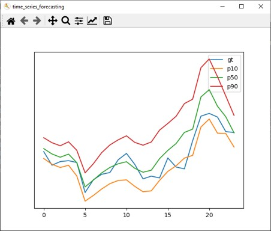

# Time Series Forecasting Python\* Demo



This README describes the Time Series Forecasting demo application.

## How It Works

On startup the demo application reads command line parameters and loads a model to OpenVINO™ Runtime plugin.

The program provides an interactive CLI interface that gets a test dataset in .pickle format as input and draws predicted quantiles and ground truth curves.

## Preparing to Run

The list of models supported by the demo is in `<omz_dir>/demos/whiteboard_inpainting_demo/python/models.lst` file.
This file can be used as a parameter for [Model Downloader](../../../tools/model_tools/README.md) and Converter to download and, if necessary, convert models to OpenVINO IR format (\*.xml + \*.bin).

An example of using the Model Downloader:

```sh
omz_downloader --list models.lst
```

An example of using the Model Converter:

```sh
omz_converter --list models.lst
```

### Supported Models

* time-series-forecasting-electricity-0001

> **NOTE**: Refer to the tables [Intel's Pre-Trained Models Device Support](../../../models/intel/device_support.md) and [Public Pre-Trained Models Device Support](../../../models/public/device_support.md) for the details on models inference support at different devices.

### Supported datasets

* [Electricity](https://archive.ics.uci.edu/ml/machine-learning-databases/00321/LD2011_2014.txt.zip).

### Prepare dataset

The demo works with the test dataset in the .pickle format provided by accuracy_checker.

* Install accuracy_checker following the [instruction](../../../tools/accuracy_checker/README.md).
* Convert test dataset:

```sh
wget https://archive.ics.uci.edu/ml/machine-learning-databases/00321/LD2011_2014.txt.zip
unzip LD2011_2014.txt.zip
convert_annotation electricity --data_path_file LD2011_2014.txt
```

## Running the Demo

Running the application with the `-h` option yields the following usage message:

```
usage: time_series_forecasting_demo.py [-h] -m MODEL [--input-name INPUT_NAME] [--output-name OUTPUT_NAME] [--data-path DATA_PATH] [--quantiles QUANTILES]

optional arguments:
  -h, --help            show this help message and exit
  -m MODEL, --model MODEL
                        Required. Path to an .xml file with a trained model
  --input-name INPUT_NAME
                        Optional. Name of the models input node.
  --output-name OUTPUT_NAME
                        Optional. Name of the models output node.
  -i INPUT, --input INPUT
                        Required. Path to the dataset file in .pickle format.
  --quantiles QUANTILES
                        Optional. Names of predicted quantiles.
```

Running the application with the empty list of options yields the usage message given above and an error message.

You can use the following command to do inference on CPU on the converted dataset using a pre-trained time-series-forecasting-electricity network:

```sh
python3 time_series_forecasting_demo.py -i electricity.pickle -m <path_to_model>/time-series-forecasting-electricity-0001.xml
```

## Demo Output

The application draws predicted quantiles and ground truth curves.

## See Also

* [Open Model Zoo Demos](../../README.md)
* [Model Optimizer](https://docs.openvino.ai/2023.0/openvino_docs_MO_DG_Deep_Learning_Model_Optimizer_DevGuide.html)
* [Model Downloader](../../../tools/model_tools/README.md)
