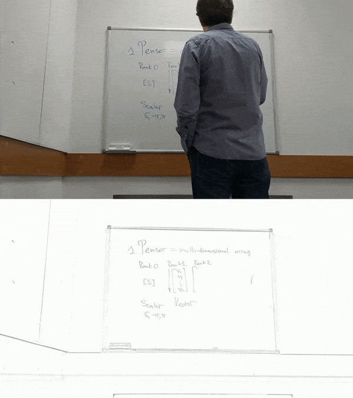

# Whiteboard Inpainting Python\* Demo



This demo focuses on a whiteboard text overlapped by a person. The demo shows
how to use the OpenVINO™ toolkit to detect and hide a person on a
video so that all text on a whiteboard is visible.

## How It Works

The demo expects one of the following models in the Intermediate Representation (IR) format:

* Instance segmentation model
* Semantic segmentation model

As an input, the demo application takes:

* Path to a video file
* Index of a web camera

> **NOTE**: By default, Open Model Zoo demos expect input with BGR channels order. If you trained your model to work with RGB order, you need to manually rearrange the default channels order in the demo application or reconvert your model using the Model Optimizer tool with the `--reverse_input_channels` argument specified. For more information about the argument, refer to **When to Reverse Input Channels** section of [Embedding Preprocessing Computation](@ref openvino_docs_MO_DG_Additional_Optimization_Use_Cases).

## Preparing to Run

For demo input image or video files, refer to the section **Media Files Available for Demos** in the [Open Model Zoo Demos Overview](../../README.md).
The list of models supported by the demo is in `<omz_dir>/demos/whiteboard_inpainting_demo/python/models.lst` file.
This file can be used as a parameter for [Model Downloader](../../../tools/model_tools/README.md) and Converter to download and, if necessary, convert models to OpenVINO IR format (\*.xml + \*.bin).

An example of using the Model Downloader:

```sh
omz_downloader --list models.lst
```

An example of using the Model Converter:

```sh
omz_converter --list models.lst
```

### Supported Models

* instance-segmentation-security-0002
* instance-segmentation-security-0091
* instance-segmentation-security-0228
* instance-segmentation-security-1039
* instance-segmentation-security-1040
* semantic-segmentation-adas-0001

> **NOTE**: Refer to the tables [Intel's Pre-Trained Models Device Support](../../../models/intel/device_support.md) and [Public Pre-Trained Models Device Support](../../../models/public/device_support.md) for the details on models inference support at different devices.

## Running

Run the application with the `-h` option to see the following usage message:

```
usage: whiteboard_inpainting_demo.py [-h] -i INPUT [--loop] [-o OUTPUT]
                                     [-limit OUTPUT_LIMIT]
                                     [-m_i M_INSTANCE_SEGMENTATION]
                                     [-m_s M_SEMANTIC_SEGMENTATION]
                                     [-t THRESHOLD] [--no_show] [-d DEVICE]
                                     [-u UTILIZATION_MONITORS]

Whiteboard inpainting demo

optional arguments:
  -h, --help            Show this help message and exit.
  -i INPUT, --input INPUT
                        Required. Path to a video file or a device node of a
                        webcam.
  --loop                Optional. Enable reading the input in a loop.
  -o OUTPUT, --output OUTPUT
                        Optional. Name of the output file(s) to save. Frames of odd width or height can be truncated. See https://github.com/opencv/opencv/pull/24086
  -limit OUTPUT_LIMIT, --output_limit OUTPUT_LIMIT
                        Optional. Number of frames to store in output.
                        If 0 is set, all frames are stored.
  -m_i M_INSTANCE_SEGMENTATION, --m_instance_segmentation M_INSTANCE_SEGMENTATION
                        Required. Path to the instance segmentation model.
  -m_s M_SEMANTIC_SEGMENTATION, --m_semantic_segmentation M_SEMANTIC_SEGMENTATION
                        Required. Path to the semantic segmentation model.
  -t THRESHOLD, --threshold THRESHOLD
                        Optional. Threshold for person instance segmentation model.
  --no_show             Optional. Don't show output.
  -d DEVICE, --device DEVICE
                        Optional. Specify a target device to infer on. CPU or
                        GPU is acceptable. The demo will
                        look for a suitable plugin for the device specified.
  -u UTILIZATION_MONITORS, --utilization_monitors UTILIZATION_MONITORS
                        Optional. List of monitors to show initially.
```

Example of a command:

```sh
python3 whiteboard_inpainting_demo.py \
    -i <path_to_video>/video.avi \
    -m_i <path_to_model>/instance-segmentation-security-0228.xml
```

You can save processed results to a Motion JPEG AVI file or separate JPEG or PNG files using the `-o` option:

* To save processed results in an AVI file, specify the name of the output file with `avi` extension, for example: `-o output.avi`.
* To save processed results as images, specify the template name of the output image file with `jpg` or `png` extension, for example: `-o output_%03d.jpg`. The actual file names are constructed from the template at runtime by replacing regular expression `%03d` with the frame number, resulting in the following: `output_000.jpg`, `output_001.jpg`, and so on.
To avoid disk space overrun in case of continuous input stream, like camera, you can limit the amount of data stored in the output file(s) with the `limit` option. The default value is 1000. To change it, you can apply the `-limit N` option, where `N` is the number of frames to store.

>**NOTE**: Windows\* systems may not have the Motion JPEG codec installed by default. If this is the case, you can download OpenCV FFMPEG back end using the PowerShell script provided with the OpenVINO &trade; install package and located at `<INSTALL_DIR>/opencv/ffmpeg-download.ps1`. The script should be run with administrative privileges if OpenVINO &trade; is installed in a system protected folder (this is a typical case). Alternatively, you can save results as images.

## Demo Output

The demo outputs original video with the processed one. Usage:

* Invert colors on the resulting frame by pressing the `i` key.
* Select a part of the frame to be shown in a separate window by using your left mouse button.
* Exit the demo by pressing `Esc`.

The demo reports

* **FPS**: average rate of video frame processing (frames per second).
* **Latency**: average time required to process one frame (from reading the frame to displaying the results).
You can use both of these metrics to measure application-level performance.

## See Also

* [Open Model Zoo Demos](../../README.md)
* [Model Optimizer](https://docs.openvino.ai/2023.0/openvino_docs_MO_DG_Deep_Learning_Model_Optimizer_DevGuide.html)
* [Model Downloader](../../../tools/model_tools/README.md)
