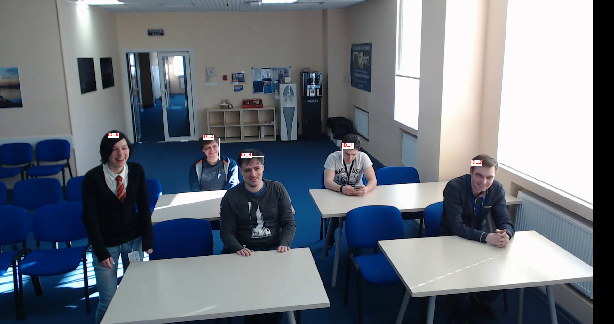

# face-reidentification-retail-0001

## Use Case and High-Level Description

This is a lightweight net for face reidentification. It is based on the RMNet backbone that includes depth-wise convolutions to reduce the amount of computations for the 3x3 convolution block. After the backbone, global max pooling and 1x1 convolution block create the final embedding vector. The model produces feature vectors that are close in cosine distance for similar faces and far for different faces.

## Example



## Specification

| Metric                          | Value                                     |
|---------------------------------|-------------------------------------------|
| LFW accuracy                    | 0.9892                                    |
| Face location requirements      | Tight aligned crop                        |
| GFlops                          | 0.19                                      |
| MParams                         | 0.59                                      |
| Source framework                | Caffe*                                    |

LFW metric is the accuracy in the pairwise reidentification test. See the full [benchmark description](http://vis-www.cs.umass.edu/lfw/) for details.

The model achieves the best results if an input face is frontally oriented and aligned. Face image is aligned if five keypoints (left eye, right eye, tip of nose, left lip corner, right lip corner) are located in the following points in normalized coordinates [0,1]x[0,1]:

```
[(0.31556875000000000, 0.4615741071428571),
 (0.68262291666666670, 0.4615741071428571),
 (0.50026249999999990, 0.6405053571428571),
 (0.34947187500000004, 0.8246919642857142),
 (0.65343645833333330, 0.8246919642857142)]
```

To align the face, use a landmarks regression model: using regressed points and the given reference landmarks, build an affine transformation to transform regressed points to the reference ones and apply this transformation to the input face image.

## Inputs

1. Name: "data" , shape: [1x3x128x128] - An input image in the format [BxCxHxW],
   where:
    - B - batch size
    - C - number of channels
    - H - image height
    - W - image width

   Expected color order is RGB.

## Outputs
The net outputs a blob with the shape [1, 128], containing a row-vector of 128 floating point values. Outputs on different images are comparable in cosine distance.

Output layer name in Inference Engine/Caffe formats:
`emb_output`

## Legal Information
[*] Other names and brands may be claimed as the property of others.
