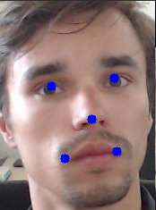

# landmarks-regression-retail-0009

## Use Case and High-Level Description

This is a lightweight landmarks regressor for the Smart Classroom scenario. It has a classic convolutional design: stacked 3x3 convolutions, batch normalizations, PReLU activations, and poolings. Final regression is done by the global depthwise pooling head and FullyConnected layers. The model predicts five facial landmarks: two eyes, nose, and two lip corners.

## Example

## Specification

| Metric                          | Value                                     |
|---------------------------------|-------------------------------------------|
| Mean Normed Error (on VGGFace2) | 0.0705                                    |
| Face location requirements      | Tight crop                                |
| GFlops                          | 0.021                                     |
| MParams                         | 0.191                                     |
| Source framework                | PyTorch*                                  |

Normed Error (NE) for ith sample has the following form:

where N is the number of landmarks, _p_-hat and _p_ are, correspondingly, the prediction and ground truth vectors of kth landmark of ith sample, and di is the interocular distance for ith sample.

## Performance
Link to [performance table](https://software.intel.com/en-us/openvino-toolkit/benchmarks)

## Inputs

1. Name: "data" , shape: [1x3x48x48] - An input image in the format [BxCxHxW],
   where:
    - B - batch size
    - C - number of channels
    - H - image height
    - W - image width

   The expected color order is RGB.

## Outputs

1.	The net outputs a blob with the shape: [1, 10], containing a row-vector of 10 floating point values
	for five landmarks coordinates in the form (x0, y0, x1, y1, ..., x5, y5).
	All the coordinates are normalized to be in range [0,1].

## Legal Information
[*] Other names and brands may be claimed as the property of others.
