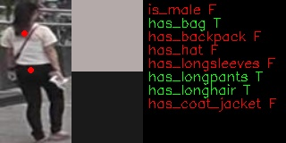

# person-attributes-recognition-crossroad-0200

## Use Case and High-Level Description
This model presents a person attributes classification algorithm analysis scenario. It produces probability of person attributions existing on the sample and a position of two point on sample, whiches can be used for color prob (like, color picker in graphical editors) 

## Examples

## Specification

| Metric                | Value                                                                                                |
|-----------------------|------------------------------------------------------------------------------------------------------|
| Pedestrian pose       | Standing person                                                                                      |
| Occlusion coverage    | <20%                                                                                                 |
| Min object width      | 80 pixels                                                                                            |
| Supported attributes  | gender, has_bag, has_backpack, has hat, has longsleeves, has longpants, has longhair, has coat_jacket|
| GFlops                | 0.174                                                                                                |
| MParams               | 0.735                                                                                                |
| Source framework      | Pytorch*                                                                                             |

## Accuracy

| Attribute         |  F1   |
|-------------------|-------|
| `is_male`         | 0.87  |
| `has_bag`         | 0.52  |
| `has_backpack`    | 0.60  |
| `has_hat`         | 0.54  |
| `has_longsleeves` | 0.41  |
| `has_longpants`   | 0.88  |
| `has_longhair`    | 0.87  |
| `has_coat_jacket` | 0.73  |

## Performance
Link to [performance table](https://software.intel.com/en-us/openvino-toolkit/benchmarks)

## Inputs

1.	name: "input" , shape: [1x3x80x160] - An input image in following format
[1xCxHxW], where

	- C - number of channels
    	- H - image height
    	- W - image width.

	The expected color order is BGR.

## Outputs

1.	The net outputs a blob named 453 with shape: [1, 8, 1, 1] across six attributes:
    [`is_male`, `has_bag`, `has_backpack`, `has_hat`, `has_longsleeves`, `has_longpants`, `has_longhair`,
     `has_coat_jacket`]. Value > 0.5 means that an attribute is present.
2.  The net outputs a blob named 455 with shape: [1, 2, 1, 1]. It is location of point with top color. 
3.  The net outputs a blob named 457 with shape: [1, 2, 1, 1]. It is location of point with bottom color.

## Legal Information
[*] Other names and brands may be claimed as the property of others.
