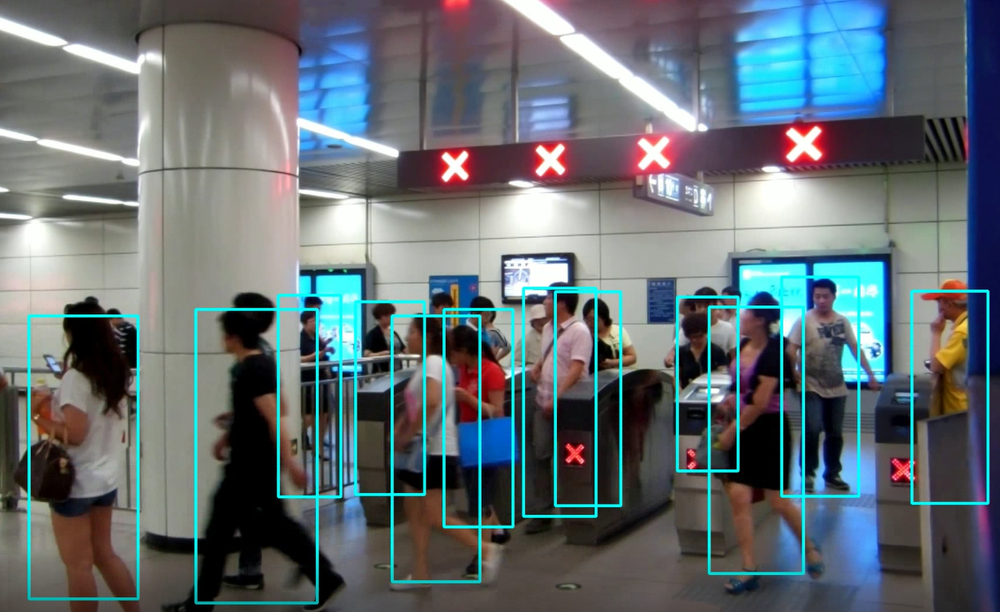

# person-detection-retail-0001

## Use case and High-level description

This model is for a pedestrian detector used for Retail scenarios. The model is
based on a backbone with hyper-feature + R-FCN.

## Example

## Specification

| Metric                          | Value                                     |
|---------------------------------|-------------------------------------------|
| AP                              | 80.91%                                    |
| Pose coverage                   | Standing upright, parallel to image plane |
| Support of occluded pedestrians | YES                                       |
| Occlusion coverage              | <50%                                      |
| Min pedestrian height           | 80 pixels (on 1080p)                      |
| Max objects to detect           | 200                                       |
| GFlops                          | 12.422                                    |
| MParams                         | 3.244                                     |
| Source framework                | Caffe                                     |

Average Precision (AP) is defined as an area under
the [precision/recall](https://en.wikipedia.org/wiki/Precision_and_recall)
curve. Validation dataset consists of about 50,000 images from about 100 scenes.

## Performance
Link to [performance table](https://software.intel.com/en-us/openvino-toolkit/benchmarks)

## Inputs

1.	name: `data` , shape: [1x3x544x992] - An input image in the format
    [1xCxHxW]. The expected channel order is BGR.

2.	name: `im_info`, shape: [1x6] - Image information
    [544, 992, 992/`frame_width`, 544/`frame_height`, 992/`frame_width`, 544/`frame_height`]

## Outputs

1.	name: `cls_prob_reshape`, shape: [200, 2] - Softmax output across two
    classes [Background, Pedestrian]
2.	name: `proposal`: shape: [200, 5] - Object proposals [0, x1, y1, x2, y2]
3.	name: `bbox_pred_reshape`, shape: [200, 8] - Bounding box deltas
    [d0, d1, d2, d3] for two classes [Background, Pedestrian]. The refined bounding
    box is
    [(cx + w \* d0) - 0.5 \* w \* exp(d2),
     (cy + h \* d1) - 0.5 \* h \* exp(d3),
     (cx + w \* d0) + 0.5 \* w \* exp(d2),
     (cy + h \* d1) + 0.5 \* h \* exp(d3)],
    where
    w = (x2 - x1 + 1),
    h = (y2 - y1 + 1),
    cx = (x1 + 0.5 \* w),
    cy = (y1 + 0.5 \* h).

## Legal Information
[*] Other names and brands may be claimed as the property of others.
