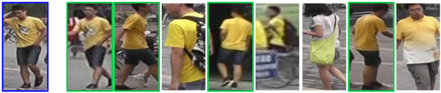

# person-reidentification-retail-0031

## Use Case and High-Level Description

This is a person reidentification model for a general scenario. It uses a whole body image as an input and outputs an embedding vector to match a pair of images by the Cosine distance. The model is based on RMNet backbone that was developed for fast inference. A single reidentification head from the 1/16 scale feature map outputs the embedding vector of 256 floats.

## Example

## Specification

| Metric                            | Value                                     |
|-----------------------------------|-------------------------------------------|
| Pairwise accuracy                 | 92.11%                                    |
| Pose coverage                     | Standing upright, parallel to image plane |
| Support of occluded pedestrians   | YES                                       |
| Occlusion coverage                | <50%                                      |
| GFlops                            | 0.03                                      |
| MParams                           | 0.28                                      |
| Source framework                  | Caffe*                                    |

Pairwise accuracy is defined as the [accuracy](https://en.wikipedia.org/wiki/Precision_and_recall) of the binary classification problem, where a positive class means that a pair of images represents the same person. Validation dataset consists of 10,000 image pairs of about 1500 persons.

## Inputs

1. name: "data" , shape: [1x3x96x48] - An input image in the format [BxCxHxW],
   where:
    - B - batch size
    - C - number of channels
    - H - image height
    - W - image width

   The expected color order is BGR.

## Outputs

1. The net outputs a blob with shape: [1, 256, 1, 1] named descriptor, which can be compared with other descriptors using the [Cosine distance](https://en.wikipedia.org/wiki/Cosine_similarity).

## Legal Information
[*] Other names and brands may be claimed as the property of others.
