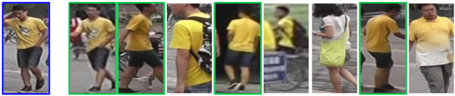

# person-reidentification-retail-0076

## Use Case and High-Level Description

This is a person reidentification model for a general scenario. It uses a whole body image as an input and outputs an embedding vector to match a pair of images by the Cosine distance. The model is based on RMNet backbone that was developed for fast inference. A single reidentification head from the 1/16 scale feature map outputs the embedding vector of 256 floats. The model is provided without last calibration layer, but can be used in the same way as the original model (with insignificant drop in accuracy).

## Example

## Specification

| Metric                            | Value                                     |
|-----------------------------------|-------------------------------------------|
| Market-1501 rank@1 accuracy       | 0.9237                                    |
| Market-1501 mAP                   | 0.8253                                    |
| Pose coverage                     | Standing upright, parallel to image plane |
| Support of occluded pedestrians   | YES                                       |
| Occlusion coverage                | <50%                                      |
| GFlops                            | 0.594                                     |
| MParams                           | 0.820                                     |
| Source framework                  | Caffe*                                    |

The cumulative matching curve (CMC) at rank-1 is accuracy denoting the possibility to locate at least one true positive in the top-1 rank.
Mean Average Precision (mAP) is the mean across all queries’ Average Precision (AP) and AP is defined as an area under the [precision/recall](https://en.wikipedia.org/wiki/Precision_and_recall) curve.

## Performance

## Inputs

1. name: "data" , shape: [1x3x384x128] - An input image in the format [BxCxHxW],
   where:
    - B - batch size
    - C - number of channels
    - H - image height
    - W - image width

   The expected color order is BGR.

## Outputs

1. The net outputs a blob with shape: [1, 256, 1, 1] named descriptor, which can be compared with other descriptors using the [Cosine distance](https://en.wikipedia.org/wiki/Cosine_similarity).

## Legal Information
[*] Other names and brands may be claimed as the property of others.
