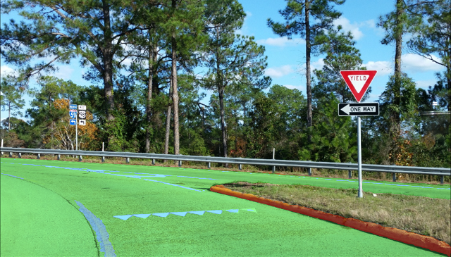

# road-segmentation-adas-0001

## Use Case and High-Level Description

Segmentation network to classify each pixel into 4 classes (BG, road, curb, mark).

## Example

## Specification
| Metric          | Value    |
|-----------------|----------|
| Image size      | 896x512  |
| GFlops          | 4.7      |
| MParams         | 0.18     |
| Source framework| PyTorch* |

## Accuracy

The quality metrics calculated on 500 images from "Mighty AI" dataset
that was converted for 4 class classification task are:

| Label    |       IOU |       ACC |
|----------|-----------|-----------|
| **mean** | **84.4%** | **90.1%** |
| BG       |     98.6% |     99.4% |
| road     |     95.4% |     97.4% |
| curbs    |     72.7% |     83.1% |
| marks    |     70.8% |     80.6% |

- `IOU=TP/(TP+FN+FP)`
- `ACC=TP/GT`
- `TP` - number of true positive pixels for given class
- `FN` - number of false negative pixels for given class
- `FP` - number of false positive pixels for given class
- `GT` - number of ground truth pixels for given class

## Inputs

A blob with a BGR image in the format: [B, C=3, H=512, W=896], where:

- B – batch size
- C – number of channels
- H – image height
- W – image width

## Outputs

The output is a blob with shape [B, C=4, H=512, W=896]. It can be treated as a 4 channels feature map, where each feature map channel is a probability of one of the classes (BG, road, curb, mark).

## Legal Information
[*] Other names and brands may be claimed as the property of others.
