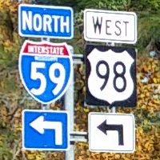
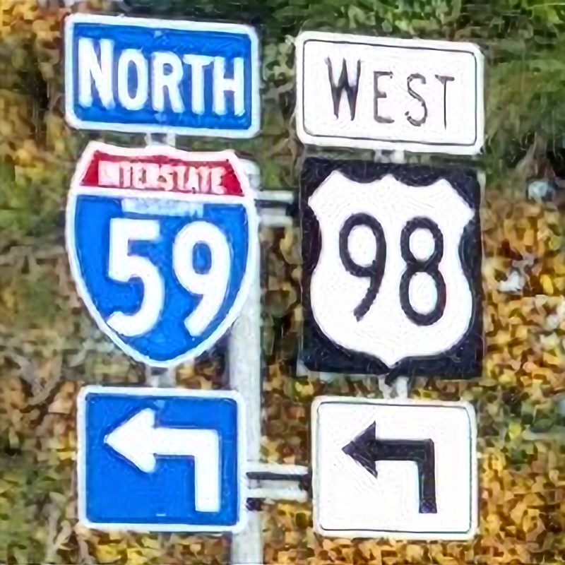

# single-image-super-resolution-0034

## Use Case and High-Level Description

Single image super resolution network based on SRResNet architecture
(["Photo-Realistic Single Image Super-Resolution Using a Generative Adversarial
Network"](https://arxiv.org/pdf/1609.04802.pdf)) but with reduced number of
channels and depthwise convolution in decoder. It enhances the resolution of the
input image by a factor of 4.

## Example

Low resolution:

Linear interpolation:

Super resolution:

## Specification

| Metric                          | Value                                     |
|---------------------------------|-------------------------------------------|
| PSNR                            | 31.55 dB                                  |
| GFlops                          | 39.713                                    |
| MParams                         | 0.363                                     |
| Source framework                | Pytorch*                                  |

For reference, PSNR for bicubic upsampling on test dataset is 28.42 dB.

## Performance
Link to [performance table](https://software.intel.com/en-us/openvino-toolkit/benchmarks)

## Inputs

1. name: "input" , shape: [1x3x200x200] - An input image in the format [BxCxHxW],
  where:
    - B - batch size
    - C - number of channels
    - H - image height
    - W - image width.

  Expected color order is BGR.

## Outputs

1. The net outputs one blobs with shapes [1, 3, 800, 800] that contains image after super
   resolution.

## Legal Information
[*] Other names and brands may be claimed as the property of others.
