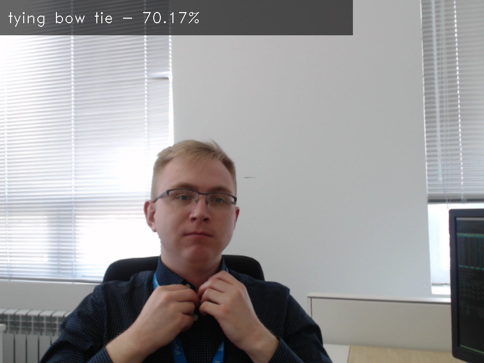

# Model name: action-recognition-0001-decoder

## Use Case and High-Level Description

This is an general-purpose action recognition model for Kinetics-400 dataset. The model uses Video Transformer approach with ResNet34 encoder.
Please refer to the [kinetics](https://deepmind.com/research/open-source/open-source-datasets/kinetics/) dataset specification to see list of action that are recognised by this model.

This model is only decoder part of the whole pipeline. It accepts stack of frame embeddings, computed by action-recognition-0001-encoder, and produces prediction on input video. Video frames should be sampled to cover ~1 second fragment (i.e. skip every second frame in 30 fps video).

## Example

## Specification

| Metric                          | Value                                     |
|---------------------------------|-------------------------------------------|
| Source framework                | PyTorch*                                  |
| GFlops                          | 0.147                                     |
| MParams                         | 4.405                                     |

## Performance

## Inputs

1. name: "0" , shape: [1x16x512] - An embedding image in the format [BxTxC],
   where:
    - B - batch size.
    - T - Duration of input clip.
    - C - dimension of embedding.

## Outputs

The model outputs a tensor with the shape [bx400], each row is a logits vector of performed actions.

## Legal Information
[*] Other names and brands may be claimed as the property of others.
