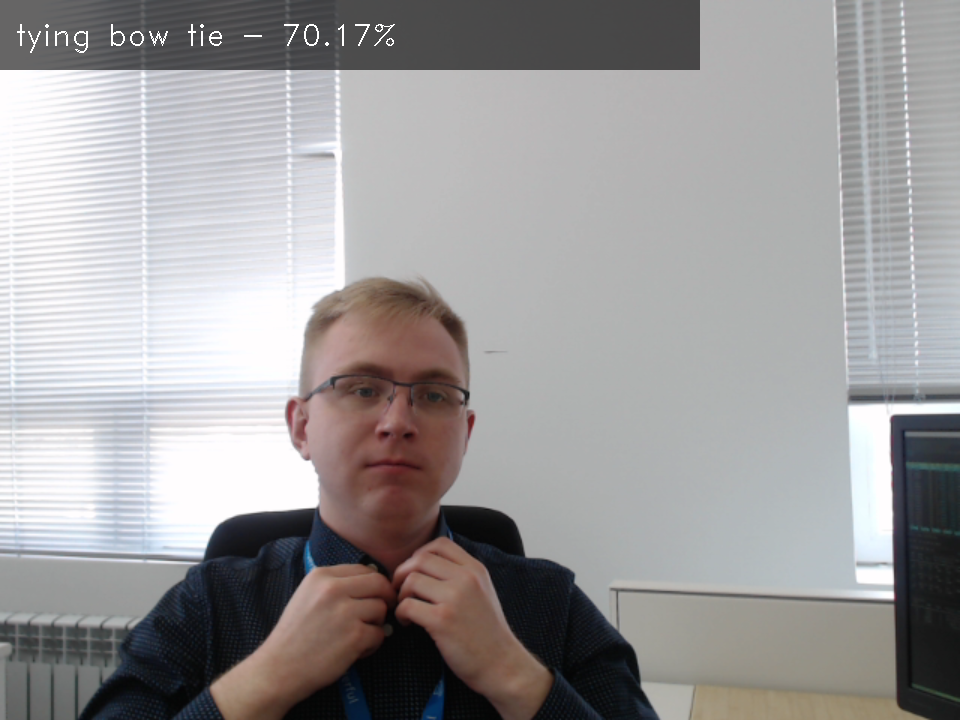

# action-recognition-0001 (composite)

## Use Case and High-Level Description

This is a general-purpose action recognition composite model, consisting of encoder and decoder parts, trained on Kinetics-400 dataset. The encoder model uses Video Transformer approach with ResNet34 encoder.
Please refer to the [kinetics](https://deepmind.com/research/open-source/open-source-datasets/kinetics/) dataset specification to see list of action that are recognised by this composite model.

## Example

## Composite model specification

| Metric                          | Value                                     |
|---------------------------------|-------------------------------------------|
| Source framework                | PyTorch\*                                 |

## Encoder model specification

The action-recognition-0001-encoder model accepts video frame and produces embedding.
Video frames should be sampled to cover ~1 second fragment (i.e. skip every second frame in 30 fps video).

| Metric                          | Value                                     |
|---------------------------------|-------------------------------------------|
| GFlops                          | 7.340                                     |
| MParams                         | 21.276                                    |

### Inputs

Image, name: `0`, shape: `1, 3, 224, 224` in the format `B, C, H, W`, where:

- `B` - batch size
- `C` - number of channels
- `H` - image height
- `W` - image width

Expected color order is `BGR`.

### Outputs

The model outputs a tensor with the shape `1, 512, 1, 1`, representing embedding of processed frame.

## Decoder model specification

The action-recognition-0001-decoder model accepts stack of frame embeddings, computed by action-recognition-0001-encoder model.

| Metric                          | Value                                     |
|---------------------------------|-------------------------------------------|
| GFlops                          | 0.147                                     |
| MParams                         | 4.405                                     |

### Inputs

An embedding image, name: `0`, shape: `1, 16, 512` in the format `B, T, C`, where:

- `B` - batch size
- `T` - duration of input clip
- `C` - dimension of embedding

### Outputs

The model outputs a tensor with the shape `1, 400`, each row is a logits vector of performed actions.

## Legal Information
[*] Other names and brands may be claimed as the property of others.
