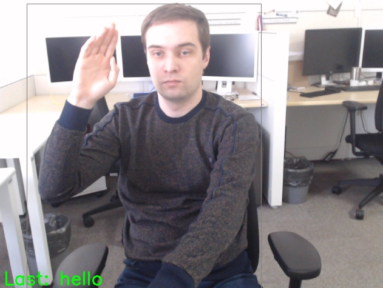

# asl-recognition-0004

## Use Case and High-Level Description

A human gesture recognition model for the American Sign Language (ASL) recognition scenario 
(word-level recognition). The model uses an S3D framework with MobileNet V3 backbone. Please refer 
to the [MS-ASL-100\*](https://www.microsoft.com/en-us/research/project/ms-asl/) dataset specification 
to see the list of gestures that are recognized by this model.

The model accepts a stack of frames sampled with a constant framerate (15 FPS) and produces a prediction
on the input clip.

## Example

## Specification

| Metric                          | Value                                     |
|---------------------------------|-------------------------------------------|
| Top-1 accuracy (MS-ASL-100\*)   | 0.847                                     |
| GFlops                          | 6.660                                     |
| MParams                         | 4.133                                     |
| Source framework                | PyTorch\*                                 |

## Performance

## Inputs

Name: `input`, shape: [1x3x16x224x224]. An input image sequence in the format [BxCxTxHxW], where:
 - B - batch size
 - C - number of channels
 - T - duration of input clip
 - H - image height
 - W - image width

## Outputs

The model outputs a tensor with the shape [Bx100], each row is a logits vector of performed ASL gestures.

## Legal Information
[\*] Other names and brands may be claimed as the property of others.
