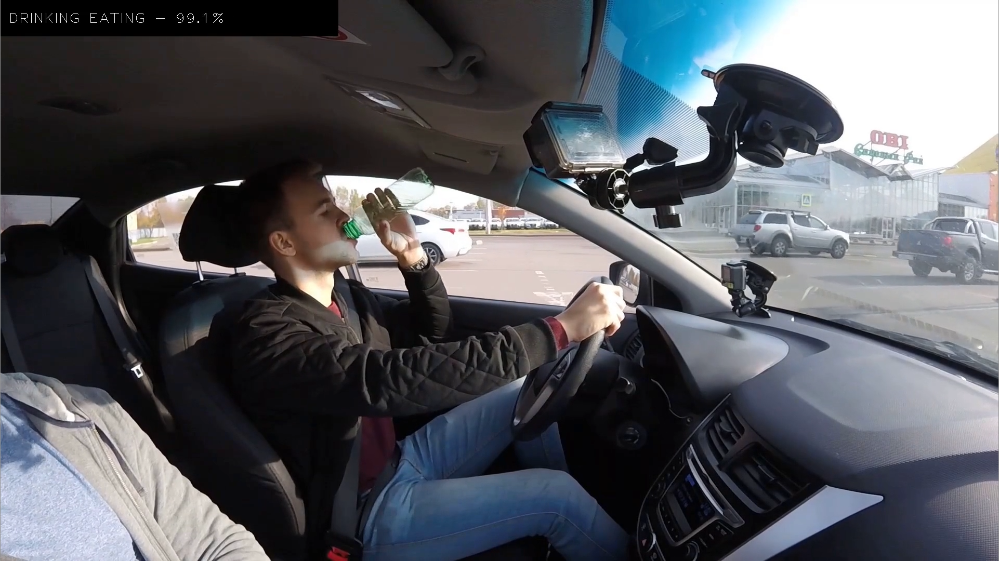

# driver-action-recognition-adas-0002 (composite)

## Use Case and High-Level Description

This is an action recognition composite model for the driver monitoring use case, consisting of encoder and decoder parts. The encoder model uses Video Transformer approach with MobileNetV2 encoder. It is able to recognize actions such as drinking, doing hair or making up, operating the radio, reaching behind, safe driving, talking on the phone, texting. The full list of recognized actions is located [here](https://github.com/openvinotoolkit/open_model_zoo/blob/develop/demos/action_recognition_demo/python/driver_actions.txt).

## Example

## Composite model specification

| Metric                          | Value                                     |
|---------------------------------|-------------------------------------------|
| Source framework                | PyTorch\*                                 |

## Encoder model specification

The driver-action-recognition-adas-0002-encoder model accepts video frame and produces embedding.
Video frames should be sampled to cover ~1 second fragment (i.e. skip every second frame in 30 fps video).

| Metric                          | Value                                     |
|---------------------------------|-------------------------------------------|
| GFlops                          | 0.676                                     |
| MParams                         | 2.863                                     |

### Inputs

Image, name: `0`, shape: `1, 3, 224, 224` in the format `B, C, H, W`, where:

- `B` - batch size
- `C` - number of channels
- `H` - image height
- `W` - image width

Expected color order is `BGR`.

### Outputs

The model outputs a tensor with the shape `1, 512, 1, 1`, representing embedding of processed frame.

## Decoder model specification

The driver-action-recognition-adas-0002-decoder model accepts stack of frame embeddings, computed by driver-action-recognition-adas-0002-encoder, and produces prediction on input video.

| Metric                          | Value                                     |
|---------------------------------|-------------------------------------------|
| GFlops                          | 0.147                                     |
| MParams                         | 4.205                                     |

### Inputs

An embedding image, name: `0`, shape: `1, 16, 512` in the format `B, T, C`, where:

- `B` - batch size
- `T` - duration of input clip
- `C` - dimension of embedding

### Outputs

The model outputs a tensor with the shape `1, 9`, each row is a logits vector of performed actions.

## Legal Information
[*] Other names and brands may be claimed as the property of others.
