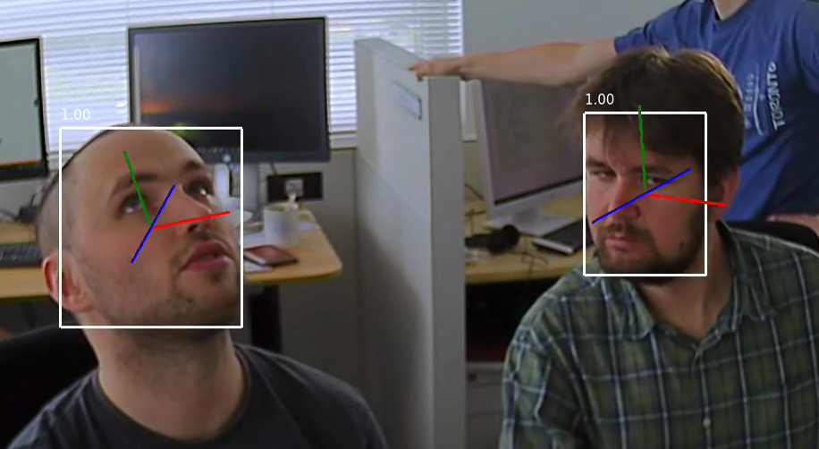

# face-detection-0206

## Use Case and High-Level Description

Face detector based on ResNet152 as a backbone with a
ATSS head for indoor and outdoor scenes shot by a front-facing camera.

## Example

## Specification

| Metric                                                        | Value                   |
|---------------------------------------------------------------|-------------------------|
| AP ([WIDER](http://mmlab.ie.cuhk.edu.hk/projects/WIDERFace/)) | 94.27%                  |
| GFlops                                                        | 339.602                 |
| MParams                                                       | 69.920                  |
| Source framework                                              | PyTorch\*               |

Average Precision (AP) is defined as an area under the
[precision/recall](https://en.wikipedia.org/wiki/Precision_and_recall)
curve. All numbers were evaluated by taking into account only faces bigger than
64 x 64 pixels.

## Inputs

Image, name: `image`, shape: `1, 3, 640, 640` in the format `B, C, H, W`, where:

- `B` - batch size
- `C` - number of channels
- `H` - image height
- `W` - image width

Expected color order: `BGR`.

## Outputs

1. The `boxes` is a blob with the shape `750, 5` in the format `N, 5`, where `N` is the number of detected
   bounding boxes. For each detection, the description has the format
   [`x_min`, `y_min`, `x_max`, `y_max`, `conf`], where:

    - (`x_min`, `y_min`) - coordinates of the top left bounding box corner
    - (`x_max`, `y_max`) - coordinates of the bottom right bounding box corner
    - `conf` - confidence for the predicted class

2. The `labels` is a blob with the shape `750` in the format `N`, where `N` is the number of detected
   bounding boxes. It contains predicted class ID (0 - face) per each detected box.

## Training Pipeline

The OpenVINO [Training Extensions](https://github.com/openvinotoolkit/training_extensions/blob/misc/README.md) provide a [training pipeline](https://github.com/openvinotoolkit/training_extensions/blob/misc/models/object_detection/model_templates/face-detection/readme.md), allowing to fine-tune the model on custom dataset.

## Demo usage

The model can be used in the following demos provided by the Open Model Zoo to show its capabilities:

* [Object Detection C++ Demo](../../../demos/object_detection_demo/cpp/README.md)
* [Object Detection Python\* Demo](../../../demos/object_detection_demo/python/README.md)

## Legal Information

[*] Other names and brands may be claimed as the property of others.
