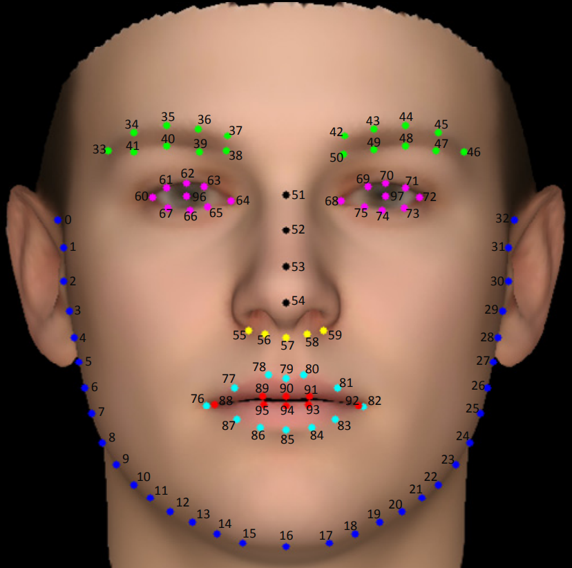
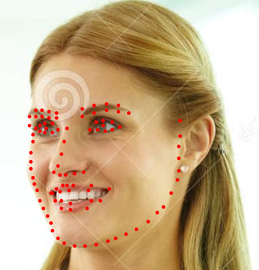

# face-98-landmarks-detection-0001

## Use Case and High-Level Description

This is a 2D face landmarks detection network based on the HRNet approach.
For face in an image, the network detects landmarks (look at image below).
The landmarks contain 98 keypoints.

## Example

## Specification

| Metric                          | Value                                     |
|---------------------------------|-------------------------------------------|
| NME                             | 0.1323                                    |
| GFlops                          | 0.6                                       |
| MParams                         | 9.66                                      |
| Source framework                | PyTorch\*                                 |

## Inputs

Name: `input.1`, shape: `1, 3, 64, 64`. An input image in the `B, C, H, W` format, where:

- `B` - batch size
- `C` - number of channels
- `H` - image height
- `W` - image width
Expected color order is `BGR`.

## Outputs

The net outputs blob:
  * `3851` of shape `1, 98, 16, 16` containing location heatmaps for keypoints of all types. Locations that are filtered out by non-maximum suppression algorithm have negated values assigned to them.

## Legal Information
[*] Other names and brands may be claimed as the property of others.
