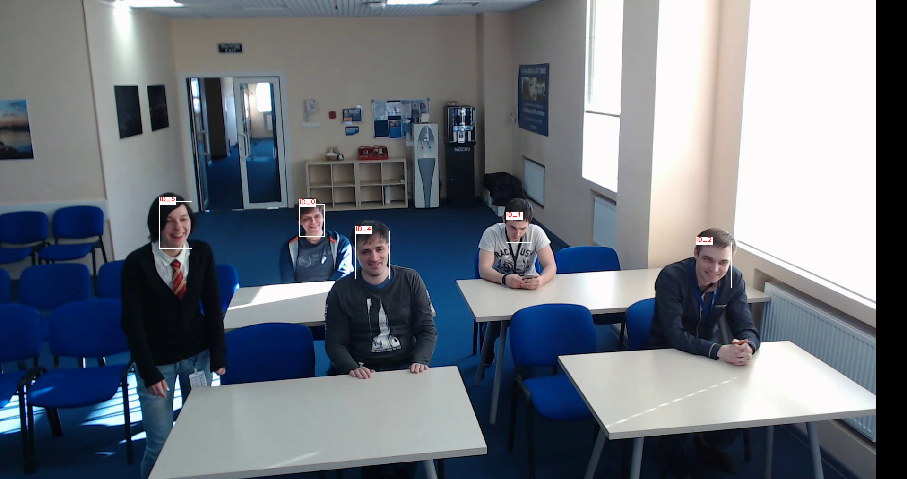

# face-reidentification-retail-0095

## Use Case and High-Level Description

This is a lightweight network for the face re-identification scenario. It is based on MobileNet V2 backbone, which consists of 3x3 inverted residual blocks with squeeze-excitation attention modules. Instead of the ReLU6 activations used in the original MobileNet V2, this network uses PReLU ones. After the backbone, the network applies global depthwise pooling and then uses 1x1 convolution to create the final embedding vector. The model produces feature vectors which should be close in cosine distance for similar faces and far for different faces.

## Example



## Specification

| Metric                          | Value                                     |
|---------------------------------|-------------------------------------------|
| LFW accuracy                    | 0.9947                                    |
| Face location requirements      | Tight aligned crop                        |
| GFlops                          | 0.588                                     |
| MParams                         | 1.107                                     |
| Source framework                | PyTorch\*                                  |

LFW metric is the accuracy in the pairwise reidentification test. See the full [benchmark description](http://vis-www.cs.umass.edu/lfw/) for details.

The model achieves the best results if an input face is frontally oriented and aligned. Face image is aligned if five keypoints (left eye, right eye, tip of nose, left lip corner, right lip corner) are located in the following points in normalized coordinates [0,1]x[0,1]:

```
[(0.31556875000000000, 0.4615741071428571),
 (0.68262291666666670, 0.4615741071428571),
 (0.50026249999999990, 0.6405053571428571),
 (0.34947187500000004, 0.8246919642857142),
 (0.65343645833333330, 0.8246919642857142)]
```

To align the face, use a landmarks regression model: using regressed points and the given reference landmarks, build an affine transformation to transform regressed points to the reference ones and apply this transformation to the input face image.

## Performance

## Inputs

Name: "data" , shape: [1x3x128x128] - An input image in the format [BxCxHxW],
where:
- B - batch size
- C - number of channels
- H - image height
- W - image width

Expected color order is BGR.

## Outputs
The net outputs a blob with the shape [1, 256, 1, 1], containing a row-vector of 256 floating point values. Outputs on different images are comparable in cosine distance.

## Legal Information
[*] Other names and brands may be claimed as the property of others.
